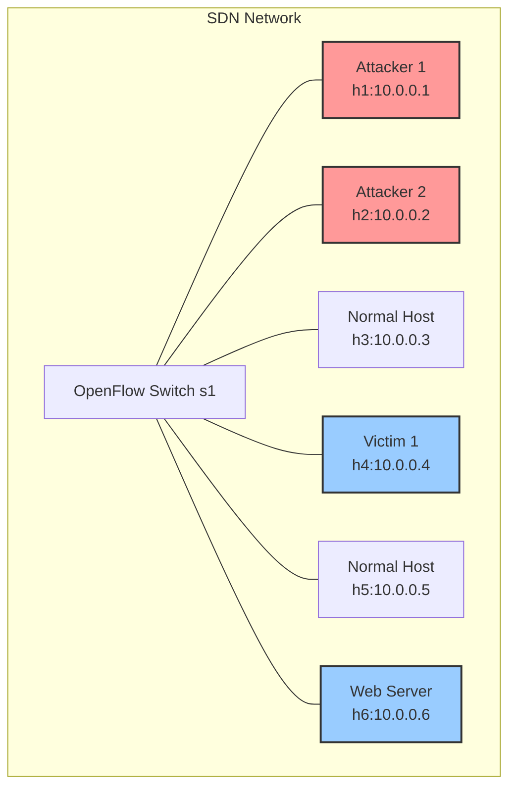
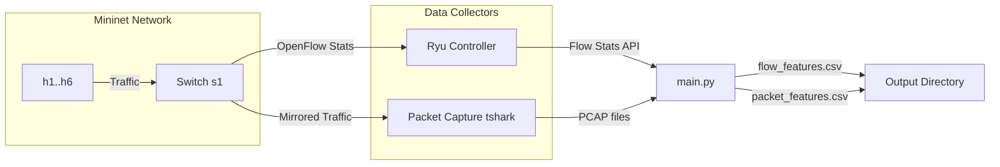

# AdDDoSDN Dataset Framework 🛡️

A comprehensive framework for generating network security datasets in Software-Defined Networks (SDN). This tool creates realistic datasets containing both normal traffic and various types of DDoS attacks for cybersecurity research and machine learning.

## 🎯 What Does This Do?

This framework helps researchers and security professionals create datasets for:
- **DDoS Attack Detection**: Training machine learning models to identify attacks
- **Network Security Research**: Studying attack patterns and defense mechanisms  
- **Cybersecurity Education**: Learning about SDN security and attack types
- **Defense System Testing**: Evaluating security tools and detection systems

## 🚀 Quick Start Guide

### Step 1: Setup Your Environment

**System Requirements:**
- Ubuntu Linux (18.04 or newer recommended)
- At least 4GB RAM and 10GB free disk space
- Internet connection for downloading dependencies

**Install Required Software:**
```bash
# Update system
sudo apt update

# Install essential tools
sudo apt install -y python3-pip python3-venv git tshark mininet ryu-manager slowhttptest

# Clone this project
git clone https://github.com/nqmn/AdDDoSDN_dataset.git
cd AdDDoSDN_dataset

# Create Python environment
python3 -m venv venv
source venv/bin/activate

# Install Python dependencies
pip install -r dataset_generation/requirements.txt
```

### Step 2: Run Your First Test

**Quick Test (5 minutes):**
```bash
# Test that everything works (requires sudo for network simulation)
sudo python3 dataset_generation/test.py
```
This creates a small dataset in `dataset_generation/test_output/` with:
- 📊 `packet_features.csv` - Individual packet data (15 features)
- 📈 `flow_features.csv` - SDN flow statistics (18 features)  
- 🔄 `cicflow_features_all.csv` - Aggregated flow data (85 features)
- 📦 `*.pcap` files - Raw network packet captures
- 📝 `attack.log` - Detailed attack information

**Full Dataset Generation (1+ hours):**
```bash
# Generate full research dataset (configurable durations)
sudo python3 dataset_generation/main.py
```
This creates a comprehensive dataset in `dataset_generation/main_output/`

**Testing and Validation:**
```bash
# Run the unified test runner to validate your datasets
cd test/
python3 test_runner.py
```
This provides a menu-driven interface to run various validation scripts including timeline analysis, statistics calculation, and dataset validation.

### Step 3: Configure for Your Needs

Edit `dataset_generation/config.json` to customize attack durations:
```json
{
  "scenario_durations": {
    "normal_traffic": 1200,    "← 20 minutes of normal traffic"
    "syn_flood": 600,          "← 10 minutes of SYN flood attack"  
    "udp_flood": 600,          "← 10 minutes of UDP flood attack"
    "icmp_flood": 600,         "← 10 minutes of ICMP flood attack"
    "ad_syn": 600,             "← 10 minutes of advanced TCP attack"
    "ad_udp": 600,             "← 10 minutes of advanced HTTP attack"
    "ad_slow": 600             "← 10 minutes of slow read attack"
  }
}
```

## 📚 Understanding the Framework

### What Gets Generated?

#### 🎭 Traffic Types Created:
1. **Normal Traffic** - Legitimate web browsing, email, file transfers
2. **Traditional DDoS Attacks** - SYN floods, UDP floods, ICMP floods  
3. **Advanced Adversarial Attacks** - Sophisticated attacks that mimic normal traffic

#### 📊 Dataset Outputs:
- **Packet Features (15 columns)** - Individual packet characteristics
- **SDN Flow Features (18 columns)** - OpenFlow switch statistics  
- **CICFlow Features (85 columns)** - Aggregated bidirectional flow statistics
- **Binary Labels** - Normal (0) vs Attack (1)
- **Multi-class Labels** - Specific attack types (normal, syn_flood, udp_flood, etc.)

### How It Works

```
🏗️  Network Setup        🚦 Traffic Generation      📈 Data Collection
   │                        │                          │
   ├─ Virtual Network       ├─ Normal Web Traffic      ├─ Packet Capture  
   ├─ SDN Controller        ├─ SYN Flood Attacks       ├─ Flow Statistics
   ├─ 6 Virtual Hosts       ├─ UDP Flood Attacks       ├─ Performance Logs
   └─ OpenFlow Switch       ├─ ICMP Flood Attacks      └─ Feature Extraction
                            ├─ Advanced TCP Attacks              │
                            ├─ Advanced HTTP Attacks             ▼
                            └─ Slow Read Attacks          📊 CSV Datasets
```

## 🛠️ Two Usage Modes

### 🧪 Development Mode (`test.py`)
**Purpose:** Quick testing and development
- **Duration:** Each attack runs for 5 seconds (45 seconds total)
- **Use Case:** Verify setup, test changes, debug issues
- **Output:** `dataset_generation/test_output/`

### 🏭 Production Mode (`main.py`) 
**Purpose:** Full research dataset generation
- **Duration:** Configurable via `config.json` (default: 80+ minutes)
- **Use Case:** Generate datasets for research, training ML models
- **Output:** `dataset_generation/main_output/`

**Both modes generate identical data formats - only duration differs!**

## 📁 Project Structure

```
📂 adversarial-ddos-attacks-sdn-dataset/
├── 📂 dataset_generation/           ← Main framework
│   ├── 🐍 test.py                  ← Quick test script (5s per attack)
│   ├── 🐍 main.py                  ← Full dataset generation (configurable)
│   ├── ⚙️ config.json              ← Duration settings for main.py
│   ├── 📂 src/                     ← Source code
│   │   ├── 📂 attacks/             ← Attack implementations
│   │   ├── 📂 controller/          ← SDN controller code
│   │   └── 📂 utils/               ← Data processing utilities
│   ├── 📂 test_output/             ← test.py results
│   ├── 📂 main_output/             ← main.py results
│   └── 📂 files/                   ← Configuration files
├── 📂 test/                        ← Testing and validation tools
│   ├── 🐍 test_runner.py           ← Unified test runner interface
│   ├── 🐍 analyze_timeline.py      ← Timeline analysis
│   ├── 🐍 calculate_percentages.py ← Statistics calculation
│   ├── 🐍 validate_cicflow_dataset.py ← Dataset validation
│   └── 🐍 [other test scripts]     ← Additional testing utilities
├── 📂 examples/                    ← Usage examples and tutorials
└── 📄 README.md                    ← This file
```

## 🎯 Three Synchronized Data Formats

The framework generates three synchronized data formats from the same network traffic, each designed for different analysis approaches:

## 🔄 Multi-Granularity Analysis Design

### **Real-Time Analysis Formats** (Network Operations)

#### **Format 1: Packet-Level Features (15 features)**
**Granularity**: Individual network packets  
**Source**: Direct PCAP extraction using tshark  
**Analysis Type**: **Real-time packet inspection**  
**Use case**: Packet-level ML models, protocol analysis, immediate threat detection

**Why packet-level for real-time:**
- **Instant detection**: Each packet analyzed immediately as it arrives
- **Low latency**: Minimal processing delay for live traffic monitoring
- **Protocol-specific**: Detect attacks based on packet headers and flags
- **Network hardware compatible**: Can be implemented in switches/routers
- **Fine-grained**: Catches attacks that may be invisible at flow level
| Feature Name | Description | Relevance |
|---|---|---|
| `timestamp` | Timestamp of the packet capture. | Essential for temporal analysis and correlating events. |
| `packet_length` | Length of the captured packet in bytes. | Indicates packet size, useful for identifying anomalies (e.g., unusually large or small packets). |
| `eth_type` | Ethernet type of the packet (e.g., IP, ARP). | Identifies the network layer protocol, crucial for protocol-specific analysis. |
| `ip_src` | Source IP address of the packet. | Identifies the sender, vital for tracing attack sources. |
| `ip_dst` | Destination IP address of the packet. | Identifies the receiver, vital for tracing attack targets. |
| `ip_proto` | IP protocol number (e.g., TCP, UDP, ICMP). | Specifies the transport layer protocol, fundamental for classifying traffic types. |
| `ip_ttl` | IP Time-To-Live value. | Can indicate network topology or unusual routing paths, sometimes manipulated in attacks. |
| `ip_id` | IP identification field. | Used for reassembling fragmented IP packets, can be used in some attack patterns. |
| `ip_flags` | IP flags (e.g., Don't Fragment). | Indicates fragmentation status, relevant for certain attack types. |
| `ip_len` | Total length of the IP packet. | Similar to `packet_length` but specific to the IP layer, useful for anomaly detection. |
| `src_port` | Source port number (TCP/UDP). | Identifies the application sending the traffic, crucial for application-layer attack detection. |
| `dst_port` | Destination port number (TCP/UDP). | Identifies the application receiving the traffic, crucial for application-layer attack detection. |
| `tcp_flags` | TCP flags (e.g., SYN, ACK, FIN). | Essential for analyzing TCP connection states and identifying SYN floods or other TCP-based attacks. |
| `Label_multi` | Multi-class label indicating the type of traffic (e.g., 'normal', 'syn_flood', 'udp_flood'). | Primary label for multi-class classification tasks. |
| `Label_binary` | Binary label indicating whether the traffic is normal (0) or attack (1). | Primary label for binary classification tasks. |

#### **Format 2: SDN Flow Features (18 features)**
**Granularity**: OpenFlow switch flow entries  
**Source**: Ryu controller flow monitoring  
**Analysis Type**: **Real-time flow monitoring**  
**Use case**: SDN-specific detection, controller-based analysis, network-wide visibility

**Why SDN flow for real-time:**
- **Controller integration**: Direct access to OpenFlow statistics
- **Network-wide view**: Centralized monitoring of all switches
- **Programmable actions**: Immediate response through flow rule updates
- **Scalable**: Aggregated flow statistics reduce processing overhead
- **SDN-native**: Leverages controller's natural traffic monitoring capabilities
**Use case**: SDN-specific ML models, controller-based analysis

| Feature Name | Description | Relevance |
|---|---|---|
| `timestamp` | Timestamp when the flow statistics were collected. | Essential for temporal analysis of flow dynamics. |
| `switch_id` | Datapath ID of the OpenFlow switch. | Identifies the switch where the flow was observed, crucial for network-wide analysis. |
| `table_id` | ID of the flow table where the flow entry resides. | Indicates the processing stage of the flow within the switch. |
| `cookie` | Opaque value used by the controller to identify the flow. | Can be used for internal tracking by the controller. |
| `priority` | Priority of the flow entry. | Determines the order of matching, higher priority flows are matched first. |
| `in_port` | Ingress port of the flow. | Identifies the port through which traffic entered the switch for this flow. |
| `eth_src` | Ethernet source address of the flow. | Identifies the source MAC address of the traffic in the flow. |
| `eth_dst` | Ethernet destination address of the flow. | Identifies the destination MAC address of the traffic in the flow. |
| `out_port` | Egress port of the flow. | Identifies the port through which traffic exited the switch for this flow. |
| `packet_count` | Number of packets matched by the flow entry. | Direct measure of traffic volume for the flow, key for anomaly detection. |
| `byte_count` | Number of bytes matched by the flow entry. | Direct measure of traffic volume in bytes, key for anomaly detection. |
| `duration_sec` | Time in seconds since the flow entry was added. | Indicates the longevity of the flow, useful for identifying short-lived attack flows. |
| `duration_nsec` | Time in nanoseconds since the flow entry was added (fractional part). | Provides higher precision for flow duration. |
| `avg_pkt_size` (calculated) | Average packet size for the flow (`byte_count / packet_count`). | Helps characterize the nature of traffic within a flow (e.g., small packets in SYN floods). |
| `pkt_rate` (calculated) | Rate of packets per second for the flow (`packet_count / total_duration`). | Indicates the intensity of traffic, crucial for detecting high-rate attacks. |
| `byte_rate` (calculated) | Rate of bytes per second for the flow (`byte_count / total_duration`). | Indicates the bandwidth consumption, crucial for detecting high-bandwidth attacks. |
| `Label_multi` | Multi-class label indicating the type of traffic (e.g., 'normal', 'syn_flood', 'udp_flood'). | Primary label for multi-class classification tasks. |
| `Label_binary` | Binary label indicating whether the traffic is normal (0) or attack (1). | Primary label for binary classification tasks. |

### **Offline Analysis Format** (Security Analytics)

#### **Format 3: CICFlow Aggregated Features (85 features)**
**Granularity**: Bidirectional network flows  
**Source**: CICFlowMeter processing of PCAP files  
**Analysis Type**: **Offline behavioral analysis**  
**Use case**: Flow-based ML models, network behavior analysis, forensic investigation

**Why CICFlow for offline analysis:**
- **Comprehensive features**: 85 statistical features capture complex behavioral patterns
- **Bidirectional flows**: Analyzes complete conversation patterns between hosts
- **Statistical aggregation**: Computes advanced statistics over entire flow lifetimes
- **Behavioral profiling**: Identifies attack patterns through temporal and statistical analysis
- **Research-grade**: Standardized features widely used in network security research
- **Post-processing**: Requires complete flow data, suitable for batch analysis

**Key Features Include**:
- **Flow Duration & Timing**: Duration, inter-arrival times, idle times
- **Packet & Byte Counts**: Forward/backward packet/byte counts and rates
- **Statistical Measures**: Min, max, mean, std of packet sizes and intervals
- **Protocol Flags**: TCP flags, flow control indicators
- **Behavioral Patterns**: Active/idle periods, subflow analysis

## 🎯 Analysis Use Cases Summary

### **Real-Time Detection Systems**
- **Packet-Level**: Immediate threat detection, protocol anomaly detection, hardware-based filtering
- **SDN Flow-Level**: Controller-based monitoring, network-wide visibility, automated response actions

### **Offline Security Analytics**
- **CICFlow-Level**: Behavioral analysis, forensic investigation, advanced ML research, pattern discovery

### **Deployment Scenarios**
| Scenario | Primary Format | Analysis Type | Response Time | Use Case |
|----------|---------------|---------------|---------------|----------|
| **Network Firewall** | Packet-Level | Real-time | Microseconds | Block malicious packets |
| **SDN Controller** | SDN Flow-Level | Real-time | Milliseconds | Update flow rules |
| **Security Operations Center** | CICFlow-Level | Offline | Minutes/Hours | Investigate incidents |
| **ML Model Training** | All Three | Offline | Hours/Days | Develop detection algorithms |

### Data Format Relationship
All three formats are synchronized and extracted from the same PCAP source:

- **Packet-to-CICFlow Ratio**: ~5.21 packets per flow
  - Each CICFlow record aggregates ~5.2 individual packets from bidirectional communication
  - Typical pattern: TCP handshake (SYN, SYN+ACK, ACK) + data + connection teardown
- **Timeline Consistency**: All formats use identical attack.log timeline boundaries
- **Conservative Data Integrity**: 98.9% labeling accuracy with legitimate unknown edge cases preserved


## Network Architecture



## Network Topology

The Mininet topology consists of the following components:

| Component | Type | IP Address | Role |
|-----------|------|------------|------|
| s1 | OpenFlow Switch | N/A | Central network switch |
| h1 | Host | 10.0.0.1 | Primary Attacker |
| h2 | Host | 10.0.0.2 | Secondary Attacker |
| h3 | Host | 10.0.0.3 | Normal Traffic Generator |
| h4 | Host | 10.0.0.4 | Primary Victim |
| h5 | Host | 10.0.0.5 | Normal Traffic Generator |
| h6 | Host | 10.0.0.6 | Web Server Victim |

## Host Roles and Traffic Patterns

### Attackers

| Host | IP | Attack Type | Target | Impact | Description |
|------|----|-------------|--------|--------|-------------|
| h1 | 10.0.0.1 | SYN Flood | h6 (Web Server) | Controller & Application | Overwhelms controller flow tables and exhausts server resources |
| h2 | 10.0.0.2 | Multiple Attacks | h4 & h6 | Various | Launches various attacks including UDP, ICMP, and advanced adversarial attacks. |

#### Detailed Attack Vectors from h2:

| Attack Type | Target | Protocol | Port | Evasion Technique |
|-------------|--------|----------|------|-------------------|
| UDP Flood | h4 | UDP | 53 | High Rate |
| ICMP Flood | h4 | ICMP | N/A | High Rate |
| Adversarial SYN | h6 | TCP | 80 | TCP State Exhaustion |
| Adversarial UDP | h6 | UDP | 53 | Application Layer Mimicry |
| Adversarial Slow Read | h6 | TCP | 80 | Slow HTTP Request |

### Victims

| Host | IP | Role | Attack Types | Impact |
|------|----|------|--------------|--------|
| h4 | 10.0.0.4 | General Victim | UDP Flood, ICMP Flood | Network Saturation |
| h6 | 10.0.0.6 | Web Server | SYN Flood, Adversarial Attacks | Service Disruption |

### Normal Traffic Generators

| Host | IP | Traffic Type | Destination | Protocols | Purpose |
|------|----|--------------|-------------|-----------|---------|
| h3 | 10.0.0.3 | Benign | h5 | ICMP, TCP, UDP, etc. | Simulate normal web and network traffic |
| h5 | 10.0.0.5 | Benign | h3 | ICMP, TCP, UDP, etc. | Simulate normal web and network traffic |

## Traffic Generation Phases

The dataset generation process follows a structured timeline with distinct phases. The duration of each phase is configurable in `dataset_generation/config.json`.

| Phase | Default Duration | Label | Description |
|-------|------------------|-------|-------------|
| Initialization | 5s | normal | Network stabilization and controller initialization. |
| Normal Traffic | 5s | normal | Benign traffic (ICMP, TCP, UDP, Telnet, SSH, FTP, HTTP) between h3 and h5. |
| SYN Flood | 5s | syn_flood | Traditional SYN flood attack from h1 to h6. |
| UDP Flood | 5s | udp_flood | Traditional UDP flood attack from h2 to h4. |
| ICMP Flood | 5s | icmp_flood | Traditional ICMP flood attack from h2 to h4. |
| Adversarial SYN | 5s | ad_syn | Adversarial TCP State Exhaustion attack from h2 to h6. |
| Adversarial UDP | 5s | ad_udp | Adversarial Application Layer attack from h2 to h6. |
| Adversarial Slow Read | 5s | ad_slow | Adversarial Slow Read attack from h2 to h6. |
| Cooldown | 10s | normal | Allow network to stabilize and ensure final flow stats are captured. |

## Data Collection Architecture



## 📊 Dataset Generation Flow

### Dataset Outputs

The generated datasets in `dataset_generation/main_output/` include:

1.  **`packet_features.csv`**
    -   The primary packet-level dataset with extracted features and labels.
    -   Each packet is associated with a label indicating the traffic phase (e.g., `normal`, `syn_flood`, `ad_slow`).

2.  **`flow_features.csv`**
    -   A flow-based dataset containing statistics collected from the Ryu controller.
    -   Features include packet/byte counts, duration, and derived rates, labeled based on the active traffic phase.


### Traffic Generation Timeline

#### test.py (Fixed Durations - Development)
```
┌─────────────────────────────────────────────────────────────────────────────────┐
│                        test.py Traffic Generation Timeline                       │
└─────────────────────────────────────────────────────────────────────────────────┘

Time: 0s    5s    10s    15s    20s    25s    30s    35s    40s    45s
      │     │     │      │      │      │      │      │      │      │
      ▼     ▼     ▼      ▼      ▼      ▼      ▼      ▼      ▼      ▼
┌─────┬─────┬─────┬─────┬─────┬─────┬─────┬─────┬─────┬─────┐
│Init │Normal│SYN │UDP │ICMP │ad_syn│ad_udp│slow │Cool │     │
│ 5s  │ 5s  │ 5s │ 5s │ 5s  │ 5s  │ 5s  │ 5s  │ 5s  │     │
└─────┴─────┴─────┴─────┴─────┴─────┴─────┴─────┴─────┴─────┘
```

#### main.py (Configurable Durations - Production)
```
┌─────────────────────────────────────────────────────────────────────────────────┐
│                        main.py Traffic Generation Timeline                       │
│                           (Default config.json values)                          │
└─────────────────────────────────────────────────────────────────────────────────┘

Time: 0s    5s     20m    30m    40m    50m    60m    70m    80m    90m
      │     │      │      │      │      │      │      │      │      │
      ▼     ▼      ▼      ▼      ▼      ▼      ▼      ▼      ▼      ▼
┌─────┬──────┬──────┬──────┬──────┬──────┬──────┬──────┬─────┐
│Init │Normal│ SYN  │ UDP  │ ICMP │ad_syn│ad_udp│slow  │Cool │
│ 5s  │1200s │ 600s │ 600s │ 600s │ 600s │ 600s │ 600s │ 10s │
└─────┴──────┴──────┴──────┴──────┴──────┴──────┴──────┴─────┘
```

**Both scripts provide identical functionality and output format:**

**Timeline Legend:**
- **Init**: Network initialization and stabilization  
- **Normal**: Benign multi-protocol traffic (HTTP, DNS, SMTP, FTP)
- **SYN/UDP/ICMP**: Traditional DDoS flood attacks with enhanced logging
- **ad_syn/ad_udp/slow**: Advanced adversarial attacks with evasion techniques
- **Cool**: Cooldown period for flow collection completion
- **Flow Collection**: Continuous SDN controller statistics via REST API

**Key Differences:**
- **test.py**: Fixed 5-second durations per phase (50 seconds total)
- **main.py**: Configurable durations via config.json (default: ~80 minutes total)
- **Output**: Both generate identical file formats and feature sets
```

### Feature Extraction Pipeline

```
┌─────────────────────────────────────────────────────────────────────────────────┐
│                           Feature Extraction Workflow                           │
└─────────────────────────────────────────────────────────────────────────────────┘

                    ┌─────────────────────────────────────┐
                    │          Raw Data Sources           │
                    └─────────────────┬───────────────────┘
                                      │
                    ┌─────────────────┼───────────────────┐
                    │                 │                   │
           ┌────────▼──────────┐     │      ┌────────────▼─────────┐
           │ PCAP Files        │     │      │ Flow Statistics     │
           │                   │     │      │ (REST API)          │
           │ • normal.pcap     │     │      │                     │
           │ • syn_flood.pcap  │     │      │ • Real-time polling │
           │ • udp_flood.pcap  │     │      │ • Switch flow tables│
           │ • icmp_flood.pcap │     │      │ • OpenFlow metrics  │
           │ • ad_syn.pcap     │     │      │ • Performance data  │
           │ • ad_udp.pcap     │     │      │                     │
           │ • ad_slow.pcap    │     │      │                     │
           └────────┬──────────┘     │      └────────────┬─────────┘
                    │                │                   │
                    ▼                │                   ▼
           ┌────────────────────┐    │      ┌─────────────────────────┐
           │ Packet Processing  │    │      │ Flow Processing         │
           │                    │    │      │                         │
           │ 1. Integrity Check │    │      │ 1. Real-time Collection │
           │ 2. Timestamp Fix   │    │      │ 2. Time Synchronization │
           │ 3. Protocol Parse  │    │      │ 3. Metric Calculation   │
           │ 4. Feature Extract │    │      │ 4. Label Assignment     │
           │ 5. Label Assign    │    │      │ 5. Quality Validation   │
           └────────┬───────────┘    │      └─────────────┬───────────┘
                    │                │                    │
                    ▼                │                    ▼
        ┌─────────────────────────┐  │     ┌──────────────────────────┐
        │ 84 Packet-Level         │  │     │ 26 Flow-Level            │
        │ Features                │  │     │ Features                 │
        │                         │  │     │                          │
        │ • Network Layer (12)    │  │     │ • Flow Identity (6)      │
        │ • Transport Layer (15)  │  │     │ • Traffic Metrics (8)    │
        │ • Temporal (20)         │  │     │ • Rate Features (6)      │
        │ • Statistical (25)      │  │     │ • Behavioral (4)         │
        │ • Protocol Specific (10)│  │     │ • Labels (2)             │
        │ • Labels (2)            │  │     │                          │
        └─────────┬───────────────┘  │     └──────────────┬───────────┘
                  │                  │                    │
                  └──────────────────┼────────────────────┘
                                     │
                                     ▼
                   ┌─────────────────────────────────────┐
                   │        Dataset Consolidation        │
                   │                                     │
                   │ ┌─────────────────────────────────┐ │
                   │ │ Quality Assurance               │ │
                   │ │ • Label consistency checks      │ │
                   │ │ • Feature completeness          │ │
                   │ │ • Statistical validation        │ │
                   │ │ • Temporal correlation          │ │
                   │ └─────────────────────────────────┘ │
                   │                                     │
                   │ ┌─────────────────────────────────┐ │
                   │ │ Final Dataset Export            │ │
                   │ │ • packet_features.csv           │ │
                   │ │ • flow_features.csv             │ │
                   │ │ • Feature name files            │ │
                   │ │ • Statistical summaries         │ │
                   │ └─────────────────────────────────┘ │
                   └─────────────────────────────────────┘
```

### Enhanced Logging Architecture

```
┌─────────────────────────────────────────────────────────────────────────────────┐
│                        Enhanced Logging System Architecture                      │
└─────────────────────────────────────────────────────────────────────────────────┘

                              ┌─────────────────────┐
                              │   Centralized       │
                              │   Logging Manager   │
                              │                     │
                              │ • Run ID Generation │
                              │ • Format Standards  │
                              │ • Multi-destination │
                              │ • Level Control     │
                              └──────────┬──────────┘
                                         │
                ┌────────────────────────┼────────────────────────┐
                │                        │                        │
                ▼                        ▼                        ▼
    ┌─────────────────────┐  ┌─────────────────────┐  ┌─────────────────────┐
    │ Attack Execution    │  │ System Operations   │  │ Network Monitoring  │
    │ Logging             │  │ Logging             │  │ Logging             │
    │                     │  │                     │  │                     │
    │ Files:              │  │ Files:              │  │ Files:              │
    │ • attack.log        │  │ • main.log/test.log │  │ • ryu.log           │
    │                     │  │ • mininet.log       │  │ • flow_stats.log    │
    │ Content:            │  │                     │  │                     │
    │ • Run ID tracking   │  │ Content:            │  │ Content:            │
    │ • Pre-attack recon  │  │ • System startup    │  │ • Controller events │
    │ • Real-time metrics │  │ • Process mgmt      │  │ • Flow installations│
    │ • Progress updates  │  │ • Error handling    │  │ • Network topology  │
    │ • Performance stats │  │ • Resource usage    │  │ • Performance data  │
    │ • Attack summaries  │  │ • Cleanup ops       │  │ • REST API calls    │
    └─────────────────────┘  └─────────────────────┘  └─────────────────────┘
                │                        │                        │
                └────────────────────────┼────────────────────────┘
                                         │
                                         ▼
                          ┌─────────────────────────────┐
                          │   Log Analysis & Debugging  │
                          │                             │
                          │ • Cross-reference capability│
                          │ • Correlation by Run ID     │
                          │ • Performance profiling     │
                          │ • Error traceability        │
                          │ • Attack pattern analysis   │
                          └─────────────────────────────┘

### Multi-Level Classification System

#### **Binary Classification**
```
┌─────────────────────────────────────────────────────────┐
│                Binary Classification                     │
├─────────────────────────────────────────────────────────┤
│                                                         │
│  Normal Traffic (Label = 0)    │  Attack Traffic (Label = 1)  │
│  ├─ Benign HTTP/HTTPS         │  ├─ Traditional DDoS          │
│  ├─ DNS Queries               │  │  ├─ SYN Flood              │
│  ├─ SMTP/FTP Traffic          │  │  ├─ UDP Flood              │
│  ├─ SSH/Telnet Sessions       │  │  └─ ICMP Flood             │
│  └─ Standard Network Ops      │  └─ Adversarial Attacks       │
│                                │     ├─ TCP State Exhaustion   │
│                                │     ├─ App Layer Mimicry      │
│                                │     └─ Slow Read Attacks      │
└─────────────────────────────────────────────────────────┘
```

#### **Multi-Class Classification**
```
┌─────────────────────────────────────────────────────────────────────────────────┐
│                        Multi-Class Attack Classification                         │
├─────────────────────────────────────────────────────────────────────────────────┤
│                                                                                 │
│  normal        syn_flood       udp_flood       icmp_flood                      │
│  │             │               │               │                               │
│  ├─Multi-proto ├─TCP port 80   ├─UDP port 53   ├─ICMP echo                    │
│  │ benign      │ connection    │ DNS service   │ requests                      │
│  │ traffic     │ exhaustion    │ overwhelming  │ bandwidth                     │
│  │ patterns    │ ~100 pps      │ ~100 pps      │ consumption                   │
│  │             │               │               │ ~100 pps                      │
│                                                                                 │
│  ad_syn         ad_udp          ad_slow                                        │
│  │              │               │                                               │
│  ├─Advanced     ├─HTTP app      ├─Slow read                                    │
│  │ TCP state    │ layer         │ connection                                   │
│  │ exhaustion   │ mimicry       │ exhaustion                                   │
│  │ IP rotation  │ legitimate    │ slowhttptest                                 │
│  │ adaptive     │ patterns      │ 100 conns                                    │
│  │ timing       │ varied UA     │ slow consume                                 │
└─────────────────────────────────────────────────────────────────────────────────┘
```

## 🏗️ System Architecture

### Overall System Architecture

```
┌─────────────────────────────────────────────────────────────────────────────────┐
│                           AdDDoSDN Dataset Framework                             │
├─────────────────────────────────────────────────────────────────────────────────┤
│                                                                                 │
│  ┌─────────────────┐    ┌──────────────────┐    ┌─────────────────────────────┐ │
│  │   Control Plane │    │    Data Plane    │    │    Management Plane        │ │
│  │                 │    │                  │    │                             │ │
│  │ ┌─────────────┐ │    │ ┌──────────────┐ │    │ ┌─────────────────────────┐ │ │
│  │ │ Ryu         │ │    │ │ Mininet      │ │    │ │ Dataset Generation      │ │ │
│  │ │ Controller  │◄┼────┼─┤ Network      │ │    │ │ Framework               │ │ │
│  │ │             │ │    │ │ Emulation    │ │    │ │                         │ │ │
│  │ │ - Flow Mon  │ │    │ │              │ │    │ │ - Traffic Orchestration │ │ │
│  │ │ - REST API  │ │    │ │ ┌──────────┐ │ │    │ │ - Attack Coordination   │ │ │
│  │ │ - Stats     │ │    │ │ │ OVS      │ │ │    │ │ - Data Collection       │ │ │
│  │ └─────────────┘ │    │ │ │ Switch   │ │ │    │ │ - Feature Extraction    │ │ │
│  └─────────────────┘    │ │ │ (OpenFlow│ │ │    │ │ - Enhanced Logging      │ │ │
│                         │ │ │  1.3)    │ │ │    │ └─────────────────────────┘ │ │
│                         │ │ └────┬─────┘ │ │    └─────────────────────────────┘ │
│                         │ │      │       │ │                                    │
│                         │ │ ┌────▼─────┐ │ │                                    │
│                         │ │ │ Hosts    │ │ │                                    │
│                         │ │ │ h1...h6  │ │ │                                    │
│                         │ │ └──────────┘ │ │                                    │
│                         │ └──────────────┘ │                                    │
│                         └──────────────────┘                                    │
│                                                                                 │
├─────────────────────────────────────────────────────────────────────────────────┤
│                              Attack Generation Layer                             │
├─────────────────────────────────────────────────────────────────────────────────┤
│                                                                                 │
│ ┌─────────────────┐  ┌─────────────────┐  ┌──────────────────────────────────┐ │
│ │ Traditional     │  │ Adversarial     │  │ Benign Traffic                   │ │
│ │ DDoS Attacks    │  │ Attacks         │  │ Generation                       │ │
│ │                 │  │                 │  │                                  │ │
│ │ • SYN Flood     │  │ • TCP State     │  │ • HTTP/HTTPS                     │ │
│ │ • UDP Flood     │  │   Exhaustion    │  │ • DNS Queries                    │ │
│ │ • ICMP Flood    │  │ • App Layer     │  │ • SMTP/FTP                       │ │
│ │                 │  │   Mimicry       │  │ • SSH/Telnet                     │ │
│ │ Enhanced with:  │  │ • Slow Read     │  │                                  │ │
│ │ • Run ID Track  │  │                 │  │ Multi-protocol                   │ │
│ │ • Real-time Mon │  │ Advanced with:  │  │ Realistic Patterns               │ │
│ │ • Target Recon  │  │ • IP Rotation   │  │                                  │ │
│ │ • Process Stats │  │ • Adaptive Rate │  │                                  │ │
│ └─────────────────┘  │ • Evasion Tech  │  │                                  │ │
│                      └─────────────────┘  └──────────────────────────────────┘ │
│                                                                                 │
└─────────────────────────────────────────────────────────────────────────────────┘
```

### Network Topology Architecture

```
                    ┌─────────────────────────────────────┐
                    │         Ryu Controller              │
                    │                                     │
                    │  ┌─────────────┐ ┌─────────────────┐│
                    │  │ Flow        │ │ REST API        ││
                    │  │ Monitor     │ │ (Port 8080)     ││
                    │  │ App         │ │                 ││
                    │  └─────────────┘ └─────────────────┘│
                    │         │ OpenFlow (Port 6653)      │
                    └─────────┼─────────────────────────────┘
                              │
                              ▼
               ┌──────────────────────────────────────────┐
               │           OpenVSwitch (s1)               │
               │          OpenFlow 1.3 Enabled           │
               └─┬──┬──┬──┬──┬──┬──┬──┬──┬──┬──┬──┬──┬──┘
                 │  │  │  │  │  │  │  │  │  │  │  │  │
        ┌────────▼┐ │  │  │  │  │  │  │  │  │  │  │  │
        │   h1    │ │  │  │  │  │  │  │  │  │  │  │  │
        │10.0.0.1 │ │  │  │  │  │  │  │  │  │  │  │  │
        │         │ │  │  │  │  │  │  │  │  │  │  │  │
        │ Attack  │ │  │  │  │  │  │  │  │  │  │  │  │
        │ Source  │ │  │  │  │  │  │  │  │  │  │  │  │
        └─────────┘ │  │  │  │  │  │  │  │  │  │  │  │
                    │  │  │  │  │  │  │  │  │  │  │  │
           ┌────────▼┐ │  │  │  │  │  │  │  │  │  │  │
           │   h2    │ │  │  │  │  │  │  │  │  │  │  │
           │10.0.0.2 │ │  │  │  │  │  │  │  │  │  │  │
           │         │ │  │  │  │  │  │  │  │  │  │  │
           │ Attack  │ │  │  │  │  │  │  │  │  │  │  │
           │ Source  │ │  │  │  │  │  │  │  │  │  │  │
           └─────────┘ │  │  │  │  │  │  │  │  │  │  │
                       │  │  │  │  │  │  │  │  │  │  │
              ┌────────▼┐ │  │  │  │  │  │  │  │  │  │
              │   h3    │ │  │  │  │  │  │  │  │  │  │
              │10.0.0.3 │ │  │  │  │  │  │  │  │  │  │
              │         │ │  │  │  │  │  │  │  │  │  │
              │ Benign  │ │  │  │  │  │  │  │  │  │  │
              │ Traffic │ │  │  │  │  │  │  │  │  │  │
              └─────────┘ │  │  │  │  │  │  │  │  │  │
                          │  │  │  │  │  │  │  │  │  │
                 ┌────────▼┐ │  │  │  │  │  │  │  │  │
                 │   h4    │ │  │  │  │  │  │  │  │  │
                 │10.0.0.4 │ │  │  │  │  │  │  │  │  │
                 │         │ │  │  │  │  │  │  │  │  │
                 │ Attack  │ │  │  │  │  │  │  │  │  │
                 │ Target  │ │  │  │  │  │  │  │  │  │
                 └─────────┘ │  │  │  │  │  │  │  │  │
                             │  │  │  │  │  │  │  │  │
                    ┌────────▼┐ │  │  │  │  │  │  │  │
                    │   h5    │ │  │  │  │  │  │  │  │
                    │10.0.0.5 │ │  │  │  │  │  │  │  │
                    │         │ │  │  │  │  │  │  │  │
                    │ Benign  │ │  │  │  │  │  │  │  │
                    │ Traffic │ │  │  │  │  │  │  │  │
                    └─────────┘ │  │  │  │  │  │  │  │
                                │  │  │  │  │  │  │  │
                       ┌────────▼┐ │  │  │  │  │  │  │
                       │   h6    │ │  │  │  │  │  │  │
                       │10.0.0.6 │ │  │  │  │  │  │  │
                       │         │ │  │  │  │  │  │  │
                       │ Attack  │ │  │  │  │  │  │  │
                       │ Target  │ │  │  │  │  │  │  │
                       └─────────┘ │  │  │  │  │  │  │
                                   └──▼──▼──▼──▼──▼──┘
                                   Additional ports for
                                   traffic monitoring
```

### Data Collection and Processing Pipeline

```
┌─────────────────────────────────────────────────────────────────────────────────┐
│                        Dataset Generation Pipeline                               │
└─────────────────────────────────────────────────────────────────────────────────┘

┌─────────────┐    ┌─────────────┐    ┌─────────────┐    ┌─────────────┐
│   Network   │    │   Traffic   │    │    Data     │    │   Dataset   │
│   Setup     │───▶│ Generation  │───▶│ Collection  │───▶│  Processing │
└─────────────┘    └─────────────┘    └─────────────┘    └─────────────┘
       │                   │                   │                   │
       ▼                   ▼                   ▼                   ▼
┌─────────────┐    ┌─────────────┐    ┌─────────────┐    ┌─────────────┐
│ 1. Cleanup  │    │ 1. Normal   │    │ 1. PCAP     │    │ 1. Feature  │
│ 2. Controller│    │    Traffic  │    │    Capture  │    │   Extraction│
│ 3. Mininet  │    │ 2. SYN      │    │ 2. Flow     │    │ 2. Label    │
│ 4. Topology │    │    Flood    │    │    Stats    │    │   Assignment│
│ 5. Connectivity│  │ 3. UDP      │    │ 3. Enhanced │    │ 3. Quality  │
│              │    │    Flood    │    │    Logging  │    │   Validation│
│              │    │ 4. ICMP     │    │ 4. Real-time│    │ 4. CSV      │
│              │    │    Flood    │    │    Monitor  │    │   Export    │
│              │    │ 5. Advanced │    │             │    │             │
│              │    │    Attacks  │    │             │    │             │
└─────────────┘    └─────────────┘    └─────────────┘    └─────────────┘

       ┌─────────────────────────────────────────────────────────────┐
       │                    Concurrent Processes                      │
       └─────────────────────────────────────────────────────────────┘
                              │
         ┌────────────────────┼────────────────────┐
         │                    │                    │
         ▼                    ▼                    ▼
┌─────────────┐    ┌─────────────┐    ┌─────────────┐
│   PCAP      │    │    Flow     │    │  Enhanced   │
│  Capture    │    │ Statistics  │    │  Logging    │
│  (tcpdump)  │    │ Collection  │    │  System     │
│             │    │ (REST API)  │    │             │
│ • Per-phase │    │ • Real-time │    │ • Run IDs   │
│   isolation │    │   polling   │    │ • Progress  │
│ • Timestamp │    │ • Flow      │    │   tracking  │
│   sync      │    │   persistence│   │ • Target    │
│ • Quality   │    │ • Performance│   │   recon     │
│   checks    │    │   metrics   │    │ • Stats     │
└─────────────┘    └─────────────┘    └─────────────┘
```

### Attack Execution Flow

```
┌─────────────────────────────────────────────────────────────────────────────────┐
│                            Attack Execution Workflow                            │
└─────────────────────────────────────────────────────────────────────────────────┘

                               ┌─────────────────┐
                               │  Attack Start   │
                               └─────────┬───────┘
                                        │
                               ┌─────────▼───────┐
                               │ Generate Run ID │
                               │ (UUID)          │
                               └─────────┬───────┘
                                        │
                               ┌─────────▼───────┐
                               │ Pre-Attack      │
                               │ Reconnaissance  │
                               │                 │
                               │ • ICMP Ping     │
                               │ • Service Test  │
                               │ • Connectivity  │
                               └─────────┬───────┘
                                        │
                               ┌─────────▼───────┐
                               │ Attack Phase    │
                               │ Identification  │
                               │                 │
                               │ • Log attack    │
                               │   type & target │
                               │ • Record params │
                               └─────────┬───────┘
                                        │
                        ┌───────────────┼───────────────┐
                        │               │               │
               ┌────────▼─────────┐    │    ┌─────────▼────────┐
               │ Traditional      │    │    │ Adversarial      │
               │ DDoS Attacks     │    │    │ Attacks          │
               │                  │    │    │                  │
               │ • SYN Flood      │    │    │ • TCP State      │
               │ • UDP Flood      │    │    │   Exhaustion     │
               │ • ICMP Flood     │    │    │ • App Layer      │
               │                  │    │    │   Mimicry        │
               │ Enhanced with:   │    │    │ • Slow Read      │
               │ • Real-time      │    │    │                  │
               │   monitoring     │    │    │ Advanced with:   │
               │ • Process stats  │    │    │ • IP Rotation    │
               │ • Progress track │    │    │ • Adaptive Rate  │
               └────────┬─────────┘    │    │ • Evasion Tech   │
                        │              │    └─────────┬────────┘
                        │              │              │
                        └──────────────┼──────────────┘
                                       │
                               ┌───────▼───────┐
                               │ Real-time     │
                               │ Monitoring    │
                               │               │
                               │ • Packet rate │
                               │ • CPU/Memory  │
                               │ • Network     │
                               │   response    │
                               │ • Progress    │
                               │   updates     │
                               └───────┬───────┘
                                       │
                               ┌───────▼───────┐
                               │ Attack        │
                               │ Termination   │
                               │               │
                               │ • Graceful    │
                               │   shutdown    │
                               │ • Process     │
                               │   cleanup     │
                               └───────┬───────┘
                                       │
                               ┌───────▼───────┐
                               │ Comprehensive │
                               │ Summary       │
                               │               │
                               │ • Total stats │
                               │ • Performance │
                               │ • Duration    │
                               │ • Success     │
                               │   metrics     │
                               └───────────────┘
```


## ⚠️ Important Notes

### Network Simulation
- Uses Mininet to create virtual networks
- Simulates real SDN environment with OpenFlow
- No actual network traffic leaves your computer
- Safe for educational and research use

### System Impact
- Requires sudo access for network simulation
- May temporarily use network resources
- Automatically cleans up after completion
- Safe shutdown with Ctrl+C

**This framework is for DEFENSIVE security research only!**

## 🧪 Testing and Validation

The framework includes a comprehensive test suite located in the `test/` directory to validate dataset quality and generation processes.

### Unified Test Runner
```bash
cd test/
python3 test_runner.py
```

The test runner provides an interactive menu with the following validation tools:

1. **Timeline Analysis** - Analyze synchronization between packet and flow features
2. **Statistics Calculation** - Calculate attack type distributions and percentages
3. **File Ownership Management** - Change file ownership (requires sudo)
4. **PCAP Timestamp Validation** - Validate timestamps in captured packets
5. **CICFlow Feature Extraction** - Extract network flow features using CICFlowMeter
6. **PCAP Processing** - Process PCAP files to labeled CSV features
7. **Dataset Validation** - Comprehensive validation of generated datasets

### Key Validation Features
- **Timeline Synchronization**: Ensures packet and flow data alignment
- **Protocol Correctness**: Validates TCP/UDP/ICMP protocol encoding
- **Attack Classification**: Verifies multi-class and binary label consistency
- **Enhanced Attack Detection**: Confirms realistic timing patterns in traditional attacks
- **Statistical Analysis**: Provides comprehensive dataset statistics and distributions

### Usage Examples
```bash
# Validate a test dataset
cd test/
python3 test_runner.py
# Select option 1 (Timeline Analysis)
# Select option 2 (Calculate Statistics)

# Extract and validate CICFlow features
python3 test_runner.py
# Select option 5 (Extract CICFlow Features)
# Select option 7 (Validate CICFlow Dataset)
```

For detailed information about each test script and validation criteria, see `test/README.md`.

## 📖 Citation

If you use this framework in research, please cite:
```bibtex
@misc{addosdn2024,
  title={AdDDoSDN: A Novel Adversarial DDoS Attack Dataset for SDN Environments},
  author={[Mohd Adil, Mokti]},
  year={2025},
  url={https://github.com/nqmn/AdDDoSSDN_dataset}
}
```

## 📄 License

MIT License - See [LICENSE](LICENSE) file for details.
