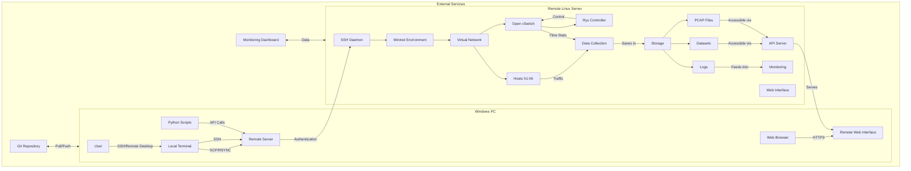

# 🛡️ AdDDoSDN Dataset Generation Framework

[](https://opensource.org/licenses/MIT)
[](https://www.python.org/)
[](http://mininet.org/)
[](https://ryu-sdn.org/)
[](https://github.com/nqmn/AdDDoSSDN-novel_adversarial_ddos_sdn_dataset/issues)

## 🌟 Overview

The AdDDoSDN Dataset Generation Framework is a powerful tool for creating comprehensive, labeled datasets of DDoS attacks in Software-Defined Networking (SDN) environments. This framework enables researchers and network security professionals to generate realistic network traffic scenarios, including both normal traffic patterns and various types of DDoS attacks, specifically designed to test and improve SDN-based intrusion detection systems.

### Key Features

- 🚀 **Multiple Attack Vectors**: Simulate various DDoS attack types including SYN Flood, UDP Flood, ICMP Flood, and advanced adversarial attacks
- 📊 **Rich Dataset Output**: Generates packet-level features, flow statistics, and CICFlowMeter-compatible datasets
- 🔍 **SDN Integration**: Native support for OpenFlow/SDN environments via Ryu controller
- 🧪 **Reproducible Experiments**: Configurable scenarios and parameters for consistent results
- 📈 **Performance Monitoring**: Real-time traffic and attack monitoring
- 🛠️ **Extensible Architecture**: Easy to add new attack types and network topologies

### ⚔️ Attack Types Involved

The framework simulates various DDoS attack vectors, each with specific characteristics and targets:

| Attack Type | Target Plane | Source | Destination | Protocol/Port | Description | Impact |
|-------------|--------------|--------|-------------|----------------|-------------|--------|
| **SYN Flood** | Data | h1 (10.0.0.1) | h6 (10.0.0.6) | TCP/80 | High-rate TCP SYN packets without completing handshakes | Web server resource exhaustion |
| **UDP Flood** | Data | h2 (10.0.0.2) | h4 (10.0.0.4) | UDP/53 | High-volume UDP packets to DNS service | DNS service disruption, bandwidth consumption |
| **ICMP Flood** | Data | h2 (10.0.0.2) | h4 (10.0.0.4) | ICMP | High-rate ICMP Echo Requests | Network congestion, service degradation |
| **Adversarial SYN** | Data/App | h2 (10.0.0.2) | h6 (10.0.0.6) | TCP/80 | Variable-rate SYN with TCP state exhaustion | Evades rate limiting, persistent connections |
| **Adversarial UDP** | Data/App | h2 (10.0.0.2) | h4 (10.0.0.4) | UDP/53 | Application layer mimicry with variable patterns | Harder detection, bypasses basic filters |
| **Multi-vector** | Data/App | h2 (10.0.0.2) | h4,h6 (10.0.0.4, 10.0.0.6) | Multiple | Combined attack vectors | Multi-layered impact across services |


## 🚀 Quick Start

### Prerequisites

- **OS**: Linux (Ubuntu 18.04/20.04 recommended)
- **Python**: 3.6 or higher
- **Root/Administrator privileges** (required for network emulation)
- **Mininet**: 2.3.0 or higher
- **Ryu SDN Framework**: 4.34 or higher
- **Other Dependencies**: See `config/requirements.txt`

### Installation

1. **Clone the repository**
   ```bash
   git clone https://github.com/nqmn/AdDDoSSDN-novel_adversarial_ddos_sdn_dataset.git
   cd AdDDoSSDN-novel_adversarial_ddos_sdn_dataset/dataset_generation
   ```

2. **Install system dependencies**
   ```bash
   # For Ubuntu/Debian
   sudo apt-get update
   sudo apt-get install -y python3-pip mininet openvswitch-switch
   ```

3. **Install Python dependencies**
   ```bash
   pip3 install -r config/requirements.txt
   pip3 install ryu  # Install Ryu SDN framework
   ```

### Basic Usage

1. **Run with default configuration**
   ```bash
   sudo python3 main.py
   ```

2. **Use a custom configuration file**
   ```bash
   sudo python3 main.py --config config/test_config.json
   ```

3. **Enable debug logging**
   ```bash
   sudo python3 main.py --debug
   ```

## 📂 Project Structure

```
dataset_generation/
├── config/                 # Configuration files
│   ├── config.json        # Main configuration
│   ├── test_config.json   # Test configuration
│   └── requirements.txt   # Python dependencies
│
├── data/                  # Generated datasets and logs
│   ├── *.pcap            # Raw packet captures
│   ├── *.csv             # Generated datasets
│   └── *.log             # Log files
│
├── docs/                  # Comprehensive documentation
│   ├── README.md         # Documentation overview
│   ├── progress.md       # Development progress
│   ├── analysis.md       # Dataset analysis
│   ├── scenario.md       # Attack scenarios
│   └── install.md        # Detailed installation guide
│
├── src/                   # Source code
│   ├── attacks/          # Attack generation scripts
│   │   ├── gen_syn_flood.py     # SYN flood attack
│   │   ├── gen_udp_flood.py     # UDP flood attack
│   │   └── gen_advanced_adversarial_ddos_attacks.py  # Advanced attacks
│   │
│   ├── controller/       # SDN controller code
│   │   └── ryu_controller_app.py  # Ryu controller application
│   │
│   ├── scripts/          # Utility scripts
│   ├── test/             # Test scripts
│   │   ├── simple_test.py       # Basic test
│   │   ├── run_remote_test.py   # Remote testing
│   │   └── check_remote.py      # Remote server checker
│   │
│   ├── utils/            # Helper functions
│   └── topology.py       # Network topology definition
│
└── main.py               # Main entry point
```

## 📊 Dataset Format

The framework generates three complementary datasets:

1. **Packet-level Features** (`packet_features.csv`)
   - Individual packet headers and metadata
   - 20+ features including IP/TCP/UDP headers
   - Binary and multi-class attack labels

2. **SDN Flow Features** (`ryu_flow_features.csv`)
   - Flow statistics from Ryu controller
   - 13+ flow-based features
   - Real-time monitoring capabilities

3. **CICFlow Features** (`cicflow_dataset.csv`)
   - Comprehensive flow analysis
   - 85+ statistical features
   - Compatible with CICFlowMeter format

### Dataset Overview

The framework generates three complementary datasets, each offering unique insights into network traffic patterns and attack behaviors:

| Dataset | Description | Features | Best For |
|---------|-------------|----------|----------|
| `packet_features.csv` | Packet-level features from raw traffic captures | 20 features | Deep packet inspection, signature-based detection, forensic analysis |
| `ryu_flow_features.csv` | Flow statistics collected from SDN controller | 13 features | Real-time monitoring, SDN-specific analysis, flow-based detection |
| `cicflow_dataset.csv` | Advanced flow features using CICFlowMeter | 85 features | Machine learning, behavioral analysis, anomaly detection |

### 1. Packet-level Features (`packet_features.csv`)

| Feature | Type | Description |
|---------|------|-------------|
| timestamp | datetime | Precise packet capture timestamp |
| packet_length | int | Total packet length in bytes |
| eth_type | int | Ethernet type (e.g., 0x0800 for IPv4) |
| ip_src | string | Source IP address |
| ip_dst | string | Destination IP address |
| ip_proto | int | IP protocol number (6=TCP, 17=UDP, 1=ICMP) |
| ip_ttl | int | Time to Live value |
| ip_id | int | IP identification field |
| ip_flags | string | IP flags (DF, MF) |
| ip_len | int | Total IP packet length |
| src_port | int | Source port (TCP/UDP) |
| dst_port | int | Destination port (TCP/UDP) |
| tcp_flags | string | TCP control flags (SYN, ACK, FIN, etc.) |
| tcp_seq | int | TCP sequence number |
| tcp_ack | int | TCP acknowledgment number |
| tcp_window | int | TCP window size |
| icmp_type | int | ICMP message type |
| icmp_code | int | ICMP message code |
| Label_multi | string | Multi-class attack type label |
| Label_binary | int | Binary label (0=normal, 1=attack) |

### 2. SDN Flow Features (`ryu_flow_features.csv`)

| Feature | Type | Description |
|---------|------|-------------|
| timestamp | datetime | Flow statistics collection time |
| datapath_id | string | OpenFlow switch identifier |
| flow_id | string | Unique flow identifier (Ryu's cookie) |
| ip_src | string | Source IP address |
| ip_dst | string | Destination IP address |
| port_src | int | Source port number |
| port_dst | int | Destination port number |
| ip_proto | int | IP protocol number |
| packet_count | int | Number of packets in flow |
| byte_count | int | Number of bytes in flow |
| duration_sec | float | Flow duration in seconds |
| Label_multi | string | Multi-class attack type |
| Label_binary | int | Binary label (0=normal, 1=attack) |

### 3. CICFlow Features (`cicflow_dataset.csv`)

This comprehensive dataset includes 83 flow-based features generated by CICFlowMeter, plus two label columns:

| Feature Category | Example Features | Description |
|------------------|------------------|-------------|
| Basic Flow Info | Flow Duration, Total Fwd/Bwd Packets | Basic flow statistics |
| Packet Length | Min/Max/Mean/Std of packet lengths | Statistical measures of packet sizes |
| Inter-arrival Times | Flow IAT Mean/Min/Max/Std | Timing between packets |
| TCP Flags | Fwd/Bwd PSH Flags, URG Flags | TCP control flag statistics |
| Flow Behavior | Init_Win_bytes_forward/backward | Initial window sizes |
| Connection State | Active/Idle Mean/Max | Connection state metrics |
| Labels | Label_multi, Label_binary | Attack classification labels |

### Dataset Comparison

| Feature | Packet-level | SDN Flow | CICFlow |
|---------|--------------|-----------|----------|
| **Granularity** | Packet | Flow | Flow |
| **Features** | 20 | 13 | 85 |
| **Real-time** | No | Yes | No |
| **Best For** | Signature detection | SDN monitoring | ML training |
| **Size** | Large | Medium | Very Large |
| **Processing** | Light | Light | Heavy |

## 🌐 Deployment Architecture

### Remote Server Deployment

The framework can be deployed in a remote server environment for large-scale testing and data collection. Below is the detailed architecture:



### Component Details

#### Windows PC Components
1. **Local Terminal**
   - SSH client for remote server access
   - SCP/RSYNC for file transfers
   - Git for version control

2. **Web Browser**
   - Access to web-based monitoring dashboards
   - Remote desktop access if GUI is needed

3. **Python Environment**
   - Local development and testing
   - API clients for remote server interaction

#### Remote Server Components
1. **SSH Daemon**
   - Secure remote access
   - Key-based authentication
   - Port forwarding capabilities

2. **Mininet Environment**
   - Network emulation
   - Virtual hosts and switches
   - Traffic generation

3. **Ryu Controller**
   - SDN controller application
   - Flow table management
   - Network monitoring

4. **Data Pipeline**
   - Real-time traffic capture
   - Flow statistics collection
   - Log aggregation

5. **Storage**
   - Structured datasets (CSV)
   - Raw packet captures (PCAP)
   - System and application logs

6. **Web Services**
   - RESTful API server
   - Real-time monitoring dashboard
   - Data visualization

### Network Flow
1. **Control Plane**
   - User commands from Windows PC → SSH → Remote Server
   - SDN controller → Open vSwitch (OVS) for flow management

2. **Data Plane**
   - Virtual hosts generate traffic through OVS
   - Traffic is monitored and logged
   - Flow statistics are collected by the controller

3. **Data Flow**
   - Raw data → Processing pipeline → Storage
   - Storage → Analytics → Visualization
   - Alerts and notifications for anomalies

### Security Considerations
- All remote access uses SSH with key-based authentication
- Firewall rules restrict access to necessary ports
- Data in transit is encrypted (SSH/HTTPS)
- Regular security updates and patches
- Role-based access control for different users

## 🔧 Configuration

Customize the dataset generation by modifying `config/config.json`:

```json
{
    "mininet_topology": "topology.py",
    "ryu_app": "controller/ryu_controller_app.py",
    "controller_port": 6633,
    "api_port": 8080,
    "attack_duration": 300,
    "normal_duration": 300,
    "output_dir": "data",
    "pcap_file": "traffic.pcap",
    "features_file": "packet_features.csv",
    "flow_features_file": "flow_features.csv",
    "timeline_file": "timeline.csv",
    "attacks": [
        {
            "name": "syn_flood",
            "start_time": 60,
            "duration": 120,
            "target": "10.0.0.6",
            "target_port": 80,
            "rate": 1000
        }
    ]
}
```

## 🛠️ Development

### Adding New Attacks

1. Create a new attack script in `src/attacks/`
2. Implement the attack logic following existing patterns
3. Update the configuration file to include your new attack
4. Test using the test framework

### Running Tests

```bash
# Run all tests
python -m pytest src/test/

# Run specific test
python -m pytest src/test/test_feature_extraction.py -v
```

## 🤝 Contributing

Contributions are welcome! Please follow these steps:

1. Fork the repository
2. Create a feature branch
3. Commit your changes
4. Push to the branch
5. Create a Pull Request

## 📚 Documentation

For detailed documentation, including API references and usage examples, please see the [documentation](docs/README.md).

## 📄 License

This project is licensed under the MIT License - see the [LICENSE](LICENSE) file for details.

## 📝 Citation

If you use this dataset or framework in your research, please cite our work:

```bibtex
@misc{sdn_ddos_dataset_2023,
  title = {{AdDDoS-SDN - A Novel Dataset for Adversarial DDoS Detection for SDNs}},
  author = {Mohd Adil Mokti},
  year = {2025},
  publisher = {GitHub},
  howpublished = {\url{https://github.com/nqmn/AdDDoSSDN-novel_adversarial_ddos_sdn_dataset}}
}
```

## 📧 Contact

For questions or support, please open an issue on the [GitHub repository](https://github.com/nqmn/AdDDoSSDN-novel_adversarial_ddos_sdn_dataset/issues).

---

<div align="center">
  <p>Built with ❤️ for the Network Security Community</p>
  <p>© 2025 NQMN</p>
</div>
