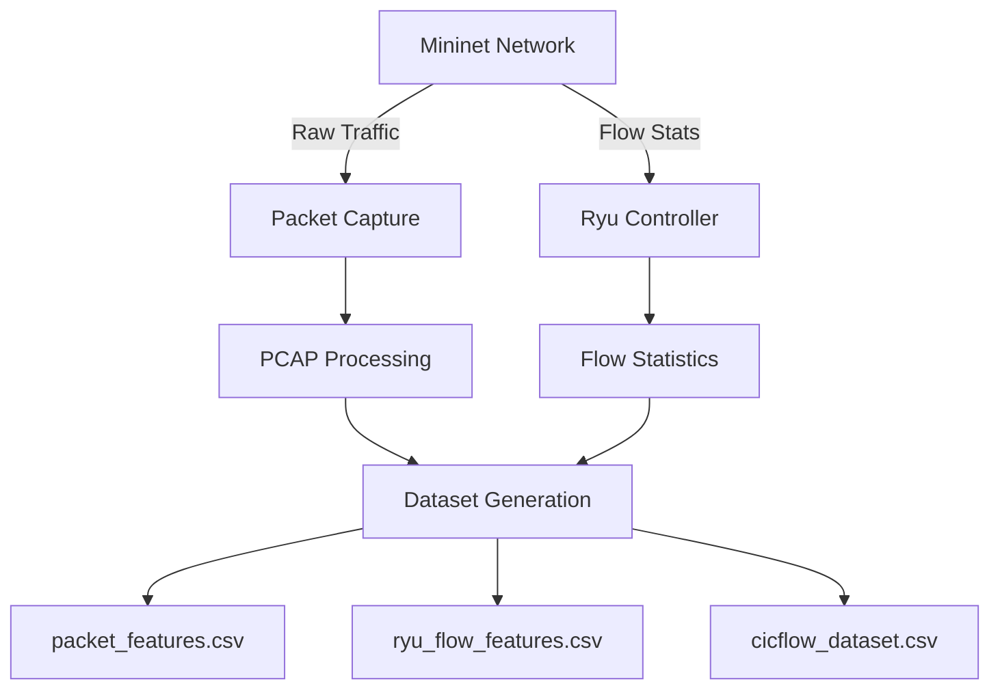

<div align="center">

# 🛡️ SDN DDoS Dataset Generation Framework

[](https://opensource.org/licenses/MIT)
[](https://www.python.org/)
[](http://mininet.org/)
[](https://ryu-sdn.org/)

</div>

## 🌟 Overview

This project provides a comprehensive framework for generating labeled DDoS attack datasets in a Software-Defined Networking (SDN) environment. It simulates both normal network traffic and various types of DDoS attacks to create realistic datasets for training and evaluating machine learning-based intrusion detection systems.

### 🎯 Key Features

- **Diverse Attack Vectors**: Simulates both traditional and advanced adversarial DDoS attacks
- **SDN Environment**: Leverages Mininet for network emulation and Ryu as the SDN controller
- **Rich Dataset**: Generates multiple dataset formats including packet-level and flow-level features
- **Extensible Architecture**: Easy to add new attack types and traffic patterns
- **Comprehensive Labeling**: Includes both binary and multi-class labels for machine learning

### 🚀 Quick Start

```bash
# Clone the repository
git clone https://github.com/yourusername/sdn-ddos-dataset.git
cd sdn-ddos-dataset/dataset_generation

# Install dependencies
pip install -r requirements.txt

# Start the dataset generation (requires sudo)
sudo python3 main.py
```

## 🏗️ System Architecture



## 🔍 Dataset Overview

The framework generates three main datasets, each serving different analysis purposes:

| Dataset | Level | Features | Format | Description |
|---------|-------|----------|--------|-------------|
| `packet_features.csv` | Packet | 20+ | CSV | Raw packet captures with extracted headers |
| `ryu_flow_features.csv` | Flow | 15+ | CSV | SDN controller flow statistics |
| `cicflow_dataset.csv` | Flow | 80+ | CSV | Advanced flow features using CICFlowMeter |

### 📊 Attack Types

| Attack Category | Type | Target | Description |
|-----------------|------|--------|-------------|
| **Traditional** | SYN Flood | Network | Overwhelms target with SYN packets |
| | UDP Flood | Network | Floods target with UDP packets |
| | ICMP Flood | Network | Overloads target with ICMP Echo Requests |
| **Adversarial** | Slow Read | Application | Slowly consumes server resources |
| | Slowloris | Application | Keeps connections open as long as possible |
| | RUDY | Application | Sends slow HTTP POST requests |
| | HULK | Application | Generates unique obfuscated traffic |

## 🛠️ Installation

### Prerequisites

- Ubuntu 18.04/20.04 LTS (recommended)
- Python 3.6+
- Mininet 2.3.0+
- Ryu SDN Framework 4.34+
- tcpdump/dumpcap
- Scapy 2.4.0+

### Step-by-Step Setup

1. **Install System Dependencies**
   ```bash
   # Update package lists
   sudo apt-get update
   
   # Install required packages
   sudo apt-get install -y python3-pip mininet tcpdump
   
   # Install Ryu SDN Framework
   pip3 install ryu
   
   # Install Python dependencies
   pip3 install -r requirements.txt
   ```

2. **Configure Sudoers (Optional)**
   ```bash
   # Allow passwordless sudo for Mininet and Ryu
   echo "$USER ALL=(ALL) NOPASSWD: /usr/bin/mn" | sudo tee -a /etc/sudoers
   echo "$USER ALL=(ALL) NOPASSWD: $(which ryu-manager)" | sudo tee -a /etc/sudoers
   ```

## 🚦 Usage

### Basic Execution

```bash
# Start the dataset generation
sudo python3 main.py
```

### Configuration

Modify `config.json` to customize the experiment:

```json
{
    "mininet_topology": "topology.py",
    "ryu_app": "controller/ryu_controller_app.py",
    "controller_port": 6633,
    "api_port": 8080,
    "traffic_types": {
        "normal": {
            "duration": 300,
            "scapy_commands": [
                {"host": "h3", "command": "sendp(Ether()/IP(dst='10.0.0.5')/TCP(dport=80, flags='S'), loop=1, inter=0.1)"}
            ]
        },
        "attacks": [
            {
                "type": "syn_flood",
                "duration": 60,
                "attacker": "h1",
                "victim": "h6",
                "script_name": "gen_syn_flood.py"
            }
        ]
    }
}
```

### Adding New Attacks

1. Create a new attack script in the `attacks/` directory:
   ```python
   # attacks/gen_new_attack.py
   from scapy.all import *
   import time
   
   def run_attack(attacker_host, victim_ip, duration):
       print(f"Starting attack from {attacker_host.name} to {victim_ip}")
       start_time = time.time()
       while time.time() - start_time < duration:
           # Your attack logic here
           send(IP(dst=victim_ip)/TCP(dport=80, flags='S'), verbose=0)
   ```

2. Add the attack to `config.json`:
   ```json
   {
       "type": "new_attack",
       "duration": 45,
       "attacker": "h1",
       "victim": "h4",
       "script_name": "gen_new_attack.py"
   }
   ```

## 📊 Dataset Format

### Packet-Level Features (`packet_features.csv`)
- Timestamp
- Source/Destination IP and Port
- Protocol
- Packet size
- TCP flags
- TTL
- And more...

### Flow-Level Features (`ryu_flow_features.csv`)
- Flow start/end time
- Source/Destination IP and Port
- Protocol
- Packet/Byte counts
- Flow duration
- Label (attack type)

### CICFlow Features (`cicflow_dataset.csv`)
- 80+ statistical features including:
  - Flow duration
  - Packet length statistics
  - Inter-arrival times
  - Protocol-specific features
  - Label (attack type)

## 📚 Documentation

For detailed documentation, please refer to:

- [Scenario Documentation](scenario.md) - Detailed network topology and attack scenarios
- [Installation Guide](install.md) - Complete installation instructions
- [Analysis](analysis.md) - Dataset analysis and statistics
- [Progress](progress.md) - Development progress and roadmap

## 🤝 Contributing

Contributions are welcome! Please read our [contributing guidelines](CONTRIBUTING.md) before submitting pull requests.

## 📄 License

This project is licensed under the MIT License - see the [LICENSE](LICENSE) file for details.

## 📧 Contact

For questions or feedback, please open an issue or contact [your-email@example.com](mailto:your-email@example.com).

---

<div align="center">
  Made with ❤️ for Network Security Research
</div>

## 🔄 Execution Workflow

### Expected Execution Sequence

1. **Environment Initialization**
   - Verify all dependencies and permissions
   - Load configuration from `config.json`
   - Initialize logging and output directories

2. **SDN Controller Launch**
   - Start Ryu SDN controller with the specified application
   - Initialize REST API for flow statistics collection

3. **Mininet Network Setup**
   - Create virtual network topology
   - Configure Open vSwitch with SDN controller
   - Set up host networking and routes

4. **Data Collection Initialization**
   - Start packet capture on all interfaces
   - Initialize flow statistics collection
   - Set up dataset storage

5. **Traffic Generation**
   - **Phase 1: Normal Traffic**
     - Generate baseline network traffic
     - Collect labeled normal traffic samples
     
   - **Phase 2: Attack Traffic**
     - Launch configured DDoS attacks
     - Monitor network behavior during attacks
     - Collect attack traffic samples

6. **Data Processing**
   - Process PCAP files to extract features
   - Aggregate flow statistics
   - Generate labeled datasets

7. **Cleanup**
   - Stop all network traffic
   - Terminate Mininet network
   - Stop SDN controller
   - Finalize dataset files

### Monitoring Progress

During execution, the system provides real-time feedback:

```
[INFO] Starting SDN DDoS Dataset Generation
[STATUS] Ryu Controller: RUNNING (http://localhost:8080)
[STATUS] Mininet Network: INITIALIZED
[PROGRESS] Phase 1/2: Normal Traffic (60s remaining)
[STATUS] Capturing: 1,245 packets (45.6 MB)
[STATUS] Flows: 342 active
```


## 5. Deliverables Verification

Upon successful completion, verify that the following files have been created in the `dataset_generation` directory:

The provision of three distinct datasets—packet-level, SDN controller flow-level, and advanced flow-level (CICFlow)—is intentional, offering a multi-faceted view of network traffic. Each dataset caters to different analytical needs and machine learning applications:
- **Packet-level data (`packet_features.csv`)** provides the most granular view, capturing individual packet characteristics. This is crucial for deep-dive analysis, understanding low-level attack signatures, and developing models that require fine-grained features.
- **SDN controller flow-level data (`ryu_flow_features.csv`)** offers insights directly from the network's control plane. This dataset is invaluable for real-time anomaly detection within SDN environments, as it reflects the controller's perspective on traffic flows and can be used to develop proactive mitigation strategies.
- **Advanced flow-level data (`cicflow_dataset.csv`)** generated by CICFlowMeter, provides a rich set of statistical features derived from aggregated packet information. This higher-level abstraction is highly effective for machine learning models, as it summarizes flow behavior, making it easier to identify complex attack patterns and reducing the dimensionality of the data compared to raw packet captures.

-   `packet_features.csv`: A CSV file containing processed offline traffic data. This dataset provides **packet-level features** and is ideal for detailed analysis of individual packet characteristics and for building models that require granular network information. It contains **20 features** including the labels.
    -   `timestamp`: Packet capture timestamp.
    -   `packet_length`: Total length of the captured packet in bytes.
    -   `eth_type`: Ethernet type (e.g., 0x0800 for IPv4).
    -   `ip_src`: Source IP address.
    -   `ip_dst`: Destination IP address.
    -   `ip_proto`: IP protocol number (e.g., 6 for TCP, 17 for UDP, 1 for ICMP).
    -   `ip_ttl`: Time to Live.
    -   `ip_id`: IP identification field.
    -   `ip_flags`: IP flags (e.g., Don't Fragment, More Fragments).
    -   `ip_len`: Total length of the IP packet (including IP header and data).
    -   `src_port`: Source port (for TCP/UDP packets).
    -   `dst_port`: Destination port (for TCP/UDP packets).
    -   `tcp_flags`: TCP flags (e.g., SYN, ACK, FIN, RST, PSH, URG).
    -   `tcp_seq`: TCP Sequence Number.
    -   `tcp_ack`: TCP Acknowledgment Number.
    -   `tcp_window`: TCP Window Size.
    -   `icmp_type`: ICMP Type (for ICMP packets).
    -   `icmp_code`: ICMP Code (for ICMP packets).
    -   `Label_multi`: This column provides a multi-class label indicating the specific type of traffic or attack (e.g., 'normal', 'syn_flood', 'udp_flood', 'icmp_flood', 'ad_syn_flood', 'ad_udp_flood', 'ad_icmp_flood', 'ad_multi_vector'). This is useful for fine-grained classification tasks.
    -   `Label_binary`: This column provides a binary label for traffic classification, where `0` indicates 'normal' traffic and `1` indicates any type of 'attack' traffic. This is suitable for binary classification (anomaly detection) models.

-   `ryu_flow_features.csv`: A CSV file containing flow statistics polled from the Ryu controller. This dataset provides **flow-level features** directly from the SDN controller, making it suitable for real-time anomaly detection and control plane analysis. It contains **13 features** including the labels.
    -   `timestamp`: The timestamp when the flow statistics were polled.
    -   `datapath_id`: The unique identifier of the OpenFlow switch (DPID).
    -   `flow_id`: A unique identifier for the flow (Ryu's cookie).
    -   `ip_src`: Source IP address of the flow.
    -   `ip_dst`: Destination IP address of the flow.
    -   `port_src`: Source port of the flow (TCP or UDP).
    -   `port_dst`: Destination port of the flow (TCP or UDP).
    -   `ip_proto`: IP protocol number of the flow.
    -   `packet_count`: Number of packets that matched this flow entry.
    -   `byte_count`: Number of bytes that matched this flow entry.
    -   `duration_sec`: Duration of the flow in seconds.
    -   `Label_multi`: This column provides a multi-class label indicating the specific type of traffic or attack (e.g., 'normal', 'syn_flood', 'udp_flood', 'icmp_flood', 'ad_syn_flood', 'ad_udp_flood', 'ad_icmp_flood', 'ad_multi_vector'). This is useful for fine-grained classification tasks.
    -   `Label_binary`: This column provides a binary label for traffic classification, where `0` indicates 'normal' traffic and `1` indicates any type of 'attack' traffic. This is suitable for binary classification (anomaly detection) models.

-   `traffic.pcap`: The raw packet capture from the simulation.
-   `label_timeline.csv`: A CSV file containing the timeline of normal and attack traffic labels.

-   `cicflow_dataset.csv`: A CSV file generated from `traffic.pcap` using CICFlowMeter. This dataset provides **advanced flow-level features** derived from packet data, offering a richer set of statistical metrics for in-depth traffic analysis and machine learning model training. It contains 83 flow features extracted by CICFlowMeter and an additional `Label_multi` and `Label_binary` column, totaling **85 features**.

If these files are present, the operation was a success.

## 🔧 Troubleshooting

### Common Issues

1. **Permission Denied Errors**
   ```bash
   # Ensure proper sudo configuration
   sudo visudo
   # Add: username ALL=(ALL) NOPASSWD: /usr/bin/mn, /usr/local/bin/ryu-manager
   ```

2. **Port Conflicts**
   ```bash
   # Check for processes using required ports
   sudo lsof -i :6633  # Controller port
   sudo lsof -i :8080  # REST API port
   ```

3. **Missing Dependencies**
   ```bash
   # Verify all required packages
   pip3 install -r requirements.txt
   sudo apt-get install -y mininet openvswitch-testcontroller
   ```

### Getting Help

For additional support:
<!-- - Check the [issue tracker](https://github.com/yourusername/sdn-ddos-dataset/issues) -->
- Review the [documentation](docs/)
<!-- - Join our [community forum](https://github.com/yourusername/sdn-ddos-dataset/discussions) -->

## 📈 Performance Considerations

### Resource Requirements

| Component | Minimum | Recommended |
|-----------|---------|-------------|
| CPU Cores | 2 | 4+ |
| RAM | 4GB | 8GB+ |
| Storage | 10GB | 50GB+ (for large captures) |
| OS | Ubuntu 18.04+ | Ubuntu 20.04 LTS |

### Optimization Tips

1. **For Better Performance**
   - Use SSD storage for packet capture
   - Increase system limits for file descriptors
   - Run with minimal GUI overhead (use `--link=tc` in Mininet)

2. **For Larger Deployments**
   - Distribute components across multiple machines
   - Use hardware-accelerated Open vSwitch
   - Implement sampling for high-speed networks

## 🤝 Community & Support

### Contributing

We welcome contributions! Please see our [Contributing Guidelines](CONTRIBUTING.md) for details on how to contribute to this project.

### Getting Help

- **Documentation**: [Read the Docs](https://sdn-ddos-dataset.readthedocs.io/)
<!-- - **Issues**: [Report a Bug](https://github.com/yourusername/sdn-ddos-dataset/issues) -->
<!-- - **Discussions**: [Join the Conversation](https://github.com/yourusername/sdn-ddos-dataset/discussions) -->

### Related Projects

- [Mininet](http://mininet.org/)
- [Ryu SDN Framework](https://ryu-sdn.org/)
- [CICFlowMeter](https://www.unb.ca/cic/datasets/andmalnet-doc.html)

## 📜 Citation

If you use this dataset in your research, please cite our work:

```bibtex
@misc{sdn_ddos_dataset_2023,
  title = {{AdDDoS-SDN - A Novel Dataset for Adversarial DDoS Detection for SDNs}},
  author = {Mohd Adil. Mokti},
  year = {2025},
  publisher = {GitHub},
  howpublished = {\url{https://github.com/nqmn/AdDDoSSDN-novel_adversarial_ddos_sdn_dataset}}
}
```

## 📄 License

This project is licensed under the MIT License - see the [LICENSE](LICENSE) file for details.

---

<div align="center">
  <p>Built with ❤️ for the Network Security Community</p>
  <p>© 2025 NQMN</p>
</div>