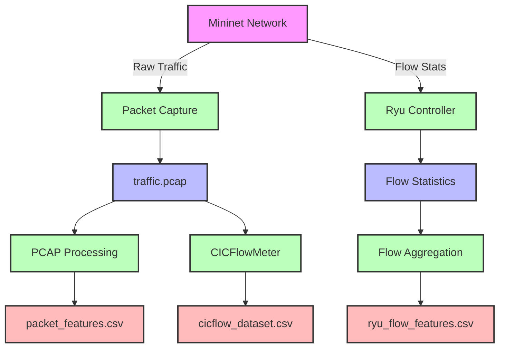

<div align="center">

# 🛡️ SDN DDoS Dataset Generation Framework

[](https://opensource.org/licenses/MIT)
[](https://www.python.org/)
[](http://mininet.org/)
[](https://ryu-sdn.org/)

</div>

## 🌟 Overview

This project provides a comprehensive framework for generating labeled DDoS attack datasets in a Software-Defined Networking (SDN) environment. It simulates both normal network traffic and various types of DDoS attacks to create realistic datasets for training and evaluating machine learning-based intrusion detection systems.

### 🎯 Key Features

- **Diverse Attack Vectors**: Simulates both traditional and advanced adversarial DDoS attacks
- **SDN Environment**: Leverages Mininet for network emulation and Ryu as the SDN controller
- **Rich Dataset**: Generates multiple dataset formats including packet-level and flow-level features
- **Extensible Architecture**: Easy to add new attack types and traffic patterns
- **Comprehensive Labeling**: Includes both binary and multi-class labels for machine learning

### 🚀 Quick Start

```bash
# Clone the repository
git clone https://github.com/yourusername/sdn-ddos-dataset.git
cd sdn-ddos-dataset/dataset_generation

# Install dependencies
pip install -r requirements.txt

# Start the dataset generation (requires sudo)
sudo python3 main.py
```

## 🏗️ System Architecture



### Data Flow Explanation:

1. **Network Traffic Generation**
   - Mininet generates both normal and attack traffic
   - All traffic is captured to `traffic.pcap`
   - Flow statistics are collected via Ryu SDN Controller

2. **Dataset Generation Paths**:
   
   a) **Packet-level Features** (`packet_features.csv`):
   - Directly processed from `traffic.pcap`
   - Extracts individual packet headers and metadata
   
   b) **SDN Flow Features** (`ryu_flow_features.csv`):
   - Aggregated from Ryu controller's flow statistics
   - Provides real-time flow monitoring capabilities
   
   c) **CICFlow Features** (`cicflow_dataset.csv`):
   - Generated by processing `traffic.pcap` with CICFlowMeter
   - Produces 83+ statistical flow features
   - Includes bidirectional flow analysis
```

## 🔍 Dataset Overview

The framework generates three main datasets, each serving different analysis purposes:

| Dataset | Level | Features | Format | Description |
|---------|-------|----------|--------|-------------|
| `packet_features.csv` | Packet | 20+ | CSV | Raw packet captures with extracted headers |
| `ryu_flow_features.csv` | Flow | 15+ | CSV | SDN controller flow statistics |
| `cicflow_dataset.csv` | Flow | 80+ | CSV | Advanced flow features using CICFlowMeter |

### 📊 Attack Types

| Attack Category | Type | Target | Description |
|-----------------|------|--------|-------------|
| **Traditional** | SYN Flood | Network | Overwhelms target with SYN packets |
| | UDP Flood | Network | Floods target with UDP packets |
| | ICMP Flood | Network | Overloads target with ICMP Echo Requests |
| **Adversarial** | Slow Read | Application | Slowly consumes server resources |
| | Slowloris | Application | Keeps connections open as long as possible |
| | RUDY | Application | Sends slow HTTP POST requests |
| | HULK | Application | Generates unique obfuscated traffic |

## 🛠️ Installation

### Prerequisites

- Ubuntu 18.04/20.04 LTS (recommended)
- Python 3.6+
- Mininet 2.3.0+
- Ryu SDN Framework 4.34+
- tcpdump/dumpcap
- Scapy 2.4.0+

### Step-by-Step Setup

1. **Install System Dependencies**
   ```bash
   # Update package lists
   sudo apt-get update
   
   # Install required packages
   sudo apt-get install -y python3-pip mininet tcpdump
   
   # Install Ryu SDN Framework
   pip3 install ryu
   
   # Install Python dependencies
   pip3 install -r requirements.txt
   ```

2. **Configure Sudoers (Optional)**
   ```bash
   # Allow passwordless sudo for Mininet and Ryu
   echo "$USER ALL=(ALL) NOPASSWD: /usr/bin/mn" | sudo tee -a /etc/sudoers
   echo "$USER ALL=(ALL) NOPASSWD: $(which ryu-manager)" | sudo tee -a /etc/sudoers
   ```

## 🚦 Usage

### Basic Execution

```bash
# Start the dataset generation
sudo python3 main.py
```

### Configuration

Modify `config.json` to customize the experiment:

```json
{
    "mininet_topology": "topology.py",
    "ryu_app": "controller/ryu_controller_app.py",
    "controller_port": 6633,
    "api_port": 8080,
    "traffic_types": {
        "normal": {
            "duration": 300,
            "scapy_commands": [
                {"host": "h3", "command": "sendp(Ether()/IP(dst='10.0.0.5')/TCP(dport=80, flags='S'), loop=1, inter=0.1)"}
            ]
        },
        "attacks": [
            {
                "type": "syn_flood",
                "duration": 60,
                "attacker": "h1",
                "victim": "h6",
                "script_name": "gen_syn_flood.py"
            }
        ]
    }
}
```

### Adding New Attacks

1. Create a new attack script in the `attacks/` directory:
   ```python
   # attacks/gen_new_attack.py
   from scapy.all import *
   import time
   
   def run_attack(attacker_host, victim_ip, duration):
       print(f"Starting attack from {attacker_host.name} to {victim_ip}")
       start_time = time.time()
       while time.time() - start_time < duration:
           # Your attack logic here
           send(IP(dst=victim_ip)/TCP(dport=80, flags='S'), verbose=0)
   ```

2. Add the attack to `config.json`:
   ```json
   {
       "type": "new_attack",
       "duration": 45,
       "attacker": "h1",
       "victim": "h4",
       "script_name": "gen_new_attack.py"
   }
   ```

## 📊 Dataset Format

### Packet-Level Features (`packet_features.csv`)
- Timestamp
- Source/Destination IP and Port
- Protocol
- Packet size
- TCP flags
- TTL
- And more...

### Flow-Level Features (`ryu_flow_features.csv`)
- Flow start/end time
- Source/Destination IP and Port
- Protocol
- Packet/Byte counts
- Flow duration
- Label (attack type)

### CICFlow Features (`cicflow_dataset.csv`)
- 80+ statistical features including:
  - Flow duration
  - Packet length statistics
  - Inter-arrival times
  - Protocol-specific features
  - Label (attack type)


---

## 🔄 Execution Workflow

### Expected Execution Sequence

1. **Environment Initialization**
   - Verify all dependencies and permissions
   - Load configuration from `config.json`
   - Initialize logging and output directories

2. **SDN Controller Launch**
   - Start Ryu SDN controller with the specified application
   - Initialize REST API for flow statistics collection

3. **Mininet Network Setup**
   - Create virtual network topology
   - Configure Open vSwitch with SDN controller
   - Set up host networking and routes

4. **Data Collection Initialization**
   - Start packet capture on all interfaces
   - Initialize flow statistics collection
   - Set up dataset storage

5. **Traffic Generation**
   - **Phase 1: Normal Traffic**
     - Generate baseline network traffic
     - Collect labeled normal traffic samples
     
   - **Phase 2: Attack Traffic**
     - Launch configured DDoS attacks
     - Monitor network behavior during attacks
     - Collect attack traffic samples

6. **Data Processing**
   - Process PCAP files to extract features
   - Aggregate flow statistics
   - Generate labeled datasets

7. **Cleanup**
   - Stop all network traffic
   - Terminate Mininet network
   - Stop SDN controller
   - Finalize dataset files

### Monitoring Progress

During execution, the system provides real-time feedback:

```
[INFO] Starting SDN DDoS Dataset Generation
[STATUS] Ryu Controller: RUNNING (http://localhost:8080)
[STATUS] Mininet Network: INITIALIZED
[PROGRESS] Phase 1/2: Normal Traffic (60s remaining)
[STATUS] Capturing: 1,245 packets (45.6 MB)
[STATUS] Flows: 342 active
```


## 📊 Dataset Overview

The framework generates three complementary datasets, each offering unique insights into network traffic patterns and attack behaviors:

| Dataset | Description | Features | Best For |
|---------|-------------|----------|----------|
| `packet_features.csv` | Packet-level features from raw traffic captures | 20 features | Deep packet inspection, signature-based detection, forensic analysis |
| `ryu_flow_features.csv` | Flow statistics collected from SDN controller | 13 features | Real-time monitoring, SDN-specific analysis, flow-based detection |
| `cicflow_dataset.csv` | Advanced flow features using CICFlowMeter | 85 features | Machine learning, behavioral analysis, anomaly detection |

## 📂 Dataset Details

### 1. Packet-level Features (`packet_features.csv`)

| Feature | Type | Description |
|---------|------|-------------|
| timestamp | datetime | Precise packet capture timestamp |
| packet_length | int | Total packet length in bytes |
| eth_type | int | Ethernet type (e.g., 0x0800 for IPv4) |
| ip_src | string | Source IP address |
| ip_dst | string | Destination IP address |
| ip_proto | int | IP protocol number (6=TCP, 17=UDP, 1=ICMP) |
| ip_ttl | int | Time to Live value |
| ip_id | int | IP identification field |
| ip_flags | string | IP flags (DF, MF) |
| ip_len | int | Total IP packet length |
| src_port | int | Source port (TCP/UDP) |
| dst_port | int | Destination port (TCP/UDP) |
| tcp_flags | string | TCP control flags (SYN, ACK, FIN, etc.) |
| tcp_seq | int | TCP sequence number |
| tcp_ack | int | TCP acknowledgment number |
| tcp_window | int | TCP window size |
| icmp_type | int | ICMP message type |
| icmp_code | int | ICMP message code |
| Label_multi | string | Multi-class attack type label |
| Label_binary | int | Binary label (0=normal, 1=attack) |

### 2. SDN Flow Features (`ryu_flow_features.csv`)

| Feature | Type | Description |
|---------|------|-------------|
| timestamp | datetime | Flow statistics collection time |
| datapath_id | string | OpenFlow switch identifier |
| flow_id | string | Unique flow identifier (Ryu's cookie) |
| ip_src | string | Source IP address |
| ip_dst | string | Destination IP address |
| port_src | int | Source port number |
| port_dst | int | Destination port number |
| ip_proto | int | IP protocol number |
| packet_count | int | Number of packets in flow |
| byte_count | int | Number of bytes in flow |
| duration_sec | float | Flow duration in seconds |
| Label_multi | string | Multi-class attack type |
| Label_binary | int | Binary label (0=normal, 1=attack) |

### 3. CICFlow Features (`cicflow_dataset.csv`)

This comprehensive dataset includes 83 flow-based features generated by CICFlowMeter, plus two label columns:

| Feature Category | Example Features | Description |
|------------------|------------------|-------------|
| Basic Flow Info | Flow Duration, Total Fwd/Bwd Packets | Basic flow statistics |
| Packet Length | Min/Max/Mean/Std of packet lengths | Statistical measures of packet sizes |
| Inter-arrival Times | Flow IAT Mean/Min/Max/Std | Timing between packets |
| TCP Flags | Fwd/Bwd PSH Flags, URG Flags | TCP control flag statistics |
| Flow Behavior | Init_Win_bytes_forward/backward | Initial window sizes |
| Connection State | Active/Idle Mean/Max | Connection state metrics |
| Labels | Label_multi, Label_binary | Attack classification labels |

## 📦 Additional Files

| File | Description |
|------|-------------|
| `traffic.pcap` | Raw packet capture in PCAP format |
| `label_timeline.csv` | Timeline of normal and attack traffic periods |
| `config.json` | Configuration file for dataset generation |
| `requirements.txt` | Python dependencies |

## 🔍 Dataset Comparison

| Feature | Packet-level | SDN Flow | CICFlow |
|---------|--------------|-----------|----------|
| **Granularity** | Packet | Flow | Flow |
| **Features** | 20 | 13 | 85 |
| **Real-time** | No | Yes | No |
| **Best For** | Signature detection | SDN monitoring | ML training |
| **Size** | Large | Medium | Very Large |
| **Processing** | Light | Light | Heavy |

If these files are present, the operation was a success.

## 🔧 Troubleshooting

### Common Issues

1. **Permission Denied Errors**
   ```bash
   # Ensure proper sudo configuration
   sudo visudo
   # Add: username ALL=(ALL) NOPASSWD: /usr/bin/mn, /usr/local/bin/ryu-manager
   ```

2. **Port Conflicts**
   ```bash
   # Check for processes using required ports
   sudo lsof -i :6633  # Controller port
   sudo lsof -i :8080  # REST API port
   ```

3. **Missing Dependencies**
   ```bash
   # Verify all required packages
   pip3 install -r requirements.txt
   sudo apt-get install -y mininet openvswitch-testcontroller
   ```

### Getting Help

For additional support:
<!-- - Check the [issue tracker](https://github.com/yourusername/sdn-ddos-dataset/issues) -->
- Review the [documentation](docs/)
<!-- - Join our [community forum](https://github.com/yourusername/sdn-ddos-dataset/discussions) -->

## 📈 Performance Considerations

### Resource Requirements

| Component | Minimum | Recommended |
|-----------|---------|-------------|
| CPU Cores | 2 | 4+ |
| RAM | 4GB | 8GB+ |
| Storage | 10GB | 50GB+ (for large captures) |
| OS | Ubuntu 18.04+ | Ubuntu 20.04 LTS |

### Optimization Tips

1. **For Better Performance**
   - Use SSD storage for packet capture
   - Increase system limits for file descriptors
   - Run with minimal GUI overhead (use `--link=tc` in Mininet)

2. **For Larger Deployments**
   - Distribute components across multiple machines
   - Use hardware-accelerated Open vSwitch
   - Implement sampling for high-speed networks

## 🤝 Community & Support

### Contributing

We welcome contributions! Please see our [Contributing Guidelines](CONTRIBUTING.md) for details on how to contribute to this project.

### Getting Help

- **Documentation**: [Read the Docs](https://sdn-ddos-dataset.readthedocs.io/)
<!-- - **Issues**: [Report a Bug](https://github.com/yourusername/sdn-ddos-dataset/issues) -->
<!-- - **Discussions**: [Join the Conversation](https://github.com/yourusername/sdn-ddos-dataset/discussions) -->

### Related Projects

- [Mininet](http://mininet.org/)
- [Ryu SDN Framework](https://ryu-sdn.org/)
- [CICFlowMeter](https://www.unb.ca/cic/datasets/andmalnet-doc.html)

## 📜 Citation

If you use this dataset in your research, please cite our work:

```bibtex
@misc{sdn_ddos_dataset_2023,
  title = {{AdDDoS-SDN - A Novel Dataset for Adversarial DDoS Detection for SDNs}},
  author = {Mohd Adil. Mokti},
  year = {2025},
  publisher = {GitHub},
  howpublished = {\url{https://github.com/nqmn/AdDDoSSDN-novel_adversarial_ddos_sdn_dataset}}
}
```

## 📄 License

This project is licensed under the MIT License - see the [LICENSE](LICENSE) file for details.

---

<div align="center">
  <p>Built with ❤️ for the Network Security Community</p>
  <p>© 2025 NQMN</p>
</div>