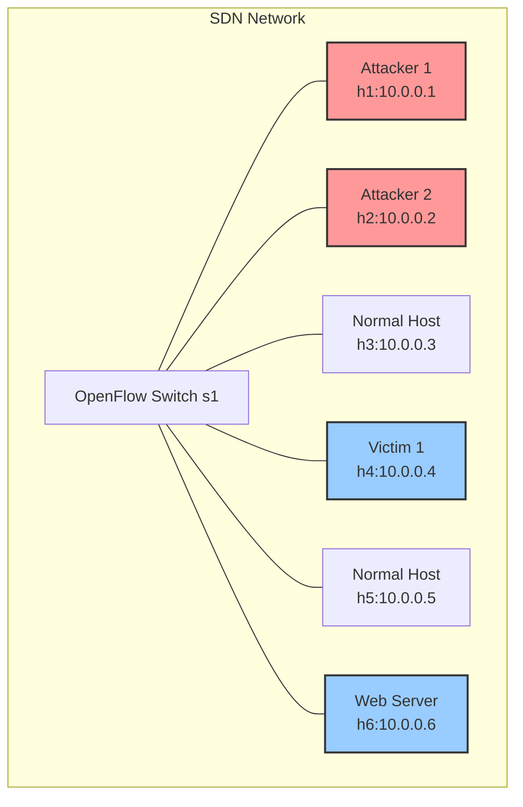
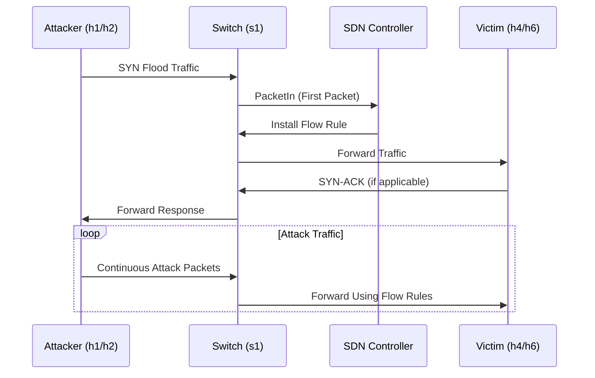
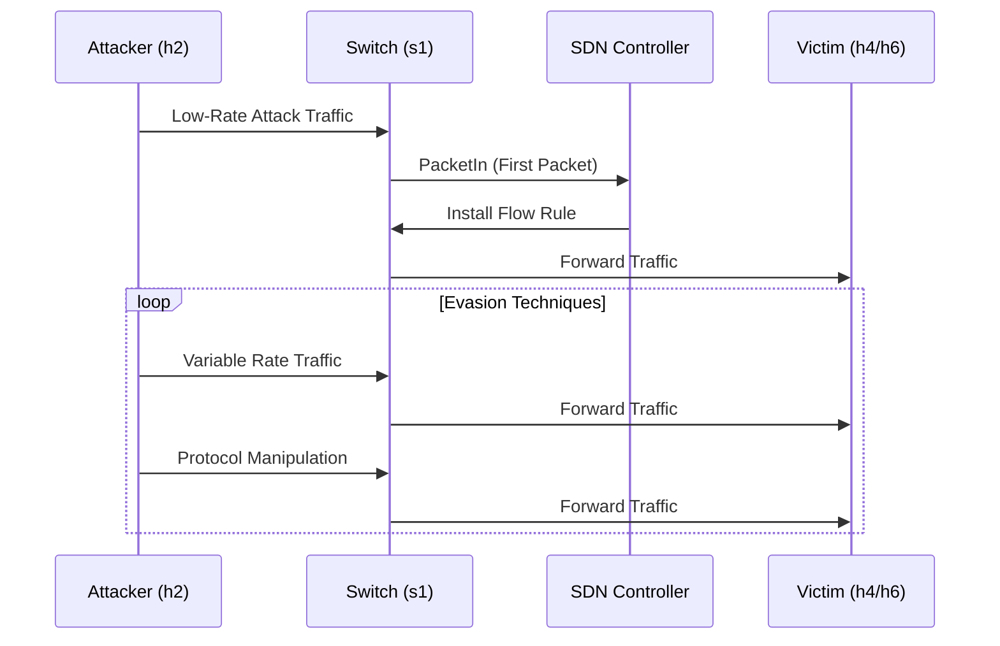
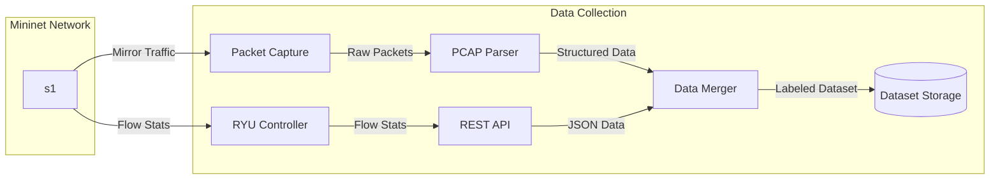

# SDN DDoS Dataset Generation Scenario

This document provides a comprehensive overview of the Mininet host scenario for DDoS dataset generation, including detailed network architecture, host roles, traffic patterns, and attack flows.

## Network Architecture

## Network Topology

The Mininet topology consists of the following components:

| Component | Type | IP Address | Role |
|-----------|------|------------|------|
| s1 | OpenFlow Switch | N/A | Central network switch |
| h1 | Host | 10.0.0.1 | Primary Attacker |
| h2 | Host | 10.0.0.2 | Secondary Attacker |
| h3 | Host | 10.0.0.3 | Normal Traffic Generator |
| h4 | Host | 10.0.0.4 | Primary Victim |
| h5 | Host | 10.0.0.5 | Normal Traffic Generator |
| h6 | Host | 10.0.0.6 | Web Server Victim |

## Host Roles and Traffic Patterns

### Attackers

| Host | IP | Attack Type | Target | Impact | Description |
|------|----|-------------|--------|--------|-------------|
| h1 | 10.0.0.1 | SYN Flood | h6 (Web Server) | Controller & Application | Overwhelms controller flow tables and exhausts server resources |
| h2 | 10.0.0.2 | Multiple Attacks | h4 & h6 | Various | Launches various attacks including SYN, UDP, and ICMP floods |

#### Detailed Attack Vectors from h2:

| Attack Type | Target | Rate | Protocol | Port | Evasion Technique |
|-------------|--------|------|----------|------|-------------------|
| SYN Flood | h6 | High | TCP | 80 | None |
| UDP Flood | h4 | High | UDP | 53 | None |
| ICMP Flood | h4 | High | ICMP | N/A | None |
| Adversarial SYN | h6 | Variable | TCP | 80 | TCP State Exhaustion |
| Adversarial UDP | h4 | Variable | UDP | 53 | Application Layer Mimicry |
| Multi-vector | h4, h6 | Variable | Multiple | Multiple | Multiple Techniques |

### Victims

| Host | IP | Role | Attack Types | Impact |
|------|----|------|--------------|--------|
| h4 | 10.0.0.4 | General Victim | UDP Flood, ICMP Flood | Network Saturation |
| h6 | 10.0.0.6 | Web Server | SYN Flood | Service Disruption |

### Normal Traffic Generators

| Host | IP | Traffic Type | Destination | Protocol | Purpose |
|------|----|--------------|-------------|----------|---------|
| h3 | 10.0.0.3 | Benign | h5 | TCP | Simulate normal web traffic |
| h5 | 10.0.0.5 | Benign | h3 | UDP | Simulate normal UDP-based services |

## Attack Flow Diagrams

### Traditional DDoS Attack Flow

### Adversarial DDoS Attack Flow

## Traffic Generation Phases

The dataset generation process follows a structured timeline with distinct phases:

### 1. Initialization Phase
- Duration: 30 seconds
- Purpose: Network stabilization and controller initialization
- Traffic: Minimal control traffic only

### 2. Normal Traffic Phase
- Duration: 300 seconds (configurable)
- Purpose: Establish baseline network behavior
- Traffic: 
  - h3 → h5: Simulated web traffic (HTTP/HTTPS)
  - h5 → h3: Simulated DNS and other UDP services
  - Background: ARP, ICMP, and other control protocols

### 3. Attack Traffic Phases

#### Phase 3.1: Traditional DDoS Attacks
| Time Window | Attack Type | Attacker | Target | Rate | Duration |
|-------------|-------------|----------|--------|------|----------|
| 0-60s | SYN Flood | h1 | h6 | 1000 pps | 60s |
| 60-120s | UDP Flood | h2 | h4 | 500 pps | 60s |
| 120-180s | ICMP Flood | h2 | h4 | 200 pps | 60s |

#### Phase 3.2: Adversarial DDoS Attacks
| Time Window | Attack Type | Attacker | Target | Characteristics |
|-------------|-------------|----------|--------|-----------------|
| 180-240s | Adversarial SYN | h2 | h6 | Variable rate, TCP state exhaustion |
| 240-300s | Multi-vector | h2 | h4,h6 | Combined attack vectors |

### 4. Cooldown Phase
- Duration: 60 seconds
- Purpose: Allow network to stabilize
- Traffic: Gradual reduction of attack traffic

## Data Collection Architecture

## Dataset Structure

The generated dataset includes the following files:

1. **packet_features.csv**
   - Raw packet captures with extracted features
   - Timestamp, protocol, size, and other packet headers

2. **ryu_flow_features.csv**
   - Flow-level metrics from OpenFlow
   - Source/destination IPs and ports
   - Packet/byte counts and duration
   - Protocol information

3. **cicflow_dataset.csv**
   - Advanced flow features using CICFlowMeter
   - 80+ statistical features per flow
   - Suitable for machine learning

## Labeling Strategy

| Phase | Time Window | Label | Description |
|-------|-------------|-------|-------------|
| 1 | 0-30s | initialization | Network bootstrapping |
| 2 | 30-330s | normal | Baseline traffic |
| 3.1 | 330-390s | syn_flood | Traditional SYN flood |
| 3.2 | 390-450s | udp_flood | Traditional UDP flood |
| 3.3 | 450-510s | icmp_flood | Traditional ICMP flood |
| 3.4 | 510-570s | adv_syn | Adversarial SYN flood |
| 3.5 | 570-630s | multi_vector | Multi-vector attack |
| 4 | 630-690s | normal | Post-attack traffic |

This comprehensive approach ensures the generated dataset accurately reflects both normal network operations and various types of DDoS attacks, making it valuable for training and evaluating intrusion detection systems.
