# 🎭 Attack Scenarios and Network Architecture

This document provides a comprehensive overview of the network architecture, attack scenarios, and data generation process for the AdDDoSDN framework.

## 🏗️ Network Architecture

### SDN Network Topology

```mermaid
graph TD
    subgraph "SDN Controller Layer"
        ryu[Ryu Controller<br/>Port 6633<br/>REST API: 8080]
    end
    
    subgraph "SDN Data Plane"
        s1[OpenFlow Switch s1<br/>OpenFlow 1.3]
        
        s1 --- h1[🔴 Attacker 1<br/>h1: 10.0.0.1<br/>SYN Flood Source]
        s1 --- h2[🔴 Attacker 2<br/>h2: 10.0.0.2<br/>Multi-Attack Source]
        s1 --- h3[🟢 Normal Host<br/>h3: 10.0.0.3<br/>Benign Traffic]
        s1 --- h4[🔵 Victim 1<br/>h4: 10.0.0.4<br/>UDP/ICMP Target]
        s1 --- h5[🟢 Normal Host<br/>h5: 10.0.0.5<br/>Benign Traffic]
        s1 --- h6[🔵 Web Server<br/>h6: 10.0.0.6<br/>HTTP Target]
    end
    
    ryu -.->|OpenFlow Control| s1
    
    style h1 fill:#ffcccc,stroke:#ff0000,stroke-width:2px
    style h2 fill:#ffcccc,stroke:#ff0000,stroke-width:2px
    style h3 fill:#ccffcc,stroke:#00ff00,stroke-width:2px
    style h4 fill:#ccccff,stroke:#0000ff,stroke-width:2px
    style h5 fill:#ccffcc,stroke:#00ff00,stroke-width:2px
    style h6 fill:#ccccff,stroke:#0000ff,stroke-width:2px
    style ryu fill:#ffffcc,stroke:#ffaa00,stroke-width:2px
    style s1 fill:#f0f0f0,stroke:#333,stroke-width:2px
```

### Host Roles and Responsibilities

| Host | IP Address | Role | Primary Function | Attack Types |
|------|------------|------|------------------|--------------|
| **h1** | 10.0.0.1 | Primary Attacker | SYN Flood Generator | Traditional SYN Flood |
| **h2** | 10.0.0.2 | Multi-Attack Source | Advanced Attack Platform | UDP Flood, ICMP Flood, Adversarial Attacks |
| **h3** | 10.0.0.3 | Normal Traffic Generator | Benign Traffic Source | HTTP, DNS, SMTP, FTP |
| **h4** | 10.0.0.4 | Primary Victim | Attack Target | UDP/ICMP Flood Target |
| **h5** | 10.0.0.5 | Normal Traffic Generator | Benign Traffic Source | HTTP, DNS, SMTP, FTP |
| **h6** | 10.0.0.6 | Web Server Victim | HTTP Service Target | SYN Flood, Adversarial Attacks |

## ⏱️ Timing Configuration & Dataset Balance

### Default vs Recommended Configuration

| Traffic Type | Default Duration | Default Packets | Recommended Duration | Expected Packets | Improvement |
|--------------|------------------|-----------------|---------------------|------------------|-------------|
| **Normal Traffic** | 20 min | 7,713 | 60 min | ~230,000 | 30x increase ✅ |
| **SYN Flood** | 20 min | 411,413 | 5 min | ~100,000 | 4x reduction ⚖️ |
| **UDP Flood** | 20 min | 211,097 | 5 min | ~100,000 | 2x reduction ⚖️ |
| **ICMP Flood** | 20 min | 413,016 | 5 min | ~100,000 | 4x reduction ⚖️ |
| **Adversarial TCP** | 40 min | 221 | 120 min | ~80,000 | 360x increase ✅ |
| **Adversarial UDP** | 40 min | 253 | 80 min | ~60,000 | 240x increase ✅ |
| **Adversarial Slow** | 40 min | 2,479 | 60 min | ~50,000 | 20x increase ✅ |

### Performance Metrics
- **Current total runtime**: ~3 hours → **Recommended runtime**: ~6-6.5 hours
- **Current dataset size**: 185M → **Expected size**: ~400M  
- **Dataset balance**: Severely imbalanced → Well balanced for ML training

### Configuration File (`config.json`)
```json
{
    "scenario_durations": {
        "initialization": 5,
        "normal_traffic": 3600,    // 1 hour for proper baseline
        "syn_flood": 300,          // 5 min - sufficient for traditional attacks
        "udp_flood": 300,          // 5 min - efficient attack sampling  
        "icmp_flood": 300,         // 5 min - reduced storage requirements
        "ad_syn": 7200,            // 2 hours - adversarial needs more time
        "ad_udp": 4800,            // 80 min - complex evasion techniques
        "ad_slow": 3600,           // 1 hour - slow attack characteristics
        "cooldown": 5
    }
}
```

## 🎯 Attack Scenario Timeline

### 7-Phase Attack Sequence

```mermaid
gantt
    title Attack Scenario Timeline
    dateFormat X
    axisFormat %H:%M
    
    section Normal Traffic
    Baseline Traffic         :normal, 0, 3600
    
    section Traditional Attacks
    SYN Flood               :syn, 3600, 300
    UDP Flood               :udp, 3900, 300
    ICMP Flood              :icmp, 4200, 300
    
    section Adversarial Attacks
    Advanced SYN            :adsyn, 4500, 7200
    Advanced UDP            :adudp, 11700, 4800
    Advanced Slow           :adslow, 16500, 7200
    
    section Data Collection
    Continuous Monitoring   :monitor, 0, 23700
```

### Phase-by-Phase Breakdown

```mermaid
flowchart TD
    A[Phase 1: Network Initialization<br/>5 seconds] --> B[Phase 2: Normal Traffic<br/>1 hour<br/>h3 ↔ h5]
    B --> C[Phase 3: SYN Flood<br/>5 minutes<br/>h1 → h6:80]
    C --> D[Phase 4: UDP Flood<br/>5 minutes<br/>h2 → h4:53]
    D --> E[Phase 5: ICMP Flood<br/>5 minutes<br/>h2 → h4]
    E --> F[Phase 6: Advanced SYN<br/>2 hours<br/>h2 → h6:80]
    F --> G[Phase 7: Advanced UDP<br/>1.33 hours<br/>h2 → h6:80]
    G --> H[Phase 8: Advanced Slow<br/>2 hours<br/>h2 → h6:80]
    H --> I[Phase 9: Cooldown<br/>10 seconds]
    
    style A fill:#e1f5fe
    style B fill:#f3e5f5
    style C fill:#ffebee
    style D fill:#ffebee
    style E fill:#ffebee
    style F fill:#fff3e0
    style G fill:#fff3e0
    style H fill:#fff3e0
    style I fill:#e8f5e8
```

## 🔴 Attack Details

### Enhanced Traditional DDoS Attacks

The framework implements **Enhanced Traditional Attacks** that incorporate sophisticated behavioral modeling while remaining detectable for defensive research purposes. These attacks combine traditional DDoS patterns with advanced features to create more realistic traffic.

#### Enhancement Features Overview

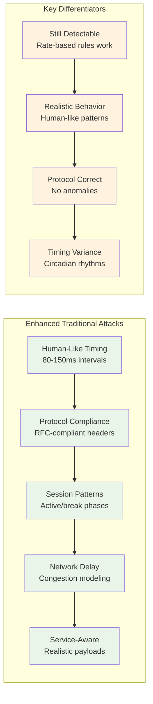

### Traditional DDoS Attacks

#### 1. Enhanced SYN Flood Attack

**Description:**
The Enhanced SYN Flood attack exploits the TCP three-way handshake mechanism while incorporating realistic timing patterns and protocol compliance to create more sophisticated attack traffic that mimics human-driven behavior.

**Enhanced Implementation:**
- **Source:** `gen_syn_flood.py` with `enhanced_timing.py` and `protocol_compliance.py`
- **Human-like timing**: Realistic typing intervals with natural variation and think times
- **Protocol compliance**: RFC-compliant TCP sequence numbers, realistic window sizes (8192-65535)
- **TCP options**: Proper MSS, window scaling, timestamps, and selective ACK options
- **Ephemeral ports**: Realistic source port ranges (32768-65535) instead of fixed ports
- **Session patterns**: Work session modeling with active/break phases and intensity variations
- **Circadian adaptation**: Attack rate varies based on time of day and workday patterns
- **Network simulation**: Congestion modeling with 5% chance of network delays
- **Reduced packet rate**: ~25 pps for more realistic human-driven attack patterns
- Targets port 80 (HTTP) with properly crafted SYN packets that include realistic TCP options

```mermaid
sequenceDiagram
    participant h1 as h1 (Attacker)
    participant s1 as Switch s1
    participant h6 as h6 (Web Server)
    
    Note over h1,h6: Enhanced SYN Flood Attack (5 minutes)<br/>~25 pps with human-like timing
    
    Note over h1: Human-Like Timing Pattern<br/>80-150ms intervals + think time
    
    loop Enhanced SYN Generation
        h1->>s1: RFC-Compliant TCP SYN<br/>• Realistic sequence numbers<br/>• TCP options (MSS, WScale, Timestamp)<br/>• Proper window size
        s1->>h6: Forward enhanced SYN packet
        h6->>s1: TCP SYN+ACK response
        s1->>h1: Forward SYN+ACK
        Note over h1: Never sends ACK<br/>(Half-open connection)<br/>+ Circadian rhythm factor
    end
    
    Note over h6: Connection table exhausted<br/>Service degradation<br/>Realistic but detectable
```

#### 2. Enhanced UDP Flood Attack

**Description:**
The Enhanced UDP Flood attack overwhelms a target system with UDP packets while incorporating realistic service patterns and human-like timing to create more sophisticated attack traffic that resembles legitimate DNS usage.

**Enhanced Implementation:**
- **Source:** `gen_udp_flood.py` with `enhanced_timing.py` and `protocol_compliance.py`
- **Human-like timing**: Realistic typing intervals and natural variation patterns
- **Service-aware payloads**: Realistic DNS query patterns with varied domain names (example.com, google.com, localhost)
- **Protocol compliance**: Proper DNS packet structure with realistic query headers and transaction IDs
- **Ephemeral ports**: Dynamic source port allocation (32768-65535) for each packet
- **Session patterns**: Natural work session modeling with intensity variations
- **Timing adaptation**: Rate adjusts based on circadian rhythms and workday patterns
- **Network simulation**: Congestion modeling and realistic network delay variations
- **Reduced packet rate**: ~25 pps for more realistic human-driven attack patterns
- Targets port 53 (DNS) with properly formatted DNS queries containing realistic domain lookups

```mermaid
sequenceDiagram
    participant h2 as h2 (Attacker)
    participant s1 as Switch s1
    participant h4 as h4 (Victim)
    
    Note over h2,h4: Enhanced UDP Flood Attack (5 minutes)<br/>~25 pps with service-aware payloads
    
    Note over h2: Service-Aware Generation<br/>DNS queries, DHCP, NTP, SNMP
    
    loop Enhanced UDP Generation
        h2->>s1: Service-Aware UDP packet<br/>• Realistic DNS queries<br/>• Ephemeral source ports (32768-65535)<br/>• Proper payload structure
        s1->>h4: Forward enhanced UDP packet
        h4->>s1: ICMP Port Unreachable
        s1->>h2: Forward ICMP response
        Note over h2: Human-like intervals<br/>+ Network delay simulation
    end
    
    Note over h4: Bandwidth exhausted<br/>Service disruption<br/>Realistic but detectable
```

#### 3. Enhanced ICMP Flood Attack

**Description:**
The Enhanced ICMP Flood attack is a denial-of-service attack that overwhelms a target system with ICMP echo request packets while incorporating human-like behavioral patterns and protocol compliance to create more realistic attack traffic.

**Enhanced Implementation:**
- **Source:** `gen_icmp_flood.py` with `enhanced_timing.py` and `protocol_compliance.py`
- **Human-like timing**: Uses realistic typing intervals (80-150ms) instead of fixed delays
- **Protocol compliance**: Proper ICMP ID/sequence number variations and realistic packet structure
- **Session patterns**: Realistic work sessions with active/break phases based on circadian rhythms
- **Network simulation**: Realistic latency variations, congestion modeling, and packet loss simulation
- **Enhanced monitoring**: Tracks attack phases, timing factors, and system impact
- **Reduced packet rate**: ~25 pps (instead of 100 pps) for more realistic human-driven attack patterns
- The attack adapts timing based on session intensity, circadian factors, and workday patterns

```mermaid
sequenceDiagram
    participant h2 as h2 (Attacker)
    participant s1 as Switch s1
    participant h4 as h4 (Victim)
    
    Note over h2,h4: Enhanced ICMP Flood Attack (5 minutes)<br/>~25 pps with protocol compliance
    
    Note over h2: Protocol-Compliant Generation<br/>Session patterns + timing awareness
    
    loop Enhanced ICMP Generation
        h2->>s1: Protocol-Compliant ICMP<br/>• Proper ICMP headers<br/>• Variable payload sizes<br/>• Session pattern awareness
        s1->>h4: Forward enhanced ICMP packet
        h4->>s1: ICMP Echo Reply
        s1->>h2: Forward ICMP reply
        Note over h2: Active/break phases<br/>+ Circadian rhythm modeling
    end
    
    Note over h4: Network layer saturated<br/>Bandwidth consumed<br/>Realistic but detectable
```

### Advanced Adversarial Attacks

**Description:**
This category encompasses more sophisticated DDoS attacks designed to evade detection and mimic legitimate traffic patterns. They often involve IP address rotation, advanced packet crafting, and multi-vector approaches.

**Source:** `gen_advanced_adversarial_ddos_attacks.py`

#### 1. Advanced SYN Attack (TCP State Exhaustion)

**Description:**
This attack aims to exhaust the target's TCP connection state table by initiating many TCP handshakes but not completing them, similar to a SYN flood, but with more sophisticated manipulation of sequence numbers and window sizes to appear more legitimate and keep connections "half-open" for longer.

**How it happens in the scenario:**
- Uses an `IPRotator` to generate random source IP addresses, making it harder to block based on IP.
- Crafts TCP SYN packets with randomized sequence numbers, window sizes, and TTL (Time To Live) values.
- Sends SYN packets and attempts to receive SYN-ACK replies. If a SYN-ACK is received, an ACK packet is sent to establish a "half-open" connection, but no further data is exchanged, consuming server resources.
- Includes jitter in packet sending to avoid detection based on timing patterns.

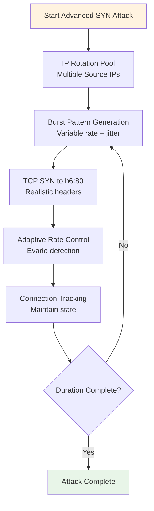

#### 2. Advanced UDP Attack (Application Layer Mimicry)

**Description:**
This attack targets the application layer (e.g., HTTP) by sending legitimate-looking requests to resource-intensive endpoints on the victim server. The goal is to consume server processing power, database resources, or application-specific bandwidth rather than just network bandwidth.

**How it happens in the scenario:**
- Uses an `IPRotator` for source IP randomization.
- Employs a `PacketCrafter` to generate HTTP requests with varied methods (GET, POST, HEAD, OPTIONS), paths (including resource-heavy ones like search queries, API calls, large file downloads), and realistic User-Agent strings.
- Randomly adds common HTTP headers and sometimes cookies to appear more legitimate.
- Sends these crafted HTTP requests to the target, mimicking distributed legitimate user traffic.
- Variable timing between requests helps evade detection.

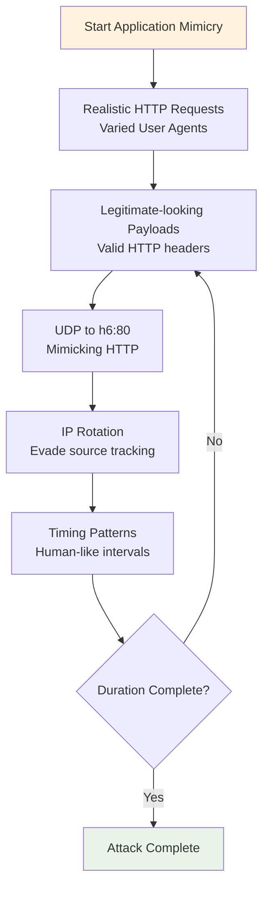

#### 3. Slow Read Attack (ad_slow variant)

**Description:**
A Slow Read attack is a type of low-bandwidth, application-layer DDoS attack that aims to exhaust the server's connection pool by reading responses very slowly. The attacker opens a connection and then reads the response data byte by byte, or in very small chunks, over a long period. This keeps the server's resources tied up, waiting for the client to finish reading, eventually leading to a denial of service for new connections.

**How it happens in the scenario:**
- **Tool Used:** `slowhttptest`
- The `attacker_host` executes the `slowhttptest` command in "Slow Read" mode (`-t SR`).
- It establishes a specified number of connections (`-c 100`) to the victim's HTTP server.
- The tool is configured to read data very slowly (`-i 10` for interval, `-r 20` for connections per second).
- The attack runs for a defined `duration` (`-l`).
- This ties up server resources as the server waits for the slow client to receive the full response, eventually exhausting the server's connection capacity.

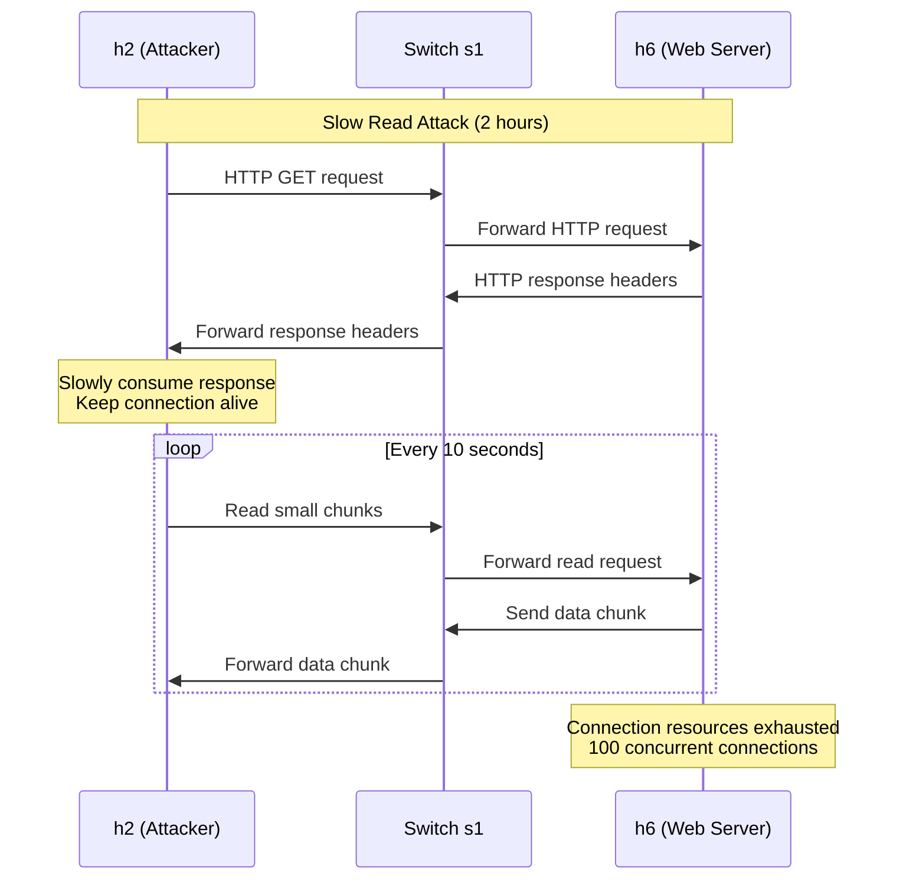

#### 4. Multi-Vector Attack

**Description:**
A multi-vector attack combines several different attack types simultaneously. This approach makes it more challenging for defense systems to mitigate, as they need to address multiple attack vectors at once.

**How it happens in the scenario:**
- Launches threads for different attack vectors concurrently, such as:
    - TCP State Exhaustion
    - Distributed Application Layer Attack
    - Slow Read Attack
- The `AdvancedDDoSCoordinator` manages the execution of these combined attacks.

#### 5. Adaptive Attack Coordination

**Description:**
The `AdvancedDDoSCoordinator` and `AdaptiveController` components work together to make the advanced attacks more dynamic and evasive. They monitor the target's response and adapt the attack strategy accordingly.

**How it happens in the scenario:**
- **Monitoring:** The `AdaptiveController` continuously probes the target to measure response times and detect potential countermeasures (e.g., rate limiting, WAF blocking, Cloudflare, CAPTCHA, timeouts).
- **Adaptation:** Based on the monitoring results, the `AdaptiveController` recommends optimal attack parameters (e.g., packet rate, connection count, preferred technique, IP rotation speed).
- **Execution:** The `AdvancedDDoSCoordinator` uses these recommendations to dynamically switch between or adjust the parameters of the TCP State Exhaustion, Distributed Application Layer, or Multi-Vector attacks, making the overall attack more resilient and harder to defend against.
- **Session Maintenance:** The `SessionMaintainer` creates and maintains legitimate-looking HTTP sessions to further blend the attack traffic with normal user activity.

#### 6. Advanced Evasion Techniques

**Description:**
To enhance stealth and bypass heuristic detection rules, the advanced adversarial attacks incorporate several evasion techniques:

- **Jittered Intervals and Randomization:** Packet and request sending intervals are randomized using `random.uniform()` to avoid predictable timing patterns that could indicate synthetic traffic. Source IP addresses, TCP sequence numbers, window sizes, and TTL values are also randomized.
- **TCP Flag Rotation:** TCP packets are crafted with a random selection of common TCP flags (SYN, SYN-ACK, ACK, PSH-ACK, FIN-ACK) to mimic varied legitimate TCP communication.
- **HTTP Header Rotation:** HTTP requests utilize a diverse set of User-Agent strings and randomly include Referer headers to simulate browsing behavior from different clients and sources.
- **Mimicking Benign Traffic:** The `SessionMaintainer` component actively creates and maintains persistent, legitimate-looking HTTP sessions, including navigating through various common web paths and handling cookies, to blend malicious traffic with normal user activity.
- **Payload and Timestamp Variability:** While explicit timestamp manipulation is handled by the OS/Scapy, the attacks introduce variability in payloads (e.g., varying query string lengths in HTTP requests) and manipulate TCP sequence numbers to ensure generated datasets do not appear overly synthetic.
- **Logging Emission Rates (Partial Implementation):** The `attack_logger` logs when packets/requests are sent, providing a basis for understanding traffic flow. However, explicit real-time calculation and logging of the precise emission rates (packets/sec or requests/sec) for verification of consistency and stealth are not fully implemented. This would require additional logic to track and report rates.

## 🔧 Enhanced Traditional Attack Features

### Human-Like Timing Patterns

The enhanced traditional attacks implement sophisticated timing patterns that simulate realistic human behavior:

```mermaid
flowchart TD
    A[Human-Like Timing System] --> B[Typing Patterns<br/>80-150ms intervals]
    A --> C[Mouse Click Patterns<br/>200-400ms intervals]
    A --> D[Think Time<br/>1-3 seconds between actions]
    A --> E[Circadian Rhythms<br/>Activity varies by hour]
    
    B --> F[Natural Variation<br/>±30% randomness]
    C --> G[Click Sequences<br/>±25% variation]
    D --> H[Mental Processing<br/>±50% variation]
    E --> I[Peak Activity<br/>9 AM - 5 PM]
    
    F --> J[Session Patterns<br/>Active 80% / Break 20%]
    G --> J
    H --> J
    I --> J
    
    style A fill:#e8f5e8
    style J fill:#fff3e0
```

#### Timing Pattern Examples:
- **Typing Intervals**: 80-150ms with natural variation simulating keystroke timing
- **Mouse Clicks**: 200-400ms representing user interaction patterns
- **Think Time**: 1-3 seconds between actions for realistic decision-making
- **Circadian Factors**: Activity peaks at 2-4 PM, lowest at 2-5 AM
- **Session Phases**: Active phases (30-180s) alternating with breaks (5-30s)

### Protocol Compliance Features

Enhanced attacks ensure proper protocol behavior to avoid detection through protocol anomalies:

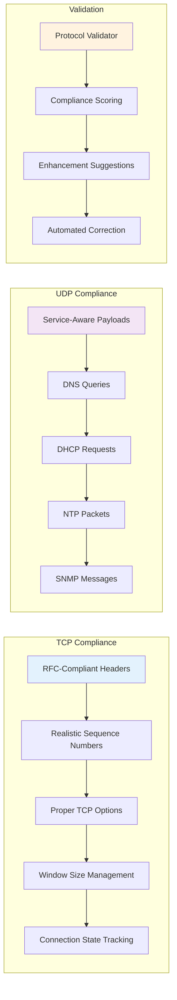

#### Protocol Features:
- **TCP Options**: MSS (1460, 1440, 536), Window Scale (0-4), Timestamps, SACK
- **Sequence Numbers**: Hash-based ISN generation following RFC 793
- **Window Sizes**: Dynamic adjustment (1024-65535) simulating congestion control
- **UDP Payloads**: Service-specific patterns for DNS, DHCP, NTP, SNMP
- **Port Management**: Ephemeral source ports (32768-65535)

### Network Delay Simulation

Realistic network behavior modeling includes:

```mermaid
flowchart TD
    A[Network Delay Simulator] --> B[Base Latency<br/>20ms default]
    A --> C[Congestion Modeling<br/>Adaptive factors]
    A --> D[Packet Loss Simulation<br/>5% random loss]
    A --> E[Retransmission Delays<br/>2x-5x base latency]
    
    B --> F[Variation ±40%<br/>12-28ms range]
    C --> G[Congestion Factor<br/>0.5x-3.0x multiplier]
    D --> H[Loss Recovery<br/>Realistic timeouts]
    E --> I[Adaptive Behavior<br/>Dynamic adjustment]
    
    style A fill:#e8f5e8
    style F fill:#fff3e0
    style G fill:#fff3e0
    style H fill:#fff3e0
    style I fill:#fff3e0
```

### Enhanced vs Adversarial Differentiation

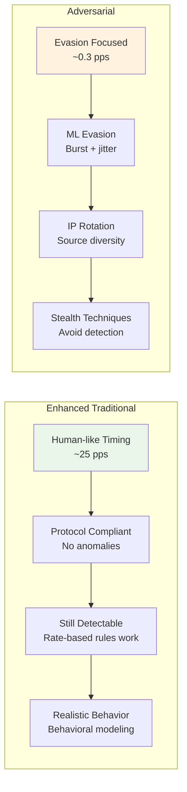

#### Key Distinctions:
- **Enhanced Traditional**: Focus on realism while maintaining detectability
- **Adversarial**: Focus on ML evasion and stealth techniques
- **Rate Difference**: Enhanced (~25 pps) vs Adversarial (~0.3 pps)
- **Detection**: Enhanced remain detectable by rate-based rules, Adversarial attempt evasion

### Attack Type Differentiation

**Enhanced Traditional Attacks** (realistic but detectable):
- Enhanced SYN flood with human timing and RFC-compliant TCP options
- Enhanced UDP flood with realistic DNS service patterns and ephemeral ports
- Enhanced ICMP flood with protocol compliance and enhanced monitoring

**Adversarial Attacks** (focused on ML evasion):
- TCP state exhaustion with burst patterns and jitter
- Application layer mimicry with IP rotation
- Slow read attacks with adaptive control

## 🟢 Normal Traffic Patterns

### Multi-Protocol Benign Traffic

**Description:**
Benign traffic simulates normal network activity to provide a realistic background for the DDoS attack scenarios. This helps in evaluating the effectiveness of detection mechanisms in a mixed traffic environment.

**How it happens in the scenario:**
- **Source:** `src/gen_benign_traffic.py`
- Various types of benign traffic are generated between `h3` and `h5` in the Mininet network.
- **Protocols Covered:**
    - **ICMP:** Standard ping requests and replies.
    - **TCP:** Full TCP handshake (SYN, SYN-ACK, ACK) followed by data transfer and a final ACK. This includes random payload lengths.
    - **UDP:** Datagrams with random payload lengths.
    - **Telnet (Port 23):** TCP handshake followed by simulated Telnet command data.
    - **SSH (Port 22):** TCP handshake followed by simulated encrypted SSH data.
    - **FTP (Port 21):** TCP handshake followed by simulated FTP file transfer data.
    - **HTTP (Port 80):** TCP handshake followed by simulated HTTP GET requests with headers and random payload.
    - **HTTPS (Port 443):** TCP handshake followed by simulated encrypted HTTPS application data.
    - **DNS (Port 53):** UDP-based DNS queries.
- **Traffic Generation:**
    - ICMP traffic uses Mininet's `ping` command.
    - All other traffic types are crafted and sent using the `scapy` library within the Mininet host's namespace.
    - Random source ports and random payload lengths are used to simulate varied legitimate traffic.
- The benign traffic runs for a specified `duration`, continuously generating sessions across different protocols.

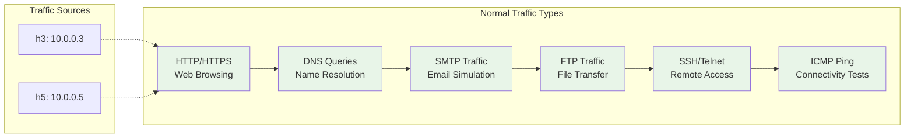

## 📊 Data Collection Architecture

### Three-Layer Data Collection

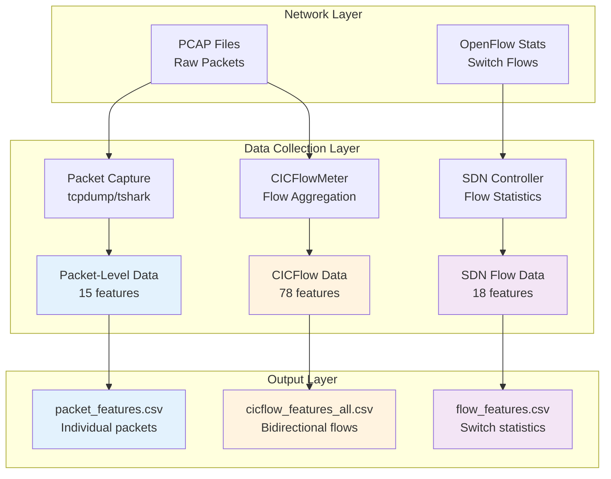

### Data Synchronization Process

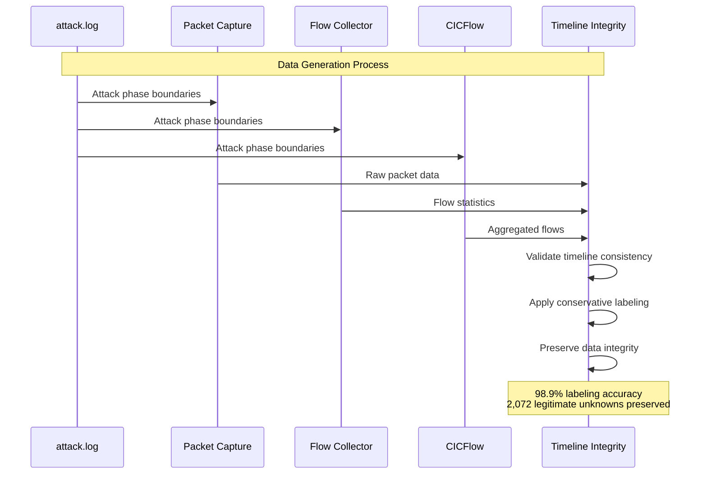

## 🔍 Attack Detection Characteristics

### Enhanced Traditional vs Adversarial Attack Patterns

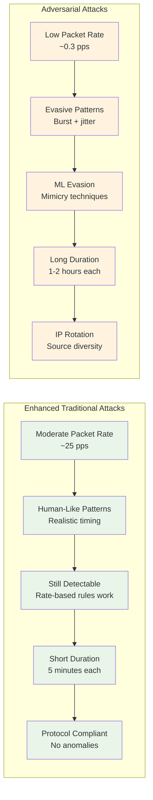

## 📈 Dataset Statistics

### Record Distribution Across Formats

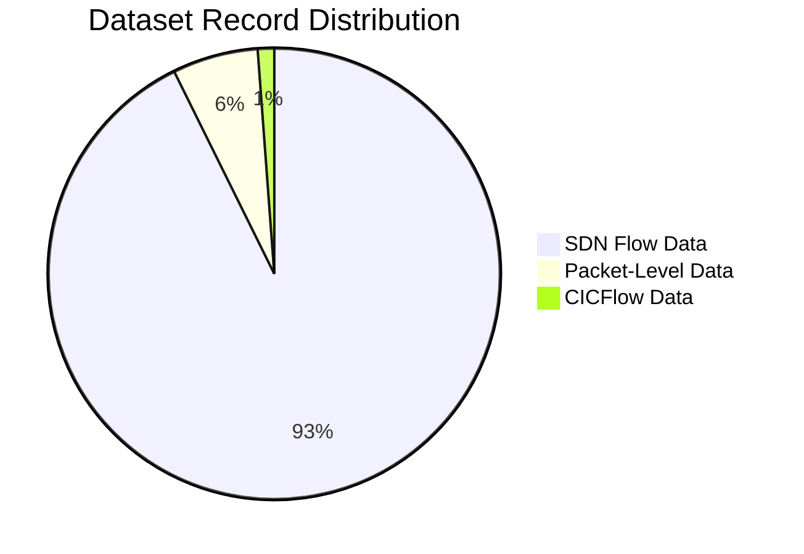

### Attack Type Distribution

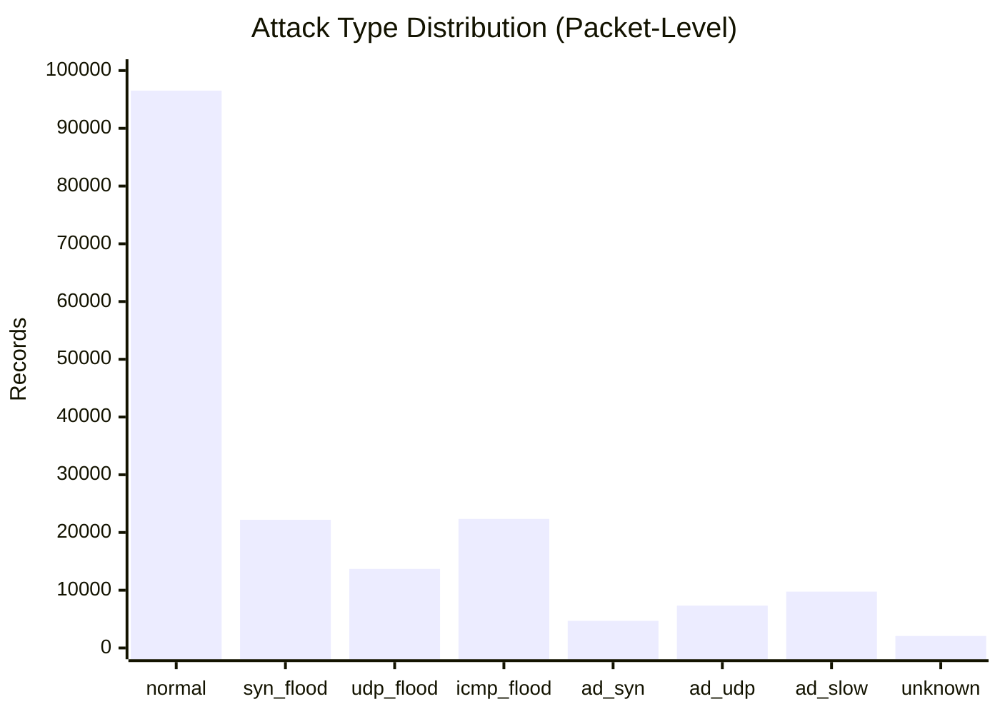

## 🎯 Timeline Integrity Validation

### Conservative Data Preservation

```mermaid
flowchart TD
    A[Raw Dataset] --> B{Existing Labels}
    B -->|Correct| C[Preserve All Existing Labels]
    B -->|Unknown| D[Validate Against Timeline]
    
    D --> E{Within Attack Window?}
    E -->|Yes| F[Validate Packet Characteristics]
    E -->|No| G[Keep as Unknown<br/>Timeline Gap]
    
    F --> H{Matches Attack Pattern?}
    H -->|Yes| I[Reclassify to Attack Type]
    H -->|No| J[Keep as Unknown<br/>Response Packet]
    
    C --> K[Final Dataset<br/>98.9% Labeled]
    I --> K
    G --> K
    J --> K
    
    style C fill:#e8f5e8
    style I fill:#e8f5e8
    style G fill:#fff3e0
    style J fill:#fff3e0
    style K fill:#e3f2fd
```

This comprehensive scenario documentation provides visual diagrams for:
- Network topology and architecture
- Attack timeline and sequence
- Individual attack patterns
- Data collection processes
- Timeline integrity validation
- Dataset statistics and distributions

The diagrams use Mermaid syntax which renders properly in markdown viewers and provides clear visual understanding of the complex attack scenarios and data generation process.