# 🎭 Attack Scenarios and Network Architecture

This document provides a comprehensive overview of the network architecture, attack scenarios, and data generation process for the AdDDoSDN framework.

## 🏗️ Network Architecture

### SDN Network Topology

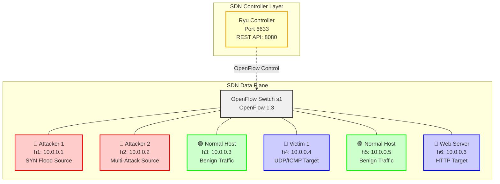

### Host Roles and Responsibilities

| Host | IP Address | Role | Primary Function | Attack Types |
|------|------------|------|------------------|--------------|
| **h1** | 10.0.0.1 | Primary Attacker | SYN Flood Generator | Traditional SYN Flood |
| **h2** | 10.0.0.2 | Multi-Attack Source | Advanced Attack Platform | UDP Flood, ICMP Flood, Adversarial Attacks |
| **h3** | 10.0.0.3 | Normal Traffic Generator | Benign Traffic Source | HTTP, DNS, SMTP, FTP |
| **h4** | 10.0.0.4 | Primary Victim | Attack Target | UDP/ICMP Flood Target |
| **h5** | 10.0.0.5 | Normal Traffic Generator | Benign Traffic Source | HTTP, DNS, SMTP, FTP |
| **h6** | 10.0.0.6 | Web Server Victim | HTTP Service Target | SYN Flood, Adversarial Attacks |

## 🎯 Attack Scenario Timeline

### 7-Phase Attack Sequence

```mermaid
gantt
    title Attack Scenario Timeline
    dateFormat X
    axisFormat %H:%M
    
    section Normal Traffic
    Baseline Traffic         :normal, 0, 3600
    
    section Traditional Attacks
    SYN Flood               :syn, 3600, 300
    UDP Flood               :udp, 3900, 300
    ICMP Flood              :icmp, 4200, 300
    
    section Adversarial Attacks
    Advanced SYN            :adsyn, 4500, 7200
    Advanced UDP            :adudp, 11700, 4800
    Advanced Slow           :adslow, 16500, 7200
    
    section Data Collection
    Continuous Monitoring   :monitor, 0, 23700
```

### Phase-by-Phase Breakdown

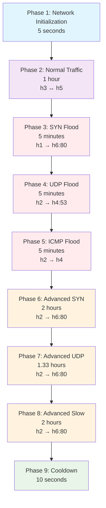

## 🔴 Attack Details

### Enhanced Traditional DDoS Attacks

The framework implements **Enhanced Traditional Attacks** that incorporate sophisticated behavioral modeling while remaining detectable for defensive research purposes. These attacks combine traditional DDoS patterns with advanced features to create more realistic traffic.

#### Enhancement Features Overview

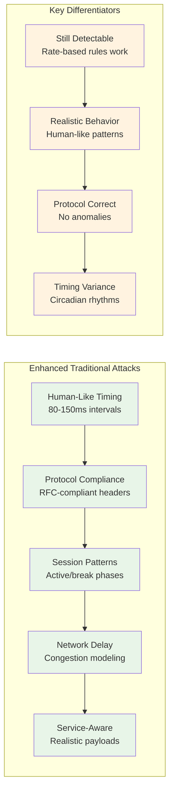

### Traditional DDoS Attacks

#### 1. Enhanced SYN Flood Attack
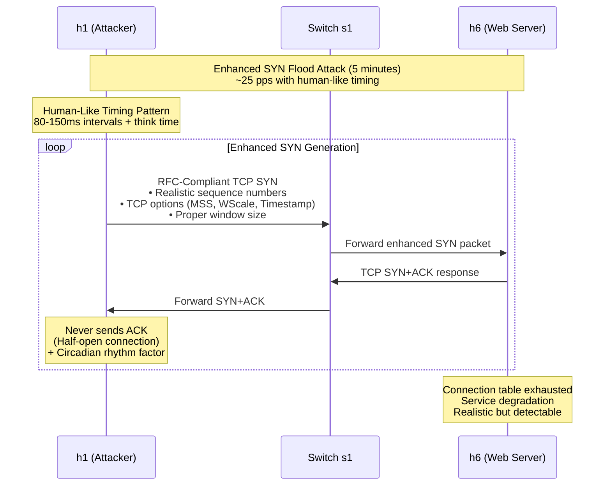

#### 2. Enhanced UDP Flood Attack
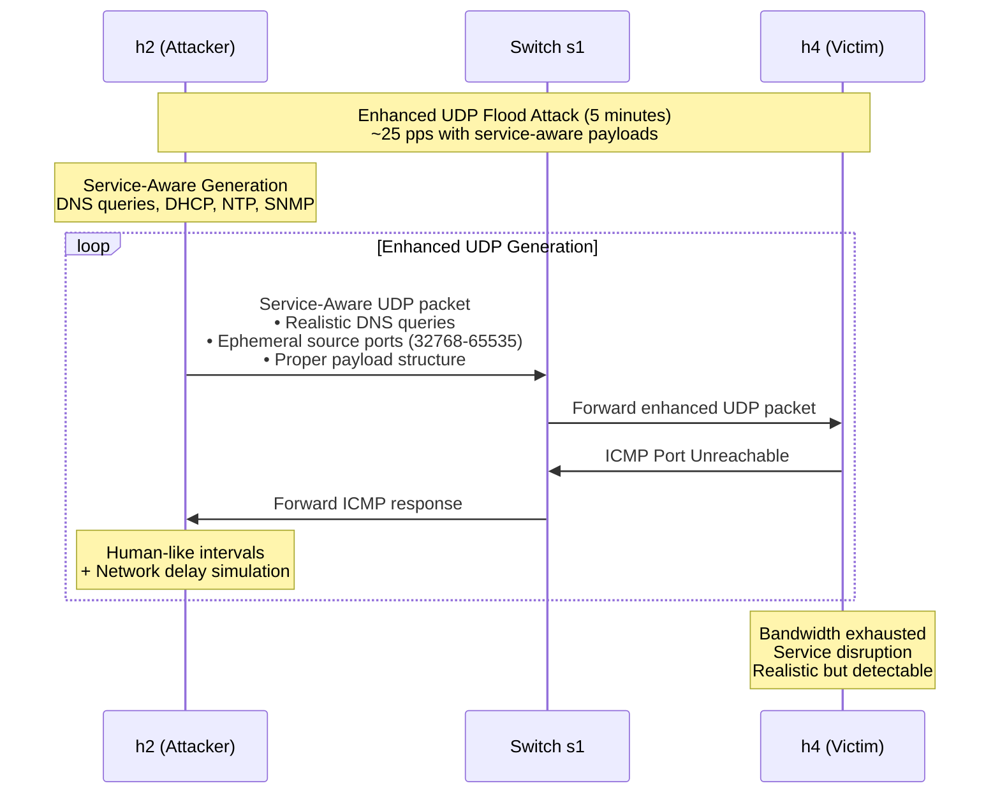

#### 3. Enhanced ICMP Flood Attack
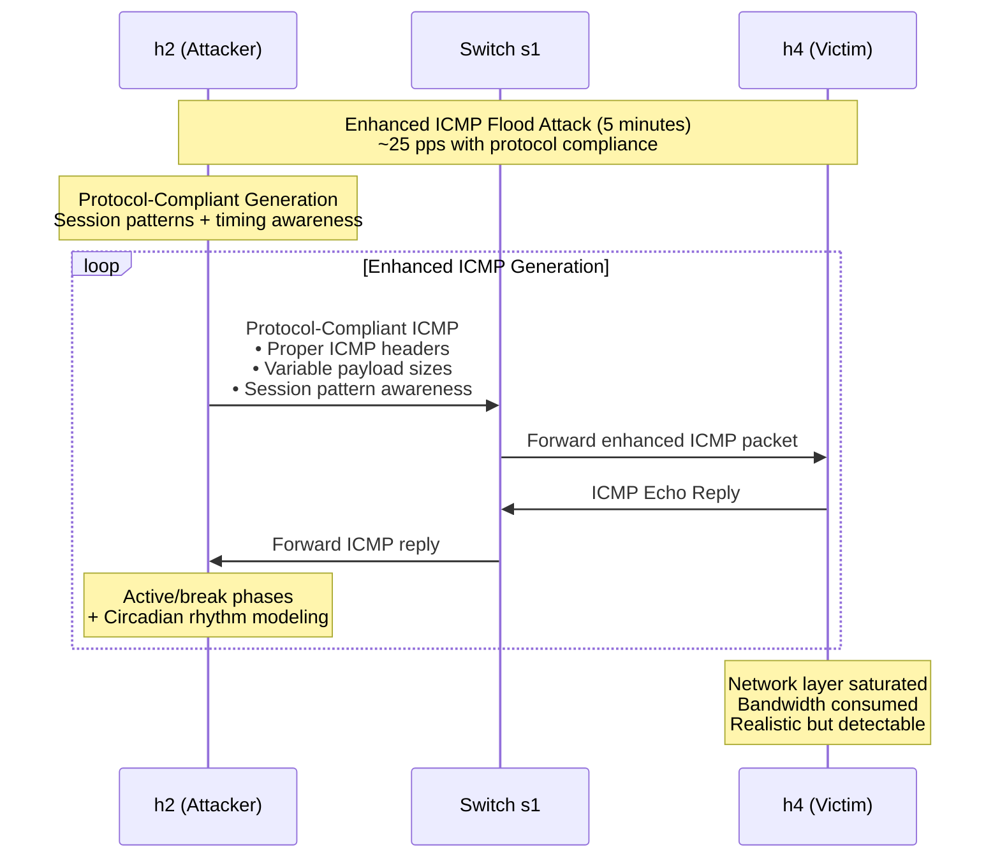

### Advanced Adversarial Attacks

#### 1. Advanced SYN Attack (TCP State Exhaustion)
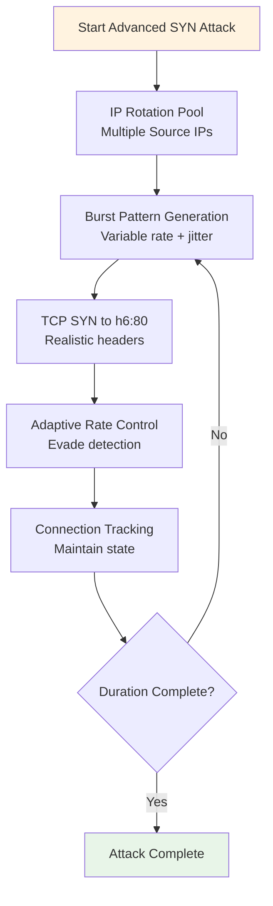

#### 2. Advanced UDP Attack (Application Layer Mimicry)
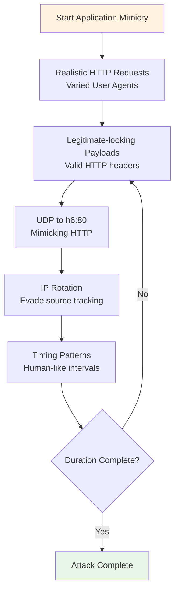

#### 3. Slow Read Attack
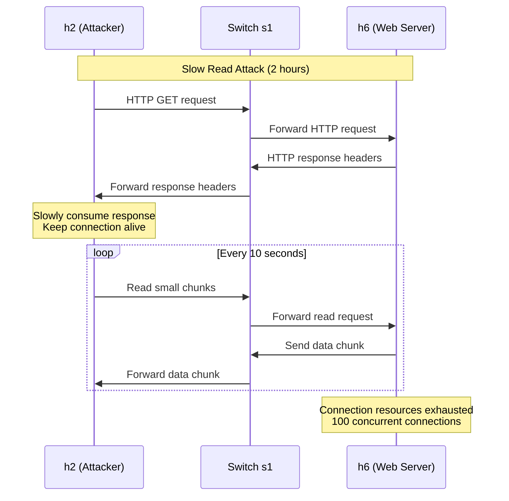

## 🟢 Normal Traffic Patterns

### Multi-Protocol Benign Traffic

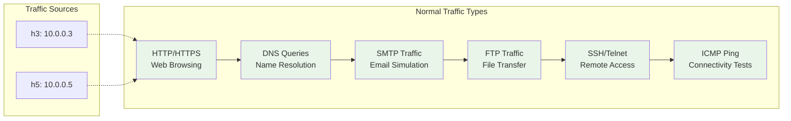

## 🔧 Enhanced Traditional Attack Features

### Human-Like Timing Patterns

The enhanced traditional attacks implement sophisticated timing patterns that simulate realistic human behavior:

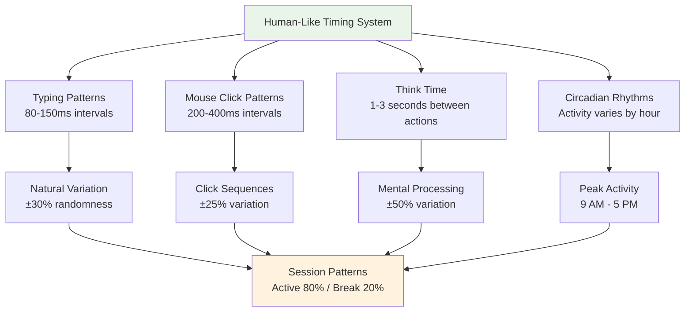

#### Timing Pattern Examples:
- **Typing Intervals**: 80-150ms with natural variation simulating keystroke timing
- **Mouse Clicks**: 200-400ms representing user interaction patterns
- **Think Time**: 1-3 seconds between actions for realistic decision-making
- **Circadian Factors**: Activity peaks at 2-4 PM, lowest at 2-5 AM
- **Session Phases**: Active phases (30-180s) alternating with breaks (5-30s)

### Protocol Compliance Features

Enhanced attacks ensure proper protocol behavior to avoid detection through protocol anomalies:

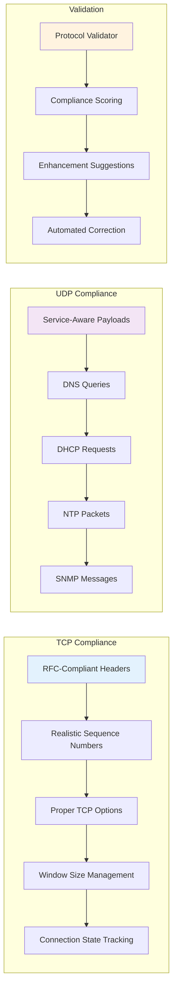

#### Protocol Features:
- **TCP Options**: MSS (1460, 1440, 536), Window Scale (0-4), Timestamps, SACK
- **Sequence Numbers**: Hash-based ISN generation following RFC 793
- **Window Sizes**: Dynamic adjustment (1024-65535) simulating congestion control
- **UDP Payloads**: Service-specific patterns for DNS, DHCP, NTP, SNMP
- **Port Management**: Ephemeral source ports (32768-65535)

### Network Delay Simulation

Realistic network behavior modeling includes:

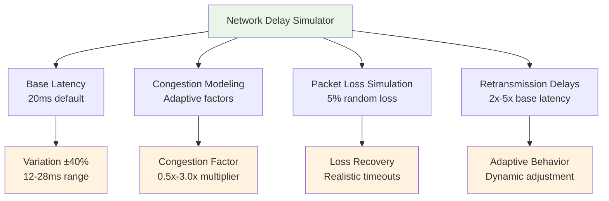

### Enhanced vs Adversarial Differentiation

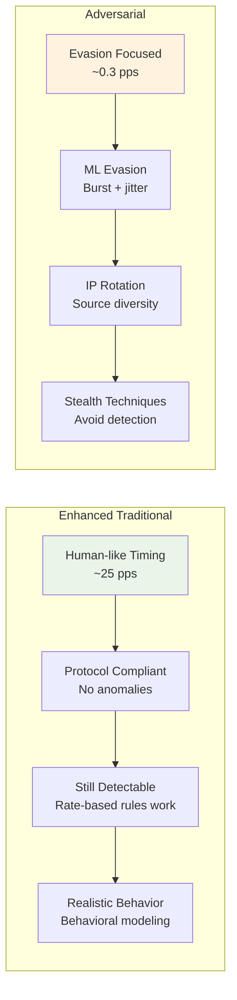

#### Key Distinctions:
- **Enhanced Traditional**: Focus on realism while maintaining detectability
- **Adversarial**: Focus on ML evasion and stealth techniques
- **Rate Difference**: Enhanced (~25 pps) vs Adversarial (~0.3 pps)
- **Detection**: Enhanced remain detectable by rate-based rules, Adversarial attempt evasion

## 📊 Data Collection Architecture

### Three-Layer Data Collection

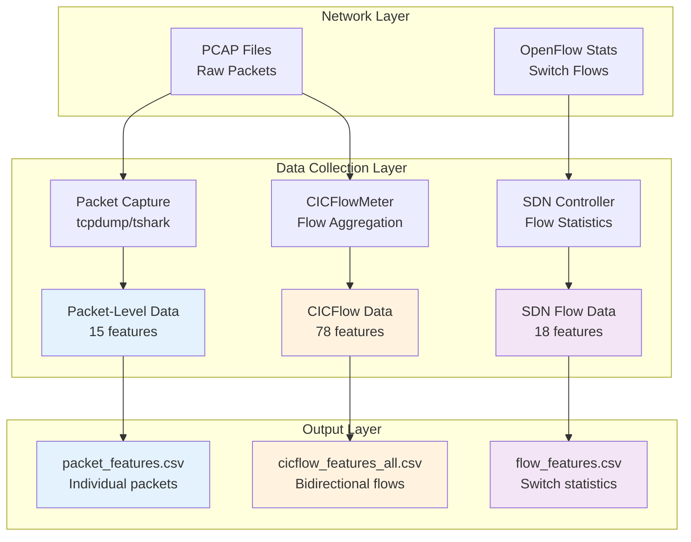

### Data Synchronization Process

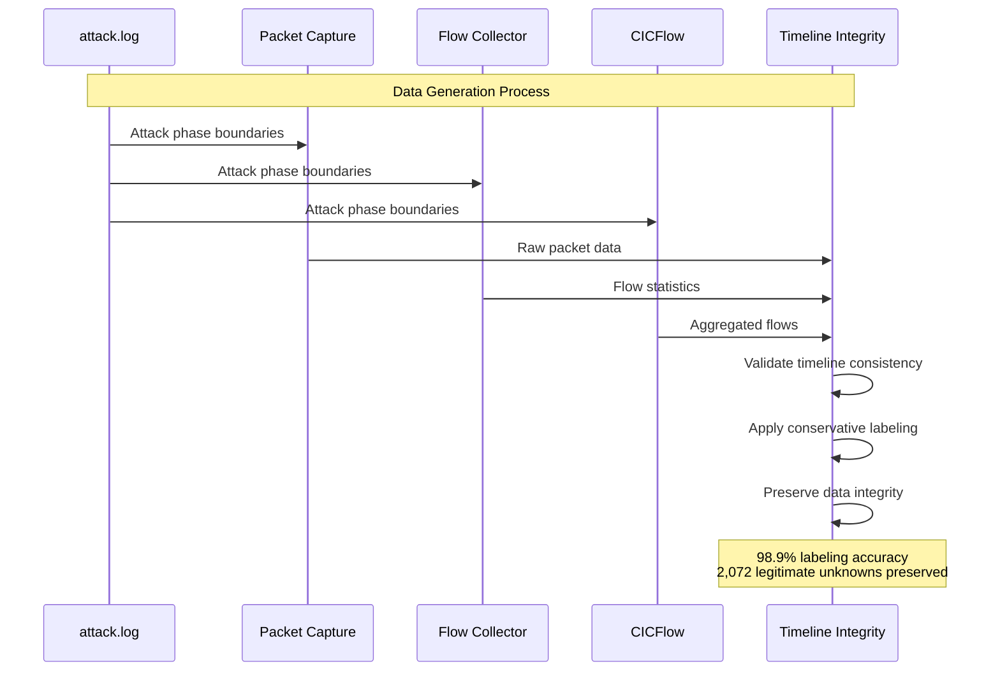

## 🔍 Attack Detection Characteristics

### Enhanced Traditional vs Adversarial Attack Patterns

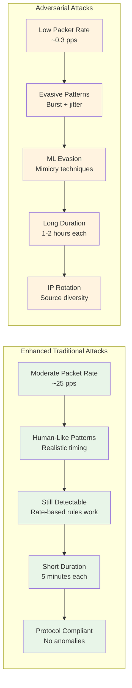

## 📈 Dataset Statistics

### Record Distribution Across Formats

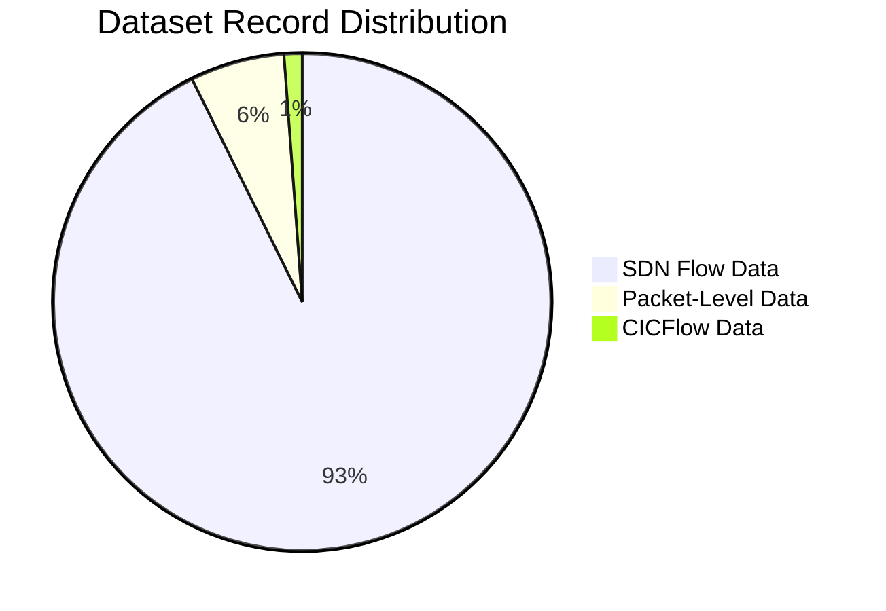

### Attack Type Distribution

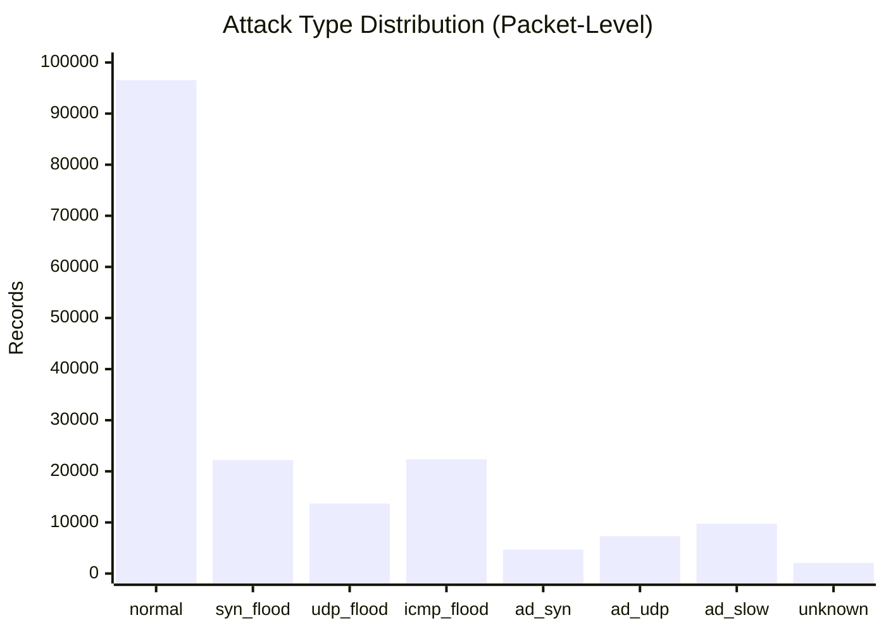

## 🎯 Timeline Integrity Validation

### Conservative Data Preservation

```mermaid
flowchart TD
    A[Raw Dataset] --> B{Existing Labels}
    B -->|Correct| C[Preserve All Existing Labels]
    B -->|Unknown| D[Validate Against Timeline]
    
    D --> E{Within Attack Window?}
    E -->|Yes| F[Validate Packet Characteristics]
    E -->|No| G[Keep as Unknown<br/>Timeline Gap]
    
    F --> H{Matches Attack Pattern?}
    H -->|Yes| I[Reclassify to Attack Type]
    H -->|No| J[Keep as Unknown<br/>Response Packet]
    
    C --> K[Final Dataset<br/>98.9% Labeled]
    I --> K
    G --> K
    J --> K
    
    style C fill:#e8f5e8
    style I fill:#e8f5e8
    style G fill:#fff3e0
    style J fill:#fff3e0
    style K fill:#e3f2fd
```

This comprehensive scenario documentation provides visual diagrams for:
- Network topology and architecture
- Attack timeline and sequence
- Individual attack patterns
- Data collection processes
- Timeline integrity validation
- Dataset statistics and distributions

The diagrams use Mermaid syntax which renders properly in markdown viewers and provides clear visual understanding of the complex attack scenarios and data generation process.