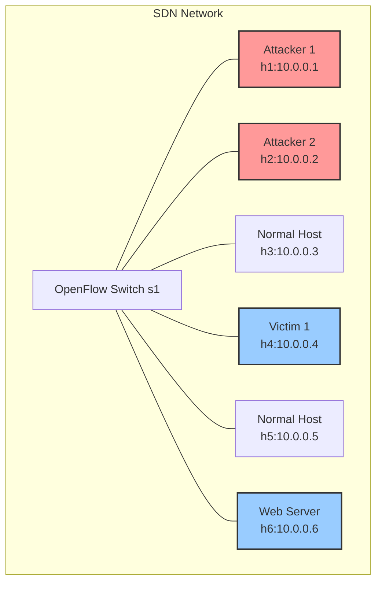
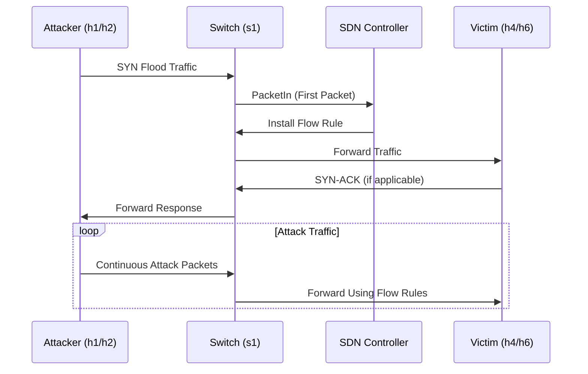
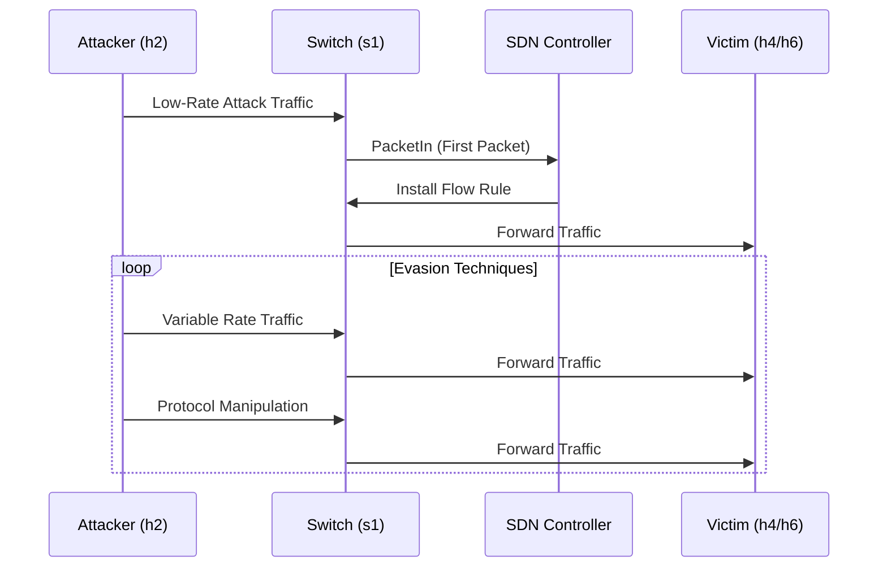

# SDN DDoS Dataset Generation Scenario

This document provides a comprehensive overview of the Mininet host scenario for DDoS dataset generation, including detailed network architecture, host roles, traffic patterns, and attack flows.

## Network Architecture



## Network Topology

The Mininet topology consists of the following components:

| Component | Type | IP Address | Role |
|-----------|------|------------|------|
| s1 | OpenFlow Switch | N/A | Central network switch |
| h1 | Host | 10.0.0.1 | Primary Attacker |
| h2 | Host | 10.0.0.2 | Secondary Attacker |
| h3 | Host | 10.0.0.3 | Normal Traffic Generator |
| h4 | Host | 10.0.0.4 | Primary Victim |
| h5 | Host | 10.0.0.5 | Normal Traffic Generator |
| h6 | Host | 10.0.0.6 | Web Server Victim |

## Host Roles and Traffic Patterns

### Attackers

| Host | IP | Attack Type | Target | Impact | Description |
|------|----|-------------|--------|--------|-------------|
| h1 | 10.0.0.1 | SYN Flood | h6 (Web Server) | Controller & Application | Overwhelms controller flow tables and exhausts server resources |
| h2 | 10.0.0.2 | Multiple Attacks | h4 & h6 | Various | Launches various attacks including SYN, UDP, and ICMP floods |

#### Detailed Attack Vectors from h2:

| Attack Type | Target | Rate | Protocol | Port | Evasion Technique |
|-------------|--------|------|----------|------|-------------------|
| SYN Flood | h6 | High | TCP | 80 | None |
| UDP Flood | h4 | High | UDP | 53 | None |
| ICMP Flood | h4 | High | ICMP | N/A | None |
| Adversarial SYN | h6 | Variable | TCP | 80 | TCP State Exhaustion |
| Adversarial UDP | h4 | Variable | UDP | 53 | Application Layer Mimicry |
| Multi-vector | h4, h6 | Variable | Multiple | Multiple | Multiple Techniques |

### Victims

| Host | IP | Role | Attack Types | Impact |
|------|----|------|--------------|--------|
| h4 | 10.0.0.4 | General Victim | UDP Flood, ICMP Flood | Network Saturation |
| h6 | 10.0.0.6 | Web Server | SYN Flood | Service Disruption |

### Normal Traffic Generators

| Host | IP | Traffic Type | Destination | Protocol | Purpose |
|------|----|--------------|-------------|----------|---------|
| h3 | 10.0.0.3 | Benign | h5 | TCP | Simulate normal web traffic |
| h5 | 10.0.0.5 | Benign | h3 | UDP | Simulate normal UDP-based services |

## Attack Flow Diagrams

### Traditional DDoS Attack Flow


### Adversarial DDoS Attack Flow


## Traffic Generation Phases

The dataset generation process follows a structured timeline with distinct phases, as orchestrated by `dataset_generation/test.py`:

### 1. Initialization Phase
- Duration: 5 seconds
- Purpose: Network stabilization and controller initialization
- Traffic: Minimal control traffic only

### 2. Normal Traffic Phase
- Duration: 5 seconds
- Purpose: Establish baseline network behavior
- Traffic: Benign traffic (ICMP, TCP, UDP, Telnet, SSH, FTP, HTTP) between h3 and h5.

### 3. Attack Traffic Phases (Total 30 seconds)

#### Phase 3.1: Traditional DDoS Attacks (15 seconds total)
- **SYN Flood**: 5 seconds | h1 -> h6
- **UDP Flood**: 5 seconds | h2 -> h4
- **ICMP Flood**: 5 seconds | h2 -> h4

#### Phase 3.2: Adversarial DDoS Attacks (15 seconds total)
- **Adversarial TCP State Exhaustion (ad_syn)**: 5 seconds | h2 -> h6
- **Adversarial Application Layer (ad_udp)**: 5 seconds | h2 -> h6
- **Adversarial Multi-Vector (multivector)**: 5 seconds | h2 -> h6

### 4. Cooldown Phase
- Duration: 5 seconds
- Purpose: Allow network to stabilize
- Traffic: Reduction of traffic after attacks.

## Data Collection Architecture

```mermaid
graph LR
    subgraph Mininet Network
        s1 -->|Traffic| PCAP_Capture[Packet Capture (tshark)]
    end
    PCAP_Capture -->|capture.pcap| PCAP_Processing[PCAP Processing (enhanced_pcap_processing.py)]
    PCAP_Processing -->|labeled_packet_features.csv| Dataset_Storage[Dataset Storage]
```

## Dataset Structure

The generated dataset includes the following files in `dataset_generation/output/`:

1.  **capture.pcap**
    -   The raw packet capture file in PCAP format.

2.  **labeled_packet_features.csv**
    -   The primary output dataset with extracted packet features and labels.
    -   Each packet is associated with a label indicating the traffic phase (e.g., `normal`, `syn_flood`, `ad_syn`).

## Labeling Strategy

The `labeled_packet_features.csv` dataset is labeled based on the following timeline:

| Phase | Duration (seconds) | Label |
|-------|--------------------|-------|
| Initialization | 5 | normal |
| Normal Traffic | 5 | normal |
| SYN Flood | 5 | syn_flood |
| UDP Flood | 5 | udp_flood |
| ICMP Flood | 5 | icmp_flood |
| Adversarial SYN | 5 | ad_syn |
| Adversarial UDP | 5 | ad_udp |
| Multi-vector | 5 | multivector |
| Cooldown | 5 | normal |

This comprehensive approach ensures the generated dataset accurately reflects both normal network operations and various types of DDoS attacks, making it valuable for training and evaluating intrusion detection systems.
