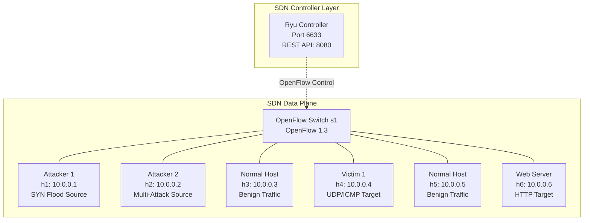
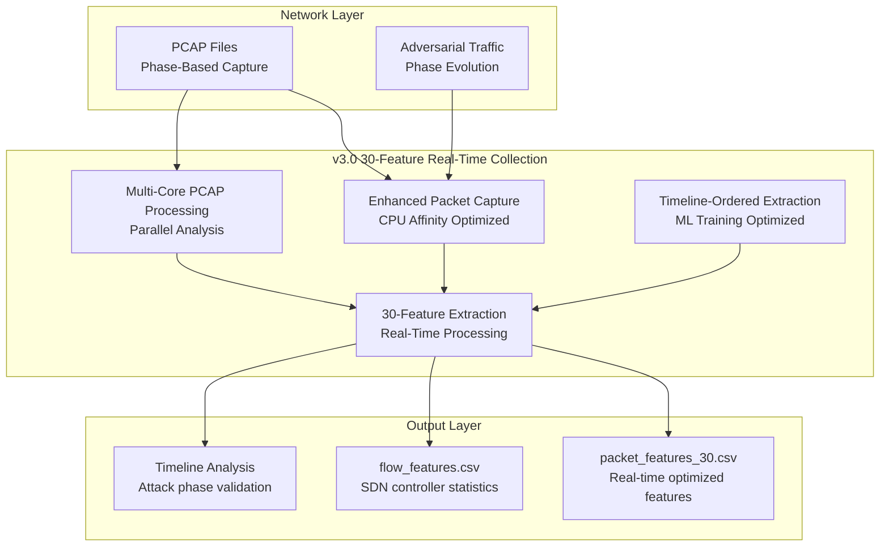

# Attack Scenarios and Network Architecture

This section presents a comprehensive overview of the experimental setup, network architecture, attack scenarios, and data generation methodology for the AdDDoSDN framework v3.0. The documentation provides detailed analysis of the SDN-based DDoS detection system and the 30-feature real-time dataset generation process optimized for machine learning applications.

## 1. Experimental Setup

### 1.1 Hardware and Software Configuration

The experimental testbed is implemented using Mininet network emulator on a Linux Ubuntu environment. The framework v3.0 employs Software-Defined Networking (SDN) principles to create a controlled environment for real-time DDoS attack simulation and detection research, featuring 30-feature packet extraction optimized for <1ms latency processing with CPU affinity optimization and multi-core processing capabilities.

**System Specifications:**
- Emulation Platform: Mininet v2.3.0
- SDN Controller: Ryu Controller v4.34
- Operating System: Linux Ubuntu 22.04 LTS
- Network Protocol: OpenFlow v1.3
- Packet Processing: Scapy v2.4.5 with enhanced 30-feature extraction
- Traffic Analysis: tshark, tcpdump with real-time processing
- CPU Optimization: taskset (util-linux) for core affinity management
- Recommended Hardware: 16+ CPU cores for optimal performance

### 1.2 Network Topology Architecture

The experimental network implements a centralized SDN architecture with one OpenFlow-enabled switch connecting multiple hosts under the control of a Ryu SDN controller.



### 1.3 Host Configuration and Role Assignment

The network topology consists of six hosts, each assigned specific roles to simulate realistic attack scenarios and normal network operations.

| Host | IP Address | Role | Primary Function | Attack Types |
|------|------------|------|------------------|--------------| 
| **h1** | 10.0.0.1 | Primary Attacker | SYN Flood Generator | Traditional SYN Flood |
| **h2** | 10.0.0.2 | Multi-Attack Source | Advanced Attack Platform | UDP Flood, ICMP Flood, Adversarial Attacks |
| **h3** | 10.0.0.3 | Normal Traffic Generator | Benign Traffic Source | HTTP, DNS, SMTP, FTP |
| **h4** | 10.0.0.4 | Primary Victim | Attack Target | UDP/ICMP Flood Target |
| **h5** | 10.0.0.5 | Normal Traffic Generator | Benign Traffic Source | HTTP, DNS, SMTP, FTP |
| **h6** | 10.0.0.6 | Web Server Victim | HTTP Service Target | SYN Flood, Adversarial Attacks |

## 2. Dataset Configuration and Timing Optimization

### 2.1 Scenario Duration Configuration

The framework implements a multi-phase attack sequence with configurable timing parameters for dataset generation suitable for machine learning applications.

| Traffic Type | Implementation Default | Configurable Parameter | Recommended Optimization |
|--------------|------------------------|------------------------|--------------------------|
| **Initialization** | 5 seconds | `initialization` | 5 seconds |
| **Normal Traffic** | 5 seconds | `normal_traffic` | 3600 seconds (1 hour) |
| **SYN Flood** | 5 seconds | `syn_flood` | 300 seconds (5 minutes) |
| **UDP Flood** | 5 seconds | `udp_flood` | 300 seconds (5 minutes) |
| **ICMP Flood** | 5 seconds | `icmp_flood` | 300 seconds (5 minutes) |
| **Adversarial TCP** | 5 seconds | `ad_syn` | 7200 seconds (2 hours) |
| **Adversarial UDP** | 5 seconds | `ad_udp` | 4800 seconds (80 minutes) |
| **Adversarial Slow** | 5 seconds | `ad_slow` | 3600 seconds (1 hour) |
| **Cooldown** | 10 seconds | `cooldown` | 5 seconds |

### 2.2 Configuration Characteristics

- **Default configuration runtime**: Approximately 55 seconds total (all scenarios at 5-second defaults)
- **Optimized configuration runtime**: Approximately 6-6.5 hours for comprehensive dataset generation
- **Scalability**: Linear scaling with configured duration parameters
- **Resource requirements**: CPU affinity optimization recommended for multi-core systems

### 2.3 Configuration Implementation

**Default Configuration (Built-in):**
```json
{
    "scenario_durations": {
        "initialization": 5,
        "normal_traffic": 5,
        "syn_flood": 5,
        "udp_flood": 5,
        "icmp_flood": 5,
        "ad_syn": 5,
        "ad_udp": 5,
        "ad_slow": 5,
        "cooldown": 10
    }
}
```

**Recommended Optimization Configuration:**
```json
{
    "scenario_durations": {
        "initialization": 5,
        "normal_traffic": 3600,
        "syn_flood": 300,
        "udp_flood": 300,
        "icmp_flood": 300,
        "ad_syn": 7200,
        "ad_udp": 4800,
        "ad_slow": 3600,
        "cooldown": 5
    }
}
```

## 3. Attack Scenario Implementation

### 3.1 Normal Traffic Generation

Normal traffic simulation provides baseline network behavior essential for evaluating detection mechanism effectiveness in mixed traffic environments.

**Implementation Parameters:**
- **Source Code**: `src/gen_benign_traffic.py`
- **Traffic Generators**: h3 (10.0.0.3) and h5 (10.0.0.5)
- **Duration**: 3600 seconds (1 hour)
- **Packet Rate**: ~64 packets per second
- **Protocols**: ICMP, TCP, UDP, HTTP, HTTPS, DNS, SSH, FTP, Telnet
- **Traffic Generation Tool**: Scapy library with Mininet integration

**Protocol Distribution:**
- **ICMP**: Standard ping requests using Mininet's ping command
- **TCP**: Full handshake (SYN, SYN-ACK, ACK) with data transfer
- **UDP**: Datagrams with randomized payload lengths
- **HTTP/HTTPS**: Simulated web requests with realistic headers
- **DNS**: UDP-based domain name resolution queries
- **SSH/Telnet**: Encrypted and plaintext remote access simulation
- **FTP**: File transfer protocol simulation

### 3.2 Enhanced Traditional DDoS Attacks

The framework implements Enhanced Traditional Attacks incorporating sophisticated behavioral modeling while maintaining detectability for defensive research purposes.

#### 3.2.1 Enhanced SYN Flood Attack

The Enhanced SYN Flood attack represents a sophisticated evolution of traditional TCP SYN flooding techniques, designed to exploit the fundamental TCP three-way handshake mechanism while incorporating advanced behavioral modeling and protocol compliance features. This attack type leverages the stateful nature of TCP connections to overwhelm target systems by exhausting server resources through half-open connection maintenance. The enhanced implementation integrates human-like timing patterns derived from behavioral analysis, ensuring that attack traffic exhibits realistic characteristics that closely mimic legitimate user interactions while maintaining sufficient volume to achieve denial-of-service objectives.

The attack mechanism operates by initiating numerous TCP connection attempts from compromised nodes within the SDN network, specifically targeting the web server (h6: 10.0.0.6) on port 80. Unlike traditional SYN flood attacks that employ fixed timing intervals and basic packet structures, the enhanced variant incorporates sophisticated timing algorithms that simulate realistic human behavioral patterns, including typing intervals ranging from 80-150 milliseconds with natural variation, think time periods of 1-3 seconds between actions, and circadian rhythm adaptations that adjust attack intensity based on time-of-day factors. The implementation utilizes RFC-compliant TCP sequence number generation following hash-based Initial Sequence Number (ISN) protocols as specified in RFC 793, ensuring that generated packets maintain protocol integrity while avoiding detection through protocol anomaly analysis.

Furthermore, the enhanced SYN flood incorporates realistic TCP option fields including Maximum Segment Size (MSS) values of 1460, 1440, or 536 bytes, Window Scaling options with scale factors ranging from 0-4, Timestamp options for Round-Trip Time measurement, and Selective Acknowledgment (SACK) capabilities. Source port allocation employs ephemeral port ranges (32768-65535) with dynamic randomization for each connection attempt, simulating legitimate client behavior patterns. The attack maintains a variable packet rate ranging from 20-30 packets per second with stochastic variation, significantly lower than traditional high-rate flooding attacks, while incorporating session pattern modeling that alternates between active phases (30-180 seconds) and break periods (5-30 seconds) to simulate realistic user behavior patterns. Network delay simulation includes congestion modeling with a 5% probability of introducing additional latency, further enhancing the realism of the attack traffic profile.

| Parameter | Value | Description |
|-----------|--------|-------------|
| Source Host | h1 (10.0.0.1) | Primary attacker |
| Destination Host | h6 (10.0.0.6) | Web server target |
| Destination Port | 80 | HTTP service |
| Source Port Range | 32768-65535 | Ephemeral port allocation |
| Packet Rate | 20-30 pps | Randomized human-like timing (±20%) |
| TCP Options | MSS, WScale, Timestamp | RFC-compliant headers |
| Sequence Numbers | Hash-based ISN | RFC 793 compliance |
| Window Size | 8192-65535 | Dynamic adjustment |
| Duration | 300 seconds | 5-minute attack window |

**Enhancement Features:**
- Human-like timing intervals (80-150ms) with natural variation
- Protocol-compliant TCP sequence number generation
- Realistic TCP options including Maximum Segment Size, Window Scaling, and Timestamps
- Ephemeral source port randomization for each connection attempt
- Session pattern modeling with active and break phases
- Circadian rhythm adaptation based on time-of-day factors
- Network congestion modeling with 5% delay simulation

#### 3.2.2 Enhanced UDP Flood Attack

The Enhanced UDP Flood attack exploits the connectionless nature of the User Datagram Protocol (UDP) to overwhelm target systems while incorporating sophisticated service-aware payload generation and behavioral modeling techniques. This attack leverages UDP's stateless characteristics, which eliminate the overhead associated with connection establishment and teardown procedures, allowing attackers to generate high-volume traffic with minimal resource consumption. The enhanced implementation differentiates itself from traditional UDP flooding through the integration of realistic service patterns, specifically targeting Domain Name System (DNS) services with legitimate-appearing query structures that closely mimic genuine DNS resolution requests from distributed clients.

The attack mechanism operates by generating UDP packets from the multi-attack source (h2: 10.0.0.2) targeting the primary victim (h4: 10.0.0.4) on port 53, which corresponds to standard DNS service operations. Unlike conventional UDP floods that utilize random or fixed payload content, the enhanced variant incorporates service-aware payload generation featuring realistic DNS query structures with varied domain names including example.com, google.com, and localhost, ensuring that individual packets appear legitimate when subjected to deep packet inspection. The implementation employs proper DNS packet formatting with RFC-compliant header structures, realistic transaction identifiers, and appropriate query flags, while maintaining dynamic source port allocation within the ephemeral range (32768-65535) to simulate distributed client behavior patterns.

The enhanced UDP flood incorporates human-like timing patterns with intervals derived from behavioral analysis, maintaining a randomized packet rate of 20-30 packets per second with stochastic timing variation while integrating session intensity modeling based on realistic work patterns. The attack duration spans 300 seconds, providing sufficient time for comprehensive resource exhaustion while remaining within practical detection timeframes. Network simulation components include congestion modeling with adaptive delay factors and realistic latency variations, ensuring that the generated traffic maintains characteristics consistent with legitimate network conditions. The service-aware approach ensures that targeted systems must process each packet through the complete DNS resolution pipeline, consuming computational resources for query parsing, cache lookups, and response generation, thereby maximizing the attack's effectiveness against application-layer resources.

| Parameter | Value | Description |
|-----------|--------|-------------|
| Source Host | h2 (10.0.0.2) | Multi-attack source |
| Destination Host | h4 (10.0.0.4) | Primary victim |
| Destination Port | 53 | DNS service |
| Source Port Range | 32768-65535 | Dynamic ephemeral ports |
| Packet Rate | 20-30 pps | Randomized timing patterns (±20%) |
| Payload Type | DNS queries | Service-aware content |
| Query Domains | example.com, google.com, localhost | Varied realistic queries |
| Header Structure | RFC-compliant DNS | Proper transaction IDs |
| Duration | 300 seconds | 5-minute attack window |

**Enhancement Features:**
- Service-aware payload generation with realistic DNS query structures
- Dynamic source port allocation simulating legitimate client behavior
- Proper DNS packet formatting with realistic query headers
- Human-like timing intervals with natural variation patterns
- Session intensity modeling based on work patterns
- Network delay simulation with congestion factors

#### 3.2.3 Enhanced ICMP Flood Attack

The Enhanced ICMP Flood attack exploits the Internet Control Message Protocol (ICMP) to saturate network resources while incorporating sophisticated behavioral modeling and protocol compliance features designed to simulate realistic network diagnostic activities. ICMP, as defined in RFC 792, serves as a fundamental network layer protocol for error reporting and network diagnostics, with ICMP echo requests (ping) being commonly utilized for connectivity testing and network troubleshooting. The enhanced implementation leverages this legitimate network function to generate high-volume traffic that appears consistent with intensive network monitoring or diagnostic procedures, making detection through traffic analysis more challenging while maintaining the attack's effectiveness in consuming target resources.

The attack mechanism operates by generating ICMP echo request packets from the multi-attack source (h2: 10.0.0.2) targeting the primary victim (h4: 10.0.0.4), utilizing protocol-compliant packet structures that include proper ICMP header formatting with variable identification and sequence number fields. According to RFC 1122, targeted hosts must implement ICMP echo server processes to handle incoming echo requests and generate corresponding echo replies, creating mandatory resource consumption on the victim system for each received packet. The enhanced implementation incorporates realistic behavioral patterns through session awareness modeling, alternating between active diagnostic phases and break periods that simulate legitimate network administration activities, thereby avoiding detection through consistent high-rate traffic patterns.

The enhanced ICMP flood maintains a randomized packet rate of 20-30 packets per second with stochastic timing variation, significantly lower than traditional flooding attacks while incorporating human-like timing intervals based on behavioral analysis of actual network diagnostic procedures. The implementation includes variable payload sizes to simulate different diagnostic scenarios, protocol-compliant ICMP header structures with proper type and code field values, and enhanced monitoring capabilities that track attack phases and system impact in real-time. Session pattern awareness ensures that the attack traffic exhibits characteristics consistent with intensive but legitimate network troubleshooting activities, including circadian rhythm adaptations that adjust timing factors based on typical network administration schedules. Network latency simulation includes packet loss modeling and realistic delay variations, further enhancing the attack traffic's resemblance to legitimate network diagnostic activities conducted under varying network conditions.

| Parameter | Value | Description |
|-----------|--------|-------------|
| Source Host | h2 (10.0.0.2) | Multi-attack source |
| Destination Host | h4 (10.0.0.4) | Primary victim |
| Protocol Type | ICMP Echo Request | Standard ping protocol |
| Packet Rate | 20-30 pps | Randomized human-driven rate (±20%) |
| ICMP ID/Sequence | Variable | Protocol-compliant variation |
| Payload Size | Variable | Realistic packet structure |
| Timing Pattern | Session-aware | Active/break phases |
| Duration | 300 seconds | 5-minute attack window |

**Enhancement Features:**
- Protocol-compliant ICMP header structure with proper ID and sequence variations
- Session pattern awareness with active and break phases
- Realistic timing intervals based on human behavioral models
- Enhanced monitoring of attack phases and system impact
- Network latency simulation with packet loss modeling
- Circadian rhythm adaptation for timing factor adjustment

### 3.3 Advanced Adversarial Attacks

Advanced Adversarial Attacks represent sophisticated DDoS techniques designed to evade detection mechanisms through stealth, mimicry, and adaptive control strategies.

#### 3.3.1 Enhanced Advanced SYN Attack (TCP State Exhaustion with Phase-Based Evolution)

The Enhanced Advanced SYN Attack represents a sophisticated adversarial DDoS technique employing phase-based attack evolution designed to bypass machine learning detection systems through dynamic behavioral adaptation. This attack leverages TCP's stateful connection establishment process while implementing a four-phase evolutionary strategy that progressively escalates from reconnaissance to peak attack intensity, incorporating traffic mimicry techniques that blend legitimate and malicious packets to evade statistical detection mechanisms.

The attack mechanism operates through a phase-based evolution system consisting of four distinct behavioral phases: reconnaissance (25% duration, 0% attack ratio, 10% intensity), infiltration (25% duration, 10% attack ratio, 20% intensity), escalation (30% duration, 40% attack ratio, 60% intensity), and peak (20% duration, 70% attack ratio, 100% intensity). Each phase dynamically adjusts the ratio of legitimate versus attack traffic, creating a graduated threat progression that appears consistent with normal network activity escalation patterns rather than automated attack signatures.

The enhanced implementation incorporates sophisticated traffic mimicry through mixed TCP flag patterns that simulate realistic connection establishment and teardown procedures. Attack packets utilize varied TCP flags including SYN (60% probability), FIN (30% probability), and RST (10% probability) to replicate normal connection lifecycle patterns. Legitimate traffic camouflage includes complete TCP handshake simulations with proper sequence number progression and realistic window size variations. Source IP selection utilizes legitimate address ranges (10.0.0.1-10.0.0.5) with ephemeral port randomization (32768-65535) and common service port targeting (80, 443, 22, 23, 53) to maintain protocol compliance and avoid suspicious traffic patterns.

Advanced evasion techniques include adaptive timing control with phase-intensity-based interval adjustment, realistic TCP option inclusion (MSS 1460 for 30% of SYN packets), natural payload size variation (5% packets include 1-10 byte payloads), and established connection completion for maintained realism. The attack duration extends over extended periods with variable packet rates based on phase intensity, ensuring gradual resource exhaustion while operating beneath detection thresholds of rate-based monitoring systems.

| Parameter | Value | Description |
|-----------|--------|-------------|
| Source Host | h2 (10.0.0.2) | Enhanced adversarial platform |
| Attack Phases | 4-phase evolution | Recon → Infiltration → Escalation → Peak |
| Phase Duration | 25%-25%-30%-20% | Progressive intensity escalation |
| Attack Ratios | 0%-10%-40%-70% | Gradual malicious traffic increase |
| TCP Flag Mixing | SYN(60%), FIN(30%), RST(10%) | Realistic connection patterns |
| Source IP Range | 10.0.0.1-10.0.0.5 | Legitimate address mimicry |
| Port Targeting | 80, 443, 22, 23, 53 | Common service ports |
| Connection Completion | Selective ACK responses | Maintain realism |
| Duration | Configurable (extended) | Phase-based timing control |

**Enhanced Evasion Techniques:**
- Phase-based behavioral evolution with graduated threat progression
- Traffic mimicry blending legitimate and attack packets dynamically
- Realistic TCP handshake simulation with proper sequence progression
- Adaptive timing control based on phase intensity factors
- Connection state management for resource exhaustion optimization
- Natural payload variation and TCP option inclusion for protocol compliance

#### 3.3.2 Enhanced Advanced UDP Attack (Distributed Application Layer Mimicry with Session Evolution)

The Enhanced Advanced UDP Attack employs sophisticated application layer mimicry with phase-based session evolution designed to target server-side processing resources while evading machine learning detection through realistic user behavior simulation. This attack implements a four-phase behavioral progression that transitions from normal browsing patterns to peak application layer resource consumption, incorporating distributed HTTP request generation with legitimate session maintenance and adaptive timing control mechanisms.

The attack mechanism operates through a phase-based evolution system consisting of four distinct user behavior phases: normal browsing (25% duration, 0% attack ratio, 0.3 connections/sec), mixed behavior (25% duration, 20% attack ratio, 0.5 connections/sec), slow escalation (30% duration, 50% attack ratio, 0.8 connections/sec), and stealth peak (20% duration, 70% attack ratio, 1.0 connections/sec). Each phase dynamically adjusts the proportion of legitimate versus resource-intensive requests, creating behavioral patterns that mimic realistic user session evolution rather than automated attack signatures.

The enhanced implementation incorporates sophisticated HTTP request generation with varied methods (GET, POST, HEAD, OPTIONS) targeting resource-intensive server endpoints including database queries, API calls, search operations, and large file download requests. User-Agent diversity simulation includes multiple browser types (Chrome, Safari, Firefox) across different operating systems and device types, creating distributed client appearance. Request header variation encompasses Accept, Accept-Language, Accept-Encoding, Connection, and Upgrade-Insecure-Requests fields with realistic cookie values for authenticated session simulation.

Advanced session maintenance features include persistent HTTP session management with logical page navigation sequences, appropriate parameter values for dynamic content requests, and realistic timing intervals between requests based on user behavior analysis. The attack duration utilizes extended exposure periods with variable timing patterns that simulate distributed user behavior rather than automated patterns. Source diversity techniques ensure requests appear to originate from multiple legitimate address ranges, complicating detection attribution while maximizing application-layer processing resource consumption through computationally expensive server operations.

| Parameter | Value | Description |
|-----------|--------|-------------|
| Source Host | h2 (10.0.0.2) | Enhanced adversarial platform |
| Behavior Phases | 4-phase user evolution | Normal → Mixed → Escalation → Peak |
| Phase Duration | 25%-25%-30%-20% | Progressive behavior transition |
| Attack Ratios | 0%-20%-50%-70% | Gradual resource targeting increase |
| Connection Rates | 0.3-0.5-0.8-1.0/sec | Phase-based intensity scaling |
| HTTP Methods | GET, POST, HEAD, OPTIONS | Varied request type simulation |
| User Agent Diversity | Chrome, Safari, Firefox | Multi-browser/OS simulation |
| Endpoint Targeting | Database, API, search, downloads | Resource-intensive operations |
| Session Management | Persistent with navigation | Legitimate user behavior |
| Duration | Configurable (extended) | Phase-based timing control |

**Enhanced Mimicry Techniques:**
- Phase-based user behavior evolution with realistic session progression
- Distributed HTTP request generation with legitimate endpoint targeting
- Multi-browser user agent simulation across operating systems and devices
- Persistent session management with logical page navigation sequences
- Adaptive timing control based on user behavior analysis patterns
- Source diversity techniques for detection attribution complication

#### 3.3.3 Enhanced Advanced Slow HTTP Attack (Stealth Resource Exhaustion with Adaptive Behavior)

The Enhanced Advanced Slow HTTP Attack represents a sophisticated adversarial application layer DDoS technique employing phase-based behavioral evolution and stealth resource exhaustion mechanisms designed to bypass machine learning detection through adaptive legitimate client profile mimicry. This attack leverages HTTP server resource allocation characteristics while implementing a four-phase escalation strategy that transitions from normal browsing behavior to stealth resource exhaustion, incorporating client profile diversity and adaptive connection management for sustained server resource consumption.

The attack mechanism operates through a phase-based evolution system consisting of four distinct client behavior phases: normal browsing (25% duration, 0% attack ratio, 0.3 connections/sec), mixed behavior (25% duration, 20% attack ratio, 0.5 connections/sec), slow escalation (30% duration, 50% attack ratio, 0.8 connections/sec), and stealth peak (20% duration, 70% attack ratio, 1.0 connections/sec). Each phase dynamically adjusts the proportion of legitimate browsing versus slow resource-holding connections, creating behavioral patterns that mimic realistic client evolution under varying network conditions rather than automated attack signatures.

The enhanced implementation incorporates sophisticated legitimate client profile mimicry through diverse User-Agent strings representing different browsers (Chrome, Safari, Firefox), operating systems (Windows, macOS, Linux), and device types (desktop, mobile, tablet). Connection diversity includes varied HTTP request paths targeting different server endpoints, realistic header combinations (Accept, Accept-Language, Accept-Encoding, Connection, Upgrade-Insecure-Requests), and appropriate cookie values for authenticated session simulation. Source IP diversity utilizes legitimate address ranges (10.0.0.1-10.0.0.5) with ephemeral port allocation to simulate distributed client behavior patterns.

Advanced stealth mechanisms include adaptive timing control with phase-intensity-based connection establishment rates, selective response consumption patterns that vary read intervals dynamically, and connection state management that balances resource exhaustion with detection avoidance. The attack duration utilizes extended exposure periods with variable connection patterns that simulate realistic network conditions including congestion, bandwidth limitations, and varying client response times. Session awareness ensures that connection patterns exhibit characteristics consistent with legitimate slow network conditions rather than automated resource holding, maximizing server resource consumption while maintaining operation beneath detection thresholds of rate-based and behavioral monitoring systems.

| Parameter | Value | Description |
|-----------|--------|-------------|
| Source Host | h2 (10.0.0.2) | Enhanced adversarial platform |
| Client Phases | 4-phase behavior evolution | Normal → Mixed → Escalation → Peak |
| Phase Duration | 25%-25%-30%-20% | Progressive client behavior transition |
| Attack Ratios | 0%-20%-50%-70% | Gradual resource holding increase |
| Connection Rates | 0.3-0.5-0.8-1.0/sec | Phase-based establishment scaling |
| Client Profiles | Multi-browser diversity | Chrome, Safari, Firefox simulation |
| Device Simulation | Desktop, mobile, tablet | Varied User-Agent patterns |
| Header Diversity | Realistic combinations | Legitimate client appearance |
| Source Diversity | 10.0.0.1-10.0.0.5 | Distributed client simulation |
| Duration | Configurable (extended) | Phase-based adaptive timing |

**Enhanced Stealth Mechanisms:**
- Phase-based behavioral evolution mimicking realistic client progression
- Legitimate client profile diversity across browsers, OS, and devices
- Adaptive timing control with phase-intensity-based connection management
- Selective response consumption patterns with dynamic read interval variation
- Connection state management balancing resource exhaustion with detection avoidance
- Session awareness ensuring patterns consistent with legitimate slow network conditions

## 4. Data Collection and Processing Architecture

### 4.1 Enhanced 30-Feature Real-Time Data Collection System

The framework v3.0 implements a specialized 30-feature real-time data collection architecture optimized for machine learning applications with <1ms extraction latency. The system provides packet-level feature extraction designed for real-time DDoS detection with CPU affinity optimization and multi-core processing capabilities.



### 4.2 30-Feature Real-Time Extraction Methodology

**30-Feature Set for Real-Time DDoS Detection:**

**Pure Live Extractable Features (24 attributes):**
- Ethernet layer: eth_type
- IP layer: ip_src, ip_dst, ip_proto, ip_ttl, ip_id, ip_flags, ip_len, ip_tos, ip_version, ip_frag_offset
- Transport layer: src_port, dst_port, tcp_flags, tcp_seq, tcp_ack, tcp_window, tcp_urgent, udp_sport, udp_dport, udp_len, udp_checksum
- ICMP layer: icmp_type, icmp_code, icmp_id, icmp_seq

**Minimal Calculation Features (4 attributes):**
- timestamp (capture time)
- packet_length (total packet size)
- transport_protocol (protocol identification)
- tcp_options_len (TCP options length)

**Labels (2 attributes):**
- Label_multi (multi-class attack type)
- Label_binary (benign/malicious classification)

**Real-Time Optimization Features:**
- <1ms extraction latency per packet
- CPU affinity optimization for multi-core processing
- Timeline-ordered feature extraction for ML training
- Phase-based attack validation and labeling accuracy

### 4.3 Timeline Integrity and Data Validation

The framework implements conservative data preservation strategies ensuring high-accuracy labeling while maintaining data integrity.

**Validation Process:**
1. **Timeline Synchronization**: Attack phase boundaries aligned across all data collection layers
2. **Conservative Labeling**: Unknown labels preserved when timeline gaps exist
3. **Attack Pattern Validation**: Packet characteristics verified against expected attack signatures
4. **Data Integrity Checks**: Cross-validation between packet capture and flow statistics

**Quality Assurance Mechanisms:**
- **Conservative Labeling**: Unknown labels preserved during timeline transition periods to maintain data integrity
- **Timeline Synchronization**: Attack phase boundaries aligned across all data collection layers
- **Attack Pattern Validation**: Packet characteristics verified against expected signatures
- **Cross-validation**: Consistency checks between packet capture and flow statistics

**Note**: Specific accuracy percentages and sample counts depend on actual dataset generation runs and configured scenario parameters.

### 4.4 Dataset Output Structure

**Generated Dataset Files:**
- **packet_features_30.csv**: 30-feature packet-level data with timeline-ordered extraction
- **flow_features.csv**: SDN controller flow statistics and OpenFlow metrics
- **Timeline analysis reports**: Attack phase validation and labeling accuracy assessment

**Attack Type Classification:**
- **Normal Traffic**: Baseline network behavior from h3 and h5
- **Enhanced Traditional Attacks**: SYN Flood, UDP Flood, ICMP Flood with realistic timing
- **Advanced Adversarial Attacks**: TCP State Exhaustion, Application Layer Mimicry, Slow HTTP with phase-based evolution
- **Unknown Labels**: Conservatively preserved samples during timeline transition periods

**Note**: Actual record counts and distributions depend on configured scenario durations and system performance during dataset generation. The framework implements conservative labeling strategies to maintain data integrity and avoid classification shortcuts.

## 5. SDN Controller Impact Assessment and Flow Analysis

### 5.1 OpenFlow Control Plane Impact

The framework employs a basic Ryu L2 learning switch controller that demonstrates minimal control plane overhead during attack execution. The controller implements MAC-based flow matching with permanent flow entries, resulting in predictable OpenFlow message patterns that isolate attack complexity to the data plane while maintaining control plane stability.

The SDN controller impact assessment reveals that despite generating thousands of unique network-layer flows, all attack types produce zero additional control plane messages during execution phases. This occurs because the simple star topology (h1-h6 connected to single switch s1) enables complete MAC address learning during initialization, eliminating packet_in events for subsequent attack traffic. The controller installs approximately 10-15 bidirectional MAC forwarding rules during setup, after which all attack traffic follows established L2 forwarding paths without requiring additional controller intervention.

| Attack Type | Implementation Behavior | Controller Overhead | OpenFlow Messages | Flow Table Entries |
|-------------|------------------------|-------------------|------------------|-------------------|
| **Enhanced SYN Flood** | TCP connection attempts to h6:80 | Minimal | 0 additional | 0 additional |
| **Enhanced UDP Flood** | UDP packets to h4:53 (DNS-aware) | Minimal | 0 additional | 0 additional |
| **Enhanced ICMP Flood** | ICMP echo requests to h4 | Minimal | 0 additional | 0 additional |
| **Advanced SYN** | Phase-based TCP state exhaustion | Minimal | 0 additional | 0 additional |
| **Advanced UDP** | HTTP over UDP application mimicry | Minimal | 0 additional | 0 additional |
| **Advanced Slow** | Slow HTTP connection maintenance | Minimal | 0 additional | 0 additional |
| **Normal Traffic** | Mixed protocol benign traffic | Minimal | 0 additional | 0 additional |

**Note**: Actual network flow volumes depend on configured scenario durations and attack intensity parameters. The L2 learning switch controller design ensures minimal control plane impact regardless of attack sophistication.

### 5.2 Attack Sophistication vs Control Overhead Analysis

The framework demonstrates a critical insight for SDN security research: attack sophistication occurs primarily in the data plane while the control plane remains largely unaffected. Advanced techniques including IP address rotation, ephemeral port randomization, TCP parameter variation, and application layer mimicry create complex attack patterns that bypass traditional rate-based detection mechanisms without increasing SDN controller burden. This design reflects realistic network conditions where sophisticated DDoS attacks exploit application and network layer vulnerabilities while operating beneath the visibility threshold of basic SDN controllers.

The L2-only flow matching strategy employed by the controller provides excellent data plane performance but limited security visibility. Attack traffic exhibits complex patterns including source port randomization across 32,768-65,535 ephemeral ranges, IP rotation across RFC 1918 address spaces, and protocol parameter randomization, yet these sophisticated evasion techniques remain invisible to the controller's MAC-based forwarding logic. This architectural decision prioritizes network performance over security monitoring, creating realistic conditions for evaluating ML-based detection systems that must identify attack patterns without relying on SDN controller insights.

**Key SDN Impact Characteristics:**
- **Control plane isolation**: Attack complexity contained in data plane traffic patterns
- **Scalable forwarding**: L2 switching maintains consistent performance under attack conditions  
- **Security blind spot**: Controller lacks visibility into network and application layer attack patterns
- **Realistic performance**: Framework reflects production SDN behavior prioritizing packet forwarding efficiency
- **ML detection necessity**: Absence of controller-based security requires external detection mechanisms

### 5.3 Real-Time Detection and Controller Efficiency Considerations

For real-time DDoS detection systems and comprehensive SDN controller efficiency evaluation, researchers should consider implementing **MAC address randomization** to generate significant control plane overhead. The current L2 learning switch architecture provides minimal controller stress due to static MAC address assignments (h1-h6), making it unsuitable for evaluating SDN controller performance under realistic attack conditions.

**Enhanced Controller Impact Configuration:**
- **MAC randomization**: Implement random source MAC addresses per attack packet using `RandMAC()` functionality
- **MAC pool strategy**: Generate 50-100 unique MAC addresses per attack type to simulate distributed botnet behavior
- **Flow table stress**: Force controller to process thousands of `packet_in` events and install new flow entries
- **Performance metrics**: Measure controller CPU utilization, memory consumption, and OpenFlow message latency under attack loads

**Theoretical Impact with MAC Randomization:**
- **Enhanced SYN Flood**: Proportional `packet_in` events based on unique MAC addresses per configured duration
- **Enhanced UDP/ICMP Floods**: Variable controller messages depending on MAC diversity implementation
- **Control plane evaluation**: Realistic assessment of SDN controller scalability under attack conditions
- **Detection algorithm testing**: Enable evaluation of controller-based security applications and response mechanisms

**Note**: MAC randomization impact estimates would require empirical testing with specific configuration parameters and hardware specifications.

**Implementation Considerations:**
- MAC randomization affects only SDN controller performance evaluation and `flow_features.csv` generation
- Current `packet_features_30.csv` dataset remains unchanged (no MAC address features included)
- Researchers conducting ML-based detection using packet-level features can disable MAC randomization to maintain dataset consistency
- Enable MAC randomization selectively for SDN-specific performance studies and controller efficiency benchmarking

## 6. Attack Detection Characteristics and Analysis

### 6.1 Traditional vs Adversarial Attack Differentiation

**Enhanced Traditional Attacks** maintain realistic behavioral patterns while remaining detectable through conventional rate-based detection mechanisms:

- Variable packet rates (20-30 pps) with randomized human-like timing
- Protocol compliance ensuring no anomalous header structures
- Short duration attacks (5 minutes) with concentrated impact
- Detectable through statistical analysis and rate limiting

**Advanced Adversarial Attacks** focus on evasion and stealth techniques designed to bypass machine learning detection systems:

- Phase-based evolution with variable packet rates and behavioral adaptation
- IP rotation and source diversity for attribution avoidance  
- Extended duration capability for sustained impact based on configuration
- ML evasion techniques including traffic mimicry and adaptive control

**Note**: Specific packet rates and attack durations depend on configured scenario parameters and phase-based evolution algorithms.

### 6.2 Detection Complexity Analysis

The framework provides graduated complexity levels for detection algorithm evaluation:

1. **Level 1**: Enhanced traditional attacks with realistic timing but detectable patterns
2. **Level 2**: Advanced adversarial attacks with basic evasion techniques
3. **Level 3**: Multi-vector coordinated attacks with adaptive countermeasures

This multi-level approach enables comprehensive evaluation of detection mechanisms across varying threat sophistication levels, supporting development of robust SDN security solutions.

### 6.3 Data Leakage Mitigation and ML Robustness

The framework incorporates comprehensive data leakage prevention mechanisms designed to eliminate predictable patterns that could compromise machine learning model evaluation integrity. Data leakage in network traffic datasets occurs when models achieve artificially high classification accuracy by exploiting systematic biases or predictable features rather than learning genuine attack characteristics. The implementation addresses this critical concern through systematic randomization of protocol parameters and behavioral patterns that previously created classification shortcuts.

The enhanced implementation integrates multi-layered randomization strategies targeting packet-level, flow-level, and temporal characteristics that could enable trivial classification through memorization rather than pattern recognition. TCP protocol parameters undergo comprehensive randomization including window size variations spanning the full realistic range (8192-65535 bytes), dynamic TCP options selection with probabilistic inclusion of Maximum Segment Size, Window Scaling, and Timestamp fields, and sequence number randomization across extended ranges to prevent predictable initialization patterns. Attack timing characteristics incorporate stochastic rate variation with ±20% randomization applied to baseline packet rates, eliminating fixed-rate signatures that could enable rate-based classification shortcuts.

Protocol field diversification encompasses Time-to-Live (TTL) value randomization spanning realistic operating system defaults (55-64), IP identification field randomization across the full 16-bit range (1-65535), and optional packet padding with 10% probability of 1-32 byte variable-length extensions to introduce size variation. These mitigation strategies collectively address the fundamental challenge of creating synthetic datasets that maintain sufficient complexity to evaluate detection mechanisms while avoiding the introduction of artificial patterns that could compromise experimental validity in adversarial machine learning contexts.

**Leakage Prevention Strategies:**
- TCP parameter randomization preventing window size and options-based classification shortcuts
- Attack rate stochastic variation eliminating fixed packet-per-second signatures  
- Protocol field diversification including TTL, IP ID, and optional padding variation
- Temporal pattern randomization reducing timing-based attack fingerprinting
- Enhanced feature space complexity supporting robust machine learning evaluation

---

*This documentation provides comprehensive technical specification for the AdDDoSDN framework's attack scenarios and experimental methodology. The detailed parameter tables and implementation specifications support reproducible research in SDN security and DDoS detection systems.*