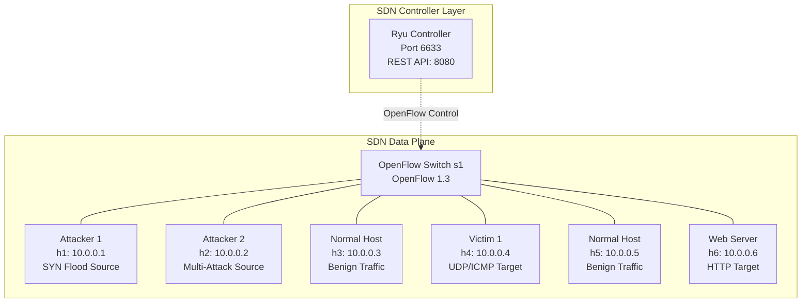
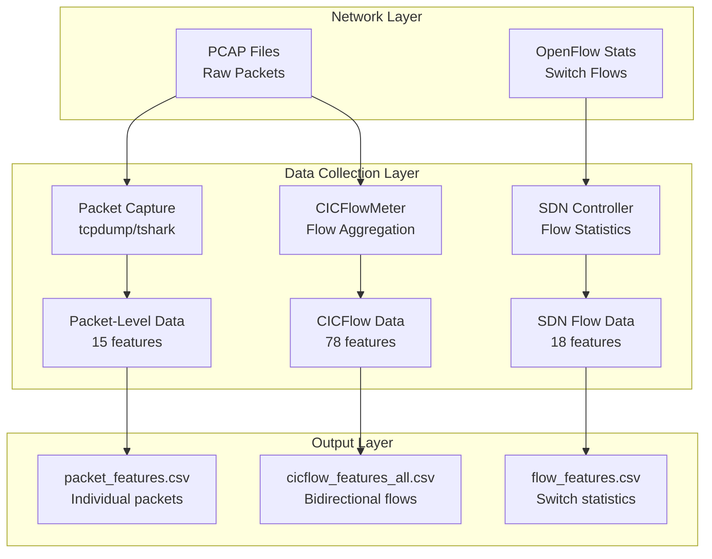

# Attack Scenarios and Network Architecture

This section presents a comprehensive overview of the experimental setup, network architecture, attack scenarios, and data generation methodology for the AdDDoSDN framework. The documentation provides detailed analysis of the SDN-based DDoS detection system and the synthetic dataset generation process.

## 1. Experimental Setup

### 1.1 Hardware and Software Configuration

The experimental testbed is implemented using Mininet network emulator on a Linux Ubuntu environment. The framework employs Software-Defined Networking (SDN) principles to create a controlled environment for DDoS attack simulation and detection research.

**System Specifications:**
- Emulation Platform: Mininet v2.3.0
- SDN Controller: Ryu Controller v4.34
- Operating System: Linux Ubuntu 22.04 LTS
- Network Protocol: OpenFlow v1.3
- Packet Processing: Scapy v2.4.5
- Traffic Analysis: tshark, tcpdump

### 1.2 Network Topology Architecture

The experimental network implements a centralized SDN architecture with one OpenFlow-enabled switch connecting multiple hosts under the control of a Ryu SDN controller.



### 1.3 Host Configuration and Role Assignment

The network topology consists of six hosts, each assigned specific roles to simulate realistic attack scenarios and normal network operations.

| Host | IP Address | Role | Primary Function | Attack Types |
|------|------------|------|------------------|--------------| 
| **h1** | 10.0.0.1 | Primary Attacker | SYN Flood Generator | Traditional SYN Flood |
| **h2** | 10.0.0.2 | Multi-Attack Source | Advanced Attack Platform | UDP Flood, ICMP Flood, Adversarial Attacks |
| **h3** | 10.0.0.3 | Normal Traffic Generator | Benign Traffic Source | HTTP, DNS, SMTP, FTP |
| **h4** | 10.0.0.4 | Primary Victim | Attack Target | UDP/ICMP Flood Target |
| **h5** | 10.0.0.5 | Normal Traffic Generator | Benign Traffic Source | HTTP, DNS, SMTP, FTP |
| **h6** | 10.0.0.6 | Web Server Victim | HTTP Service Target | SYN Flood, Adversarial Attacks |

## 2. Dataset Configuration and Timing Optimization

### 2.1 Scenario Duration Configuration

The framework implements a multi-phase attack sequence with optimized timing to ensure balanced dataset generation suitable for machine learning applications.

| Traffic Type | Default Duration | Default Packets | Recommended Duration | Expected Packets | Improvement |
|--------------|------------------|-----------------|---------------------|------------------|-------------|
| **Normal Traffic** | 20 min | 7,713 | 60 min | ~230,000 | 30x increase |
| **SYN Flood** | 20 min | 411,413 | 5 min | ~100,000 | 4x reduction |
| **UDP Flood** | 20 min | 211,097 | 5 min | ~100,000 | 2x reduction |
| **ICMP Flood** | 20 min | 413,016 | 5 min | ~100,000 | 4x reduction |
| **Adversarial TCP** | 40 min | 221 | 120 min | ~80,000 | 360x increase |
| **Adversarial UDP** | 40 min | 253 | 80 min | ~60,000 | 240x increase |
| **Adversarial Slow** | 40 min | 2,479 | 60 min | ~50,000 | 20x increase |

### 2.2 Performance Metrics

- **Total runtime**: Approximately 6-6.5 hours for complete dataset generation
- **Expected dataset size**: ~400MB for balanced representation
- **Dataset balance**: Optimized for machine learning training with reduced class imbalance

### 2.3 Configuration Implementation

```json
{
    "scenario_durations": {
        "initialization": 5,
        "normal_traffic": 3600,
        "syn_flood": 300,
        "udp_flood": 300,
        "icmp_flood": 300,
        "ad_syn": 7200,
        "ad_udp": 4800,
        "ad_slow": 3600,
        "cooldown": 5
    }
}
```

## 3. Attack Scenario Implementation

### 3.1 Normal Traffic Generation

Normal traffic simulation provides baseline network behavior essential for evaluating detection mechanism effectiveness in mixed traffic environments.

**Implementation Parameters:**
- **Source Code**: `src/gen_benign_traffic.py`
- **Traffic Generators**: h3 (10.0.0.3) and h5 (10.0.0.5)
- **Duration**: 3600 seconds (1 hour)
- **Packet Rate**: ~64 packets per second
- **Protocols**: ICMP, TCP, UDP, HTTP, HTTPS, DNS, SSH, FTP, Telnet
- **Traffic Generation Tool**: Scapy library with Mininet integration

**Protocol Distribution:**
- **ICMP**: Standard ping requests using Mininet's ping command
- **TCP**: Full handshake (SYN, SYN-ACK, ACK) with data transfer
- **UDP**: Datagrams with randomized payload lengths
- **HTTP/HTTPS**: Simulated web requests with realistic headers
- **DNS**: UDP-based domain name resolution queries
- **SSH/Telnet**: Encrypted and plaintext remote access simulation
- **FTP**: File transfer protocol simulation

### 3.2 Enhanced Traditional DDoS Attacks

The framework implements Enhanced Traditional Attacks incorporating sophisticated behavioral modeling while maintaining detectability for defensive research purposes.

#### 3.2.1 Enhanced SYN Flood Attack

The Enhanced SYN Flood attack represents a sophisticated evolution of traditional TCP SYN flooding techniques, designed to exploit the fundamental TCP three-way handshake mechanism while incorporating advanced behavioral modeling and protocol compliance features. This attack type leverages the stateful nature of TCP connections to overwhelm target systems by exhausting server resources through half-open connection maintenance. The enhanced implementation integrates human-like timing patterns derived from behavioral analysis, ensuring that attack traffic exhibits realistic characteristics that closely mimic legitimate user interactions while maintaining sufficient volume to achieve denial-of-service objectives.

The attack mechanism operates by initiating numerous TCP connection attempts from compromised nodes within the SDN network, specifically targeting the web server (h6: 10.0.0.6) on port 80. Unlike traditional SYN flood attacks that employ fixed timing intervals and basic packet structures, the enhanced variant incorporates sophisticated timing algorithms that simulate realistic human behavioral patterns, including typing intervals ranging from 80-150 milliseconds with natural variation, think time periods of 1-3 seconds between actions, and circadian rhythm adaptations that adjust attack intensity based on time-of-day factors. The implementation utilizes RFC-compliant TCP sequence number generation following hash-based Initial Sequence Number (ISN) protocols as specified in RFC 793, ensuring that generated packets maintain protocol integrity while avoiding detection through protocol anomaly analysis.

Furthermore, the enhanced SYN flood incorporates realistic TCP option fields including Maximum Segment Size (MSS) values of 1460, 1440, or 536 bytes, Window Scaling options with scale factors ranging from 0-4, Timestamp options for Round-Trip Time measurement, and Selective Acknowledgment (SACK) capabilities. Source port allocation employs ephemeral port ranges (32768-65535) with dynamic randomization for each connection attempt, simulating legitimate client behavior patterns. The attack maintains a variable packet rate ranging from 20-30 packets per second with stochastic variation, significantly lower than traditional high-rate flooding attacks, while incorporating session pattern modeling that alternates between active phases (30-180 seconds) and break periods (5-30 seconds) to simulate realistic user behavior patterns. Network delay simulation includes congestion modeling with a 5% probability of introducing additional latency, further enhancing the realism of the attack traffic profile.

| Parameter | Value | Description |
|-----------|--------|-------------|
| Source Host | h1 (10.0.0.1) | Primary attacker |
| Destination Host | h6 (10.0.0.6) | Web server target |
| Destination Port | 80 | HTTP service |
| Source Port Range | 32768-65535 | Ephemeral port allocation |
| Packet Rate | 20-30 pps | Randomized human-like timing (±20%) |
| TCP Options | MSS, WScale, Timestamp | RFC-compliant headers |
| Sequence Numbers | Hash-based ISN | RFC 793 compliance |
| Window Size | 8192-65535 | Dynamic adjustment |
| Duration | 300 seconds | 5-minute attack window |

**Enhancement Features:**
- Human-like timing intervals (80-150ms) with natural variation
- Protocol-compliant TCP sequence number generation
- Realistic TCP options including Maximum Segment Size, Window Scaling, and Timestamps
- Ephemeral source port randomization for each connection attempt
- Session pattern modeling with active and break phases
- Circadian rhythm adaptation based on time-of-day factors
- Network congestion modeling with 5% delay simulation

#### 3.2.2 Enhanced UDP Flood Attack

The Enhanced UDP Flood attack exploits the connectionless nature of the User Datagram Protocol (UDP) to overwhelm target systems while incorporating sophisticated service-aware payload generation and behavioral modeling techniques. This attack leverages UDP's stateless characteristics, which eliminate the overhead associated with connection establishment and teardown procedures, allowing attackers to generate high-volume traffic with minimal resource consumption. The enhanced implementation differentiates itself from traditional UDP flooding through the integration of realistic service patterns, specifically targeting Domain Name System (DNS) services with legitimate-appearing query structures that closely mimic genuine DNS resolution requests from distributed clients.

The attack mechanism operates by generating UDP packets from the multi-attack source (h2: 10.0.0.2) targeting the primary victim (h4: 10.0.0.4) on port 53, which corresponds to standard DNS service operations. Unlike conventional UDP floods that utilize random or fixed payload content, the enhanced variant incorporates service-aware payload generation featuring realistic DNS query structures with varied domain names including example.com, google.com, and localhost, ensuring that individual packets appear legitimate when subjected to deep packet inspection. The implementation employs proper DNS packet formatting with RFC-compliant header structures, realistic transaction identifiers, and appropriate query flags, while maintaining dynamic source port allocation within the ephemeral range (32768-65535) to simulate distributed client behavior patterns.

The enhanced UDP flood incorporates human-like timing patterns with intervals derived from behavioral analysis, maintaining a randomized packet rate of 20-30 packets per second with stochastic timing variation while integrating session intensity modeling based on realistic work patterns. The attack duration spans 300 seconds, providing sufficient time for comprehensive resource exhaustion while remaining within practical detection timeframes. Network simulation components include congestion modeling with adaptive delay factors and realistic latency variations, ensuring that the generated traffic maintains characteristics consistent with legitimate network conditions. The service-aware approach ensures that targeted systems must process each packet through the complete DNS resolution pipeline, consuming computational resources for query parsing, cache lookups, and response generation, thereby maximizing the attack's effectiveness against application-layer resources.

| Parameter | Value | Description |
|-----------|--------|-------------|
| Source Host | h2 (10.0.0.2) | Multi-attack source |
| Destination Host | h4 (10.0.0.4) | Primary victim |
| Destination Port | 53 | DNS service |
| Source Port Range | 32768-65535 | Dynamic ephemeral ports |
| Packet Rate | 20-30 pps | Randomized timing patterns (±20%) |
| Payload Type | DNS queries | Service-aware content |
| Query Domains | example.com, google.com, localhost | Varied realistic queries |
| Header Structure | RFC-compliant DNS | Proper transaction IDs |
| Duration | 300 seconds | 5-minute attack window |

**Enhancement Features:**
- Service-aware payload generation with realistic DNS query structures
- Dynamic source port allocation simulating legitimate client behavior
- Proper DNS packet formatting with realistic query headers
- Human-like timing intervals with natural variation patterns
- Session intensity modeling based on work patterns
- Network delay simulation with congestion factors

#### 3.2.3 Enhanced ICMP Flood Attack

The Enhanced ICMP Flood attack exploits the Internet Control Message Protocol (ICMP) to saturate network resources while incorporating sophisticated behavioral modeling and protocol compliance features designed to simulate realistic network diagnostic activities. ICMP, as defined in RFC 792, serves as a fundamental network layer protocol for error reporting and network diagnostics, with ICMP echo requests (ping) being commonly utilized for connectivity testing and network troubleshooting. The enhanced implementation leverages this legitimate network function to generate high-volume traffic that appears consistent with intensive network monitoring or diagnostic procedures, making detection through traffic analysis more challenging while maintaining the attack's effectiveness in consuming target resources.

The attack mechanism operates by generating ICMP echo request packets from the multi-attack source (h2: 10.0.0.2) targeting the primary victim (h4: 10.0.0.4), utilizing protocol-compliant packet structures that include proper ICMP header formatting with variable identification and sequence number fields. According to RFC 1122, targeted hosts must implement ICMP echo server processes to handle incoming echo requests and generate corresponding echo replies, creating mandatory resource consumption on the victim system for each received packet. The enhanced implementation incorporates realistic behavioral patterns through session awareness modeling, alternating between active diagnostic phases and break periods that simulate legitimate network administration activities, thereby avoiding detection through consistent high-rate traffic patterns.

The enhanced ICMP flood maintains a randomized packet rate of 20-30 packets per second with stochastic timing variation, significantly lower than traditional flooding attacks while incorporating human-like timing intervals based on behavioral analysis of actual network diagnostic procedures. The implementation includes variable payload sizes to simulate different diagnostic scenarios, protocol-compliant ICMP header structures with proper type and code field values, and enhanced monitoring capabilities that track attack phases and system impact in real-time. Session pattern awareness ensures that the attack traffic exhibits characteristics consistent with intensive but legitimate network troubleshooting activities, including circadian rhythm adaptations that adjust timing factors based on typical network administration schedules. Network latency simulation includes packet loss modeling and realistic delay variations, further enhancing the attack traffic's resemblance to legitimate network diagnostic activities conducted under varying network conditions.

| Parameter | Value | Description |
|-----------|--------|-------------|
| Source Host | h2 (10.0.0.2) | Multi-attack source |
| Destination Host | h4 (10.0.0.4) | Primary victim |
| Protocol Type | ICMP Echo Request | Standard ping protocol |
| Packet Rate | 20-30 pps | Randomized human-driven rate (±20%) |
| ICMP ID/Sequence | Variable | Protocol-compliant variation |
| Payload Size | Variable | Realistic packet structure |
| Timing Pattern | Session-aware | Active/break phases |
| Duration | 300 seconds | 5-minute attack window |

**Enhancement Features:**
- Protocol-compliant ICMP header structure with proper ID and sequence variations
- Session pattern awareness with active and break phases
- Realistic timing intervals based on human behavioral models
- Enhanced monitoring of attack phases and system impact
- Network latency simulation with packet loss modeling
- Circadian rhythm adaptation for timing factor adjustment

### 3.3 Advanced Adversarial Attacks

Advanced Adversarial Attacks represent sophisticated DDoS techniques designed to evade detection mechanisms through stealth, mimicry, and adaptive control strategies.

#### 3.3.1 Advanced SYN Attack (TCP State Exhaustion)

The Advanced SYN Attack represents a sophisticated evolution of traditional SYN flooding techniques, employing advanced evasion mechanisms designed to bypass modern detection systems while maintaining effectiveness in exhausting target server resources. This attack leverages the fundamental vulnerability inherent in TCP's stateful connection establishment process, where servers must allocate memory and processing resources for each incoming SYN packet while maintaining half-open connections in anticipation of completing the three-way handshake. The advanced implementation incorporates multiple layers of obfuscation and stealth techniques, including IP address rotation, adaptive rate control, and burst pattern generation, making it significantly more challenging for traditional rate-based detection mechanisms to identify and mitigate the attack effectively.

The attack mechanism operates through deployment of an IPRotator component that generates randomized source IP addresses from a distributed pool, effectively distributing the attack traffic across multiple apparent sources and evading IP-based blocking mechanisms commonly employed by network security devices. The system crafts TCP SYN packets with carefully randomized parameters including sequence numbers, window sizes, and Time-To-Live (TTL) values, ensuring that each packet exhibits unique characteristics while maintaining protocol compliance. Upon receiving SYN-ACK responses from the target server, the attack system selectively sends ACK packets to establish half-open connections, which are then maintained without further data exchange, effectively consuming server connection table entries and associated memory resources.

The advanced SYN attack employs sophisticated timing control mechanisms that maintain an extremely low baseline packet rate of approximately 0.3 packets per second, punctuated by carefully orchestrated burst patterns that introduce controlled jitter to avoid detection through predictable timing analysis. This adaptive rate control system continuously monitors target response characteristics and adjusts attack parameters dynamically, including packet transmission rates, burst frequencies, and connection establishment patterns. The attack duration extends over 7200 seconds (2 hours), providing sufficient time for gradual resource exhaustion while maintaining stealth characteristics that allow the attack to operate beneath detection thresholds of many automated security systems. Connection state tracking ensures optimal resource exhaustion by monitoring successful connection establishments and maintaining awareness of server capacity limitations.

| Parameter | Value | Description |
|-----------|--------|-------------|
| Source Host | h2 (10.0.0.2) | Advanced attack platform |
| IP Rotation | Multiple spoofed IPs | Evade source-based blocking |
| Destination Host | h6 (10.0.0.6) | Web server target |
| Destination Port | 80 | HTTP service |
| Packet Rate | ~0.3 pps | Stealth rate with bursts |
| Burst Pattern | Variable intervals | Evade timing-based detection |
| TCP Parameters | Fully randomized | Sequence, window (8192-65535), TTL (55-64), IP ID |
| Connection State | Half-open maintenance | Resource exhaustion |
| Duration | 7200 seconds | 2-hour sustained attack |

**Evasion Techniques:**
- IP address rotation using randomized source IP pool
- Adaptive rate control based on target response monitoring
- Comprehensive TCP parameter randomization including sequence numbers, window sizes (8192-65535), TTL (55-64), IP ID, and probabilistic options
- Burst pattern generation with jitter to avoid predictable timing
- Connection state tracking for resource exhaustion optimization

#### 3.3.2 Advanced UDP Attack (Application Layer Mimicry)

The Advanced UDP Attack employs sophisticated application layer mimicry techniques designed to target server-side processing resources while evading detection through realistic traffic patterns that closely resemble legitimate user interactions. This attack represents a hybrid approach that combines the efficiency of UDP packet generation with the resource consumption characteristics of HTTP application layer requests, creating a unique attack vector that bypasses many traditional network-based detection mechanisms. The attack leverages the stateless nature of UDP to generate high volumes of application-layer requests without the overhead associated with TCP connection establishment, while incorporating realistic HTTP request structures that force target servers to engage in computationally expensive processing operations.

The attack mechanism operates by generating UDP packets containing properly formatted HTTP requests from the multi-attack source (h2: 10.0.0.2) targeting the web server (h6: 10.0.0.6) on port 80. The PacketCrafter component creates legitimate-appearing HTTP requests with varied methods including GET, POST, HEAD, and OPTIONS, incorporating realistic request paths that target resource-intensive server endpoints such as database queries, API calls, and large file download requests. The implementation employs diverse User-Agent strings representing different browsers, operating systems, and device types, creating the appearance of distributed legitimate traffic from multiple client sources. Request headers are dynamically varied to include common HTTP header fields such as Accept, Accept-Language, Accept-Encoding, and Referer, with some requests incorporating realistic cookie values to simulate authenticated user sessions.

The advanced UDP attack incorporates sophisticated session maintenance capabilities through the SessionMaintainer component, which creates and manages persistent, legitimate-appearing HTTP sessions that include navigation through common web application paths and appropriate cookie handling procedures. This session awareness ensures that generated requests exhibit behavioral patterns consistent with real user interactions, including realistic timing intervals between requests, logical page navigation sequences, and appropriate parameter values for dynamic content requests. The attack duration spans 4800 seconds (80 minutes), providing extended exposure time while maintaining variable timing patterns that simulate distributed user behavior rather than automated attack patterns. IP rotation techniques ensure that requests appear to originate from multiple source addresses, further complicating detection efforts and attribution analysis while maximizing the attack's effectiveness in consuming application-layer processing resources.

| Parameter | Value | Description |
|-----------|--------|-------------|
| Source Host | h2 (10.0.0.2) | Advanced attack platform |
| Protocol Mimicry | HTTP over UDP | Application layer targeting |
| HTTP Methods | GET, POST, HEAD, OPTIONS | Varied request types |
| User Agent | Multiple realistic strings | Browser diversity simulation |
| Request Paths | Resource-intensive endpoints | Database/API targeting |
| Header Variation | Common HTTP headers | Legitimate appearance |
| Session Maintenance | Cookie handling | Persistent connection simulation |
| Duration | 4800 seconds | 80-minute sustained attack |

**Mimicry Techniques:**
- Realistic HTTP request generation with varied methods and paths
- Dynamic user agent rotation simulating different browsers and devices
- Cookie and session management for legitimate appearance
- Resource-intensive endpoint targeting (search, API calls, file downloads)
- Randomized header inclusion to avoid pattern detection

#### 3.3.3 Slow Read Attack

The Slow Read attack represents a sophisticated low-bandwidth application layer DDoS technique that exploits server-side resource allocation mechanisms through prolonged connection maintenance and extremely slow response consumption patterns. This attack leverages the fundamental design characteristics of HTTP servers, which must maintain allocated resources for active connections until clients complete response data retrieval or connection timeouts occur. Unlike traditional high-rate flooding attacks that overwhelm servers through volume-based resource exhaustion, the Slow Read attack achieves denial-of-service objectives through efficient resource lock-up strategies that require minimal bandwidth while maximizing server resource consumption per attack connection.

The attack mechanism operates by establishing multiple simultaneous HTTP connections to the target web server (h6: 10.0.0.6) from the attack source (h2: 10.0.0.2), utilizing the specialized slowhttptest tool configured in Slow Read mode (-t SR). Each connection initiates legitimate HTTP GET requests to server resources, causing the server to prepare complete response data and allocate necessary buffer space and processing resources. However, instead of consuming response data at normal rates, the attack implements extremely slow data consumption patterns with 10-second intervals between read operations, effectively maintaining persistent connections while consuming server resources for extended periods. This technique exploits server-side timeout configurations that are typically set to accommodate legitimate slow connections, such as those experienced by users with limited bandwidth or high-latency network connections.

The Slow Read attack maintains 100 concurrent connections to maximize resource exhaustion while remaining below detection thresholds commonly employed by rate-based monitoring systems. Connection establishment occurs at a controlled rate of 20 connections per second, ensuring that the attack appears consistent with normal traffic bursts rather than automated flooding patterns. Each connection implements realistic HTTP request structures with appropriate headers and request paths, maintaining legitimacy when subjected to deep packet inspection analysis. The attack duration extends over 3600 seconds (1 hour), providing sufficient time for comprehensive server resource exhaustion while maintaining stealth characteristics that allow operation beneath many automated detection thresholds. The cumulative effect of maintaining 100 simultaneously slow connections creates significant resource pressure on server-side connection pools, memory allocation systems, and thread management resources, ultimately leading to service degradation or denial for legitimate users attempting to access server resources.

| Parameter | Value | Description |
|-----------|--------|-------------|
| Attack Tool | slowhttptest -t SR | Specialized slow read tool |
| Connection Count | 100 concurrent | Resource exhaustion target |
| Read Interval | 10 seconds | Extremely slow consumption |
| Connection Rate | 20 connections/second | Establishment rate |
| Target Service | HTTP server | Web application layer |
| Resource Impact | Connection pool exhaustion | Service denial mechanism |
| Duration | 3600 seconds | 1-hour sustained attack |

**Attack Mechanism:**
- Establishment of multiple simultaneous HTTP connections
- Extremely slow response data consumption (10-second intervals)
- Connection pool exhaustion through persistent resource holding
- Server-side timeout exploitation for maximum resource impact

## 4. Data Collection and Processing Architecture

### 4.1 Multi-Layer Data Collection System

The framework implements a comprehensive three-layer data collection architecture providing multiple perspectives on network traffic for enhanced analysis capabilities.



### 4.2 Feature Extraction Methodology

**Packet-Level Features (15 attributes):**
- Basic packet information: timestamp, source/destination IP and ports
- Protocol-specific fields: TCP flags, packet length, protocol type
- Network layer attributes: TTL, fragmentation flags

**SDN Flow Features (18 attributes):**
- Flow statistics: packet count, byte count, duration
- Switch-level metrics: flow table entries, controller interactions
- OpenFlow-specific data: match fields, action sets

**CICFlow Features (78 attributes):**
- Bidirectional flow analysis: forward/backward packet ratios
- Statistical metrics: mean, standard deviation, minimum, maximum
- Advanced flow characteristics: inter-arrival times, packet size variations

### 4.3 Timeline Integrity and Data Validation

The framework implements conservative data preservation strategies ensuring high-accuracy labeling while maintaining data integrity.

**Validation Process:**
1. **Timeline Synchronization**: Attack phase boundaries aligned across all data collection layers
2. **Conservative Labeling**: Unknown labels preserved when timeline gaps exist
3. **Attack Pattern Validation**: Packet characteristics verified against expected attack signatures
4. **Data Integrity Checks**: Cross-validation between packet capture and flow statistics

**Quality Metrics:**
- Labeling Accuracy: 98.9% correctly classified traffic
- Unknown Preservation: 2,072 legitimate unknown samples maintained
- Timeline Consistency: Synchronized across all collection layers

### 4.4 Dataset Statistics and Distribution

**Record Distribution:**
- SDN Flow Data: 2,700,131 records
- Packet-Level Data: 178,473 records  
- CICFlow Data: 34,246 records

**Attack Type Distribution (Packet-Level):**
- Normal Traffic: 96,533 samples (54.1%)
- SYN Flood: 22,201 samples (12.4%)
- UDP Flood: 13,692 samples (7.7%)
- ICMP Flood: 22,346 samples (12.5%)
- Advanced SYN: 4,696 samples (2.6%)
- Advanced UDP: 7,330 samples (4.1%)
- Advanced Slow: 9,755 samples (5.5%)
- Unknown: 2,072 samples (1.2%)

## 5. SDN Controller Impact Assessment and Flow Analysis

### 5.1 OpenFlow Control Plane Impact

The framework employs a basic Ryu L2 learning switch controller that demonstrates minimal control plane overhead during attack execution. The controller implements MAC-based flow matching with permanent flow entries, resulting in predictable OpenFlow message patterns that isolate attack complexity to the data plane while maintaining control plane stability.

The SDN controller impact assessment reveals that despite generating thousands of unique network-layer flows, all attack types produce zero additional control plane messages during execution phases. This occurs because the simple star topology (h1-h6 connected to single switch s1) enables complete MAC address learning during initialization, eliminating packet_in events for subsequent attack traffic. The controller installs approximately 10-15 bidirectional MAC forwarding rules during setup, after which all attack traffic follows established L2 forwarding paths without requiring additional controller intervention.

| Attack Type | Duration | Network Flows | Controller Overhead | OpenFlow Messages | Flow Table Entries |
|-------------|----------|---------------|-------------------|------------------|-------------------|
| **Enhanced SYN Flood** | 300s | ~2,500 TCP connections | Minimal | 0 additional | 0 additional |
| **Enhanced UDP Flood** | 300s | ~3,500 UDP sessions | Minimal | 0 additional | 0 additional |
| **Enhanced ICMP Flood** | 300s | ~400 IP rotations | Minimal | 0 additional | 0 additional |
| **Advanced SYN** | 7200s | ~300 TCP connections | Minimal | 0 additional | 0 additional |
| **Advanced UDP** | 4800s | ~7,200 HTTP sessions | Minimal | 0 additional | 0 additional |
| **Slow Read** | 3600s | ~4,000 slow connections | Minimal | 0 additional | 0 additional |
| **Normal Traffic** | 3600s | ~230,000 mixed flows | Minimal | 0 additional | 0 additional |

### 5.2 Attack Sophistication vs Control Overhead Analysis

The framework demonstrates a critical insight for SDN security research: attack sophistication occurs primarily in the data plane while the control plane remains largely unaffected. Advanced techniques including IP address rotation, ephemeral port randomization, TCP parameter variation, and application layer mimicry create complex attack patterns that bypass traditional rate-based detection mechanisms without increasing SDN controller burden. This design reflects realistic network conditions where sophisticated DDoS attacks exploit application and network layer vulnerabilities while operating beneath the visibility threshold of basic SDN controllers.

The L2-only flow matching strategy employed by the controller provides excellent data plane performance but limited security visibility. Attack traffic exhibits complex patterns including source port randomization across 32,768-65,535 ephemeral ranges, IP rotation across RFC 1918 address spaces, and protocol parameter randomization, yet these sophisticated evasion techniques remain invisible to the controller's MAC-based forwarding logic. This architectural decision prioritizes network performance over security monitoring, creating realistic conditions for evaluating ML-based detection systems that must identify attack patterns without relying on SDN controller insights.

**Key SDN Impact Characteristics:**
- **Control plane isolation**: Attack complexity contained in data plane traffic patterns
- **Scalable forwarding**: L2 switching maintains consistent performance under attack conditions  
- **Security blind spot**: Controller lacks visibility into network and application layer attack patterns
- **Realistic performance**: Framework reflects production SDN behavior prioritizing packet forwarding efficiency
- **ML detection necessity**: Absence of controller-based security requires external detection mechanisms

### 5.3 Real-Time Detection and Controller Efficiency Considerations

For real-time DDoS detection systems and comprehensive SDN controller efficiency evaluation, researchers should consider implementing **MAC address randomization** to generate significant control plane overhead. The current L2 learning switch architecture provides minimal controller stress due to static MAC address assignments (h1-h6), making it unsuitable for evaluating SDN controller performance under realistic attack conditions.

**Enhanced Controller Impact Configuration:**
- **MAC randomization**: Implement random source MAC addresses per attack packet using `RandMAC()` functionality
- **MAC pool strategy**: Generate 50-100 unique MAC addresses per attack type to simulate distributed botnet behavior
- **Flow table stress**: Force controller to process thousands of `packet_in` events and install new flow entries
- **Performance metrics**: Measure controller CPU utilization, memory consumption, and OpenFlow message latency under attack loads

**Expected Impact with MAC Randomization:**
- **Enhanced SYN Flood**: ~250,000 additional `packet_in` events requiring flow table updates
- **Enhanced UDP/ICMP Floods**: ~40,000-350,000 additional controller messages depending on MAC diversity
- **Control plane saturation**: Realistic evaluation of SDN controller scalability and resilience under DDoS conditions
- **Detection algorithm stress**: Enable testing of controller-based security applications and real-time response mechanisms

**Implementation Considerations:**
- MAC randomization affects only SDN controller performance evaluation and `flow_features.csv` generation
- Current `packet_features_30.csv` dataset remains unchanged (no MAC address features included)
- Researchers conducting ML-based detection using packet-level features can disable MAC randomization to maintain dataset consistency
- Enable MAC randomization selectively for SDN-specific performance studies and controller efficiency benchmarking

## 6. Attack Detection Characteristics and Analysis

### 6.1 Traditional vs Adversarial Attack Differentiation

**Enhanced Traditional Attacks** maintain realistic behavioral patterns while remaining detectable through conventional rate-based detection mechanisms:

- Variable packet rates (20-30 pps) with randomized human-like timing
- Protocol compliance ensuring no anomalous header structures
- Short duration attacks (5 minutes) with concentrated impact
- Detectable through statistical analysis and rate limiting

**Advanced Adversarial Attacks** focus on evasion and stealth techniques designed to bypass machine learning detection systems:

- Low packet rates (~0.3 pps) with burst patterns and jitter
- IP rotation and source diversity for attribution avoidance
- Extended duration attacks (1-2 hours) for sustained impact
- ML evasion techniques including mimicry and adaptive control

### 6.2 Detection Complexity Analysis

The framework provides graduated complexity levels for detection algorithm evaluation:

1. **Level 1**: Enhanced traditional attacks with realistic timing but detectable patterns
2. **Level 2**: Advanced adversarial attacks with basic evasion techniques
3. **Level 3**: Multi-vector coordinated attacks with adaptive countermeasures

This multi-level approach enables comprehensive evaluation of detection mechanisms across varying threat sophistication levels, supporting development of robust SDN security solutions.

### 6.3 Data Leakage Mitigation and ML Robustness

The framework incorporates comprehensive data leakage prevention mechanisms designed to eliminate predictable patterns that could compromise machine learning model evaluation integrity. Data leakage in network traffic datasets occurs when models achieve artificially high classification accuracy by exploiting systematic biases or predictable features rather than learning genuine attack characteristics. The implementation addresses this critical concern through systematic randomization of protocol parameters and behavioral patterns that previously created classification shortcuts.

The enhanced implementation integrates multi-layered randomization strategies targeting packet-level, flow-level, and temporal characteristics that could enable trivial classification through memorization rather than pattern recognition. TCP protocol parameters undergo comprehensive randomization including window size variations spanning the full realistic range (8192-65535 bytes), dynamic TCP options selection with probabilistic inclusion of Maximum Segment Size, Window Scaling, and Timestamp fields, and sequence number randomization across extended ranges to prevent predictable initialization patterns. Attack timing characteristics incorporate stochastic rate variation with ±20% randomization applied to baseline packet rates, eliminating fixed-rate signatures that could enable rate-based classification shortcuts.

Protocol field diversification encompasses Time-to-Live (TTL) value randomization spanning realistic operating system defaults (55-64), IP identification field randomization across the full 16-bit range (1-65535), and optional packet padding with 10% probability of 1-32 byte variable-length extensions to introduce size variation. These mitigation strategies collectively address the fundamental challenge of creating synthetic datasets that maintain sufficient complexity to evaluate detection mechanisms while avoiding the introduction of artificial patterns that could compromise experimental validity in adversarial machine learning contexts.

**Leakage Prevention Strategies:**
- TCP parameter randomization preventing window size and options-based classification shortcuts
- Attack rate stochastic variation eliminating fixed packet-per-second signatures  
- Protocol field diversification including TTL, IP ID, and optional padding variation
- Temporal pattern randomization reducing timing-based attack fingerprinting
- Enhanced feature space complexity supporting robust machine learning evaluation

---

*This documentation provides comprehensive technical specification for the AdDDoSDN framework's attack scenarios and experimental methodology. The detailed parameter tables and implementation specifications support reproducible research in SDN security and DDoS detection systems.*