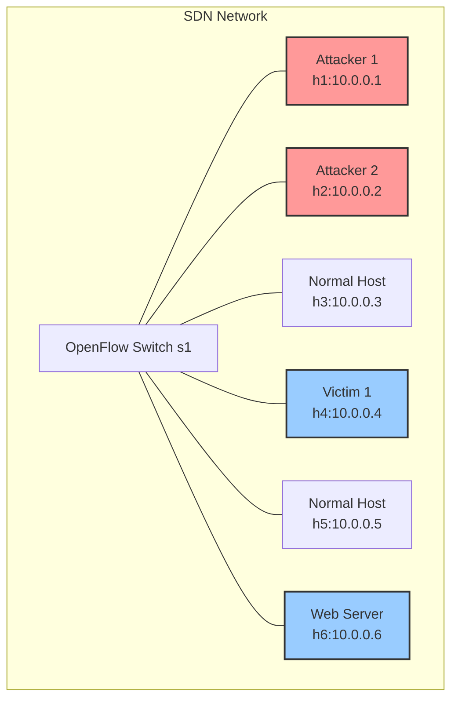

# SDN DDoS Dataset Generation Scenario

This document provides a comprehensive overview of the Mininet host scenario for DDoS dataset generation, including detailed network architecture, host roles, traffic patterns, and attack flows, as orchestrated by `dataset_generation/main.py` and configured by `dataset_generation/config.json`.

## Network Architecture



## Network Topology

The Mininet topology consists of the following components:

| Component | Type | IP Address | Role |
|-----------|------|------------|------|
| s1 | OpenFlow Switch | N/A | Central network switch |
| h1 | Host | 10.0.0.1 | Primary Attacker |
| h2 | Host | 10.0.0.2 | Secondary Attacker |
| h3 | Host | 10.0.0.3 | Normal Traffic Generator |
| h4 | Host | 10.0.0.4 | Primary Victim |
| h5 | Host | 10.0.0.5 | Normal Traffic Generator |
| h6 | Host | 10.0.0.6 | Web Server Victim |

## Host Roles and Traffic Patterns

### Attackers

| Host | IP | Attack Type | Target | Impact | Description |
|------|----|-------------|--------|--------|-------------|
| h1 | 10.0.0.1 | SYN Flood | h6 (Web Server) | Controller & Application | Overwhelms controller flow tables and exhausts server resources |
| h2 | 10.0.0.2 | Multiple Attacks | h4 & h6 | Various | Launches various attacks including UDP, ICMP, and advanced adversarial attacks. |

#### Detailed Attack Vectors from h2:

| Attack Type | Target | Protocol | Port | Evasion Technique |
|-------------|--------|----------|------|-------------------|
| UDP Flood | h4 | UDP | 53 | High Rate |
| ICMP Flood | h4 | ICMP | N/A | High Rate |
| Adversarial SYN | h6 | TCP | 80 | TCP State Exhaustion |
| Adversarial UDP | h6 | UDP | 53 | Application Layer Mimicry |
| Adversarial Slow Read | h6 | TCP | 80 | Slow HTTP Request |

### Victims

| Host | IP | Role | Attack Types | Impact |
|------|----|------|--------------|--------|
| h4 | 10.0.0.4 | General Victim | UDP Flood, ICMP Flood | Network Saturation |
| h6 | 10.0.0.6 | Web Server | SYN Flood, Adversarial Attacks | Service Disruption |

### Normal Traffic Generators

| Host | IP | Traffic Type | Destination | Protocols | Purpose |
|------|----|--------------|-------------|-----------|---------|
| h3 | 10.0.0.3 | Benign | h5 | ICMP, TCP, UDP, etc. | Simulate normal web and network traffic |
| h5 | 10.0.0.5 | Benign | h3 | ICMP, TCP, UDP, etc. | Simulate normal web and network traffic |

## Traffic Generation Phases

The dataset generation process follows a structured timeline with distinct phases. The duration of each phase is configurable in `dataset_generation/config.json`.

| Phase | Default Duration | Label | Description |
|-------|------------------|-------|-------------|
| Initialization | 5s | normal | Network stabilization and controller initialization. |
| Normal Traffic | 5s | normal | Benign traffic (ICMP, TCP, UDP, Telnet, SSH, FTP, HTTP) between h3 and h5. |
| SYN Flood | 5s | syn_flood | Traditional SYN flood attack from h1 to h6. |
| UDP Flood | 5s | udp_flood | Traditional UDP flood attack from h2 to h4. |
| ICMP Flood | 5s | icmp_flood | Traditional ICMP flood attack from h2 to h4. |
| Adversarial SYN | 5s | ad_syn | Adversarial TCP State Exhaustion attack from h2 to h6. |
| Adversarial UDP | 5s | ad_udp | Adversarial Application Layer attack from h2 to h6. |
| Adversarial Slow Read | 5s | ad_slow | Adversarial Slow Read attack from h2 to h6. |
| Cooldown | 10s | normal | Allow network to stabilize and ensure final flow stats are captured. |

## Data Collection Architecture

```mermaid
graph LR
    subgraph Mininet Network
        s1[Switch s1]
        h1[h1..h6]
        h1 -- Traffic --> s1
    end

    subgraph Data Collectors
        Ryu[Ryu Controller]
        Tshark[Packet Capture (tshark)]
    end

    s1 -- OpenFlow Stats --> Ryu
    s1 -- Mirrored Traffic --> Tshark

    Ryu -->|Flow Stats API| main_py[main.py]
    Tshark -->|PCAP files| main_py

    main_py -->|flow_features.csv| Dataset_Storage[Output Directory]
    main_py -->|packet_features.csv| Dataset_Storage
```

## Dataset Outputs

The generated datasets in `dataset_generation/main_output/` include:

1.  **`packet_features.csv`**
    -   The primary packet-level dataset with extracted features and labels.
    -   Each packet is associated with a label indicating the traffic phase (e.g., `normal`, `syn_flood`, `ad_slow`).

2.  **`flow_features.csv`**
    -   A flow-based dataset containing statistics collected from the Ryu controller.
    -   Features include packet/byte counts, duration, and derived rates, labeled based on the active traffic phase.
