# 🎭 Attack Scenarios and Network Architecture

This document provides a comprehensive overview of the network architecture, attack scenarios, and data generation process for the AdDDoSDN framework.

## 🏗️ Network Architecture

### SDN Network Topology

```mermaid
graph TD
    subgraph "SDN Controller Layer"
        ryu[Ryu Controller<br/>Port 6633<br/>REST API: 8080]
    end
    
    subgraph "SDN Data Plane"
        s1[OpenFlow Switch s1<br/>OpenFlow 1.3]
        
        s1 --- h1[🔴 Attacker 1<br/>h1: 10.0.0.1<br/>SYN Flood Source]
        s1 --- h2[🔴 Attacker 2<br/>h2: 10.0.0.2<br/>Multi-Attack Source]
        s1 --- h3[🟢 Normal Host<br/>h3: 10.0.0.3<br/>Benign Traffic]
        s1 --- h4[🔵 Victim 1<br/>h4: 10.0.0.4<br/>UDP/ICMP Target]
        s1 --- h5[🟢 Normal Host<br/>h5: 10.0.0.5<br/>Benign Traffic]
        s1 --- h6[🔵 Web Server<br/>h6: 10.0.0.6<br/>HTTP Target]
    end
    
    ryu -.->|OpenFlow Control| s1
    
    style h1 fill:#ffcccc,stroke:#ff0000,stroke-width:2px
    style h2 fill:#ffcccc,stroke:#ff0000,stroke-width:2px
    style h3 fill:#ccffcc,stroke:#00ff00,stroke-width:2px
    style h4 fill:#ccccff,stroke:#0000ff,stroke-width:2px
    style h5 fill:#ccffcc,stroke:#00ff00,stroke-width:2px
    style h6 fill:#ccccff,stroke:#0000ff,stroke-width:2px
    style ryu fill:#ffffcc,stroke:#ffaa00,stroke-width:2px
    style s1 fill:#f0f0f0,stroke:#333,stroke-width:2px
```

### Host Roles and Responsibilities

| Host | IP Address | Role | Primary Function | Attack Types |
|------|------------|------|------------------|--------------|
| **h1** | 10.0.0.1 | Primary Attacker | SYN Flood Generator | Traditional SYN Flood |
| **h2** | 10.0.0.2 | Multi-Attack Source | Advanced Attack Platform | UDP Flood, ICMP Flood, Adversarial Attacks |
| **h3** | 10.0.0.3 | Normal Traffic Generator | Benign Traffic Source | HTTP, DNS, SMTP, FTP |
| **h4** | 10.0.0.4 | Primary Victim | Attack Target | UDP/ICMP Flood Target |
| **h5** | 10.0.0.5 | Normal Traffic Generator | Benign Traffic Source | HTTP, DNS, SMTP, FTP |
| **h6** | 10.0.0.6 | Web Server Victim | HTTP Service Target | SYN Flood, Adversarial Attacks |

## 🎯 Attack Scenario Timeline

### 7-Phase Attack Sequence

### Phase-by-Phase Breakdown

```mermaid
flowchart TD
    A[Phase 1: Network Initialization<br/>5 seconds] --> B[Phase 2: Normal Traffic<br/>1 hour<br/>h3 ↔ h5]
    B --> C[Phase 3: SYN Flood<br/>5 minutes<br/>h1 → h6:80]
    C --> D[Phase 4: UDP Flood<br/>5 minutes<br/>h2 → h4:53]
    D --> E[Phase 5: ICMP Flood<br/>5 minutes<br/>h2 → h4]
    E --> F[Phase 6: Advanced SYN<br/>2 hours<br/>h2 → h6:80]
    F --> G[Phase 7: Advanced UDP<br/>1.33 hours<br/>h2 → h6:80]
    G --> H[Phase 8: Advanced Slow<br/>2 hours<br/>h2 → h6:80]
    H --> I[Phase 9: Cooldown<br/>10 seconds]
    
    style A fill:#e1f5fe
    style B fill:#f3e5f5
    style C fill:#ffebee
    style D fill:#ffebee
    style E fill:#ffebee
    style F fill:#fff3e0
    style G fill:#fff3e0
    style H fill:#fff3e0
    style I fill:#e8f5e8
```

## 🔴 Attack Details

### Traditional DDoS Attacks

#### 1. SYN Flood Attack

#### 2. UDP Flood Attack

#### 3. ICMP Flood Attack

### Advanced Adversarial Attacks

#### 1. Advanced SYN Attack (TCP State Exhaustion)

#### 2. Advanced UDP Attack (Application Layer Mimicry)

#### 3. Slow Read Attack

## 🟢 Normal Traffic Patterns

### Multi-Protocol Benign Traffic

## 📊 Data Collection Architecture

### Three-Layer Data Collection

### Data Synchronization Process

## 🔍 Attack Detection Characteristics

### Traditional vs Adversarial Attack Patterns

## 📈 Dataset Statistics

### Record Distribution Across Formats

### Attack Type Distribution

## 🎯 Timeline Integrity Validation

### Conservative Data Preservation

This comprehensive scenario documentation provides visual diagrams for:
- Network topology and architecture
- Attack timeline and sequence
- Individual attack patterns
- Data collection processes
- Timeline integrity validation
- Dataset statistics and distributions

The diagrams use Mermaid syntax which renders properly in markdown viewers and provides clear visual understanding of the complex attack scenarios and data generation process.